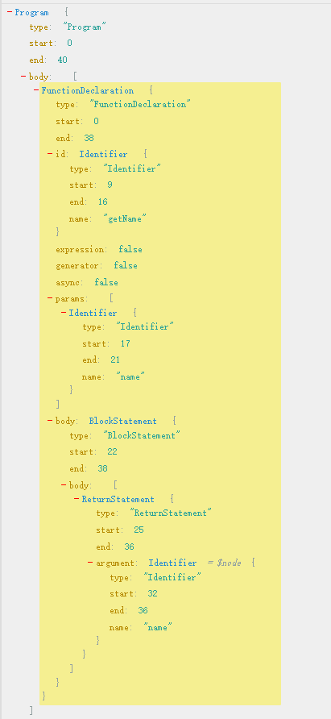

## 深入babel

> Babel 是一个编译器（输入源码 => 输出编译后的代码）。就像其他编译器一样，编译过程分为三个阶段：解析、转换和打印输出。（官网的解释）。

#### babel plugin和babel preset是什么？
babel中有很多概念，比如：
* 插件(plugin)
* 预设(preset)
* 一些比较基础的工具(例如`@babel/parser`,`@babel/traverse`等等)

可以理解为babel的plugin构建在基础工具之上；<br>
而babel的preset是多个babel plugin的打包集合，例如我们所熟悉的`@babel/preset-env`,`@babel/preset-react`。

### babel的转译步骤

+ 第一步(parse)：code=>ast
+ 第二步(transform)：ast=>修改过的ast
+ 第三步(generate)：修改过的ast=>编译后的code

#### parse(@babel/parser)
将代码转成ast(Abstract syntax tree)抽象语法树，可以使用[astexplorer.net](https://astexplorer.net/)来帮你运行@babel/parser：
```js
function getName(name) {
	return name
}
```
被转译为ast:(code<=>ast)




<details><summary>常见节点</summary><br>

**FunctionDeclaration(函数声明)**

`function a(){}`

**FunctionExpression(函数表达式)**

`var a=function(){}`

**ArrowFunctionExpression(箭头函数表达式)**

`()=>{}`

**AwaitExpression(await表达式)**

`async function a () { await b() }`

**CallExpression(调用表达式)**

`a()`

**MemberExpression(成员表达式)**

`a.b`

**VariableDeclarator(变量声明)**

`var,const,let`(var,const,let用Node中的kind区分)

**Identifier(变量标识符)**

`var a`(这里a是一个Identifier)

**NumericLiteral(数字字面量)**

`var a = 1`

**StringLiteral(字符串字面量)**

`var a = 'a'`

**BooleanLiteral(布尔值字面量)**

`var a = true`

**NullLiteral(null字面量)**

`var a = null`(此处可以思考：为什么没有undefined字面量)

**BlockStatement(块)**

`{}`

**ArrayExpression(数组表达式)**

`[] `

**ObjectExpression(对象表达式)**

`var a = {}`

**SpreadElement(扩展运算符)**

`{...a},[...a]`

**ObjectProperty对象属性**

`{a:1}`(这里的a:1是一个ObjectProperty)

**ObjectMethod(函数属性)**

`{a(){}}`

**ExpressionStatement(表达式语句)**

`a()`

**IfStatement(if)**

`if () {}`

**ForStatement(for)**

`for (;;){}`

**ForInStatement(for in)**

`for (a in b) {}`

**ForOfStatement(for of)**

`for (a of b) {}`

**ImportDeclaration(import声明)**

`import 'a'`

**ImportDefaultSpecifier(import default说明符)**

`import a from 'a'`

**ImportSpecifier(import说明符)**

`import {a} from 'a'`

**NewExpression(new表达式)**

`new A()`

**ClassDeclaration(class声明)**

`class A {}`

**ClassBody(class body)**

`class A {}`(类的内部)

</details>

[更多节点](https://babeljs.io/docs/en/babel-types)

#### generate(@babel/generator)
将ast转换为code [api]((https://babeljs.io/docs/en/babel-generator))

`npm install @babel/parser @babel/generator`

```js
const parser = require('@babel/parser')
const generate = require('@babel/generator').default

const code = `function mirror(something) {
  return something
}`
const ast = parser.parse(code, {
  sourceType: 'module',
})
const transformedCode = generate(ast).code
console.log(transformedCode)
```

#### transform(@babel/traverse,@babel/types,@babel/template)

##### visitor
>访问者是一个用于 AST 遍历的跨语言的模式。 简单的说它们就是一个对象，定义了用于在一个树状结构中获取具体节点的方法。

假如你这样写了一个visitor传递给babel:
```js
const visitor = {
  Identifier () {
    enter () {
      console.log('Hello Identifier!')
    },
    exit () {
      console.log('Bye Identifier!')
    }
  }
}
```
那么babel会使用他的递归遍历器去遍历整棵ast，在`进入`和`退出`Identifier节点时，会执行我们定义的函数。一般情况下`exit`较少使用，所以经常这样写：
```js
const visitor = {
  Identifier () {
    console.log('Hello Identifier!')
  }
}
```
如有必要，你还可以把方法名用|分割成a节点类型|b节点类型形式的字符串，把同一个函数应用到多种访问节点。
```js
const visitor = {
  'FunctionExpression|ArrowFunctionExpression' () {
    console.log('A function expression or a arrow function expression!')
  }
}
```
好了，现在以上边的mirror函数为例，来动手写一个traverse的简单示例吧：
```js
const parser = require('@babel/parser')
const traverse = require('@babel/traverse').default

const code = `function mirror(something) {
  return something
}`
const ast = parser.parse(code, {
  sourceType: 'module',
})
const visitor = {
  Identifier (path) {
    console.log(path.node.name)
  }
}
traverse(ast, visitor)
```

##### path

可以简单地认为path是对当前访问的node的一层包装。例如使用path.node可以访问到当前的节点，使用path.parent可以访问到父节点，这里列出了path所包含的内容（尚未列出path中所包含的一些方法）。

当你有一个 Identifier() 成员方法的访问者时，你实际上是在访问路径而非节点。 通过这种方式，你操作的就是节点的响应式表示（译注：即路径）而非节点本身。[babel handbook](https://github.com/jamiebuilds/babel-handbook/blob/master/translations/zh-Hans/plugin-handbook.md)

path中还提供了一系列的工具函数，例如traverse(在当前path下执行递归),remove(删除当前节点),replaceWith(替换当前节点)等等。

解释完了path之后，我们试着真正的来转换一下代码吧，在这里使用了@babel/generator来将ast转换为code

```js
const parser = require('@babel/parser')
const traverse = require('@babel/traverse').default
const generate = require('@babel/generator').default

const code = `function mirror(something) {
  return something
}`
const ast = parser.parse(code, {
  sourceType: 'module',
})
const visitor = {
  Identifier (path) {
    path.node.name = path.node.name.split('').reverse().join('')
  }
}
traverse(ast, visitor)
const transformedCode = generate(ast).code
console.log(transformedCode)
```
结果
```js
function rorrim(gnihtemos) {
  return gnihtemos;
}
```

#### @babel/types
>Babel Types模块是一个用于 AST 节点的 Lodash 式工具库（译注：Lodash 是一个 JavaScript 函数工具库，提供了基于函数式编程风格的众多工具函数）， 它包含了构造、验证以及变换 AST 节点的方法。 该工具库包含考虑周到的工具方法，对编写处理AST逻辑非常有用。（依然是handbook原话）

用来判断节点的类型
```js
const parser = require('@babel/parser')
const traverse = require('@babel/traverse').default
const t = require('@babel/types')

const code = `function mirror(something) {
  return something
}`
const ast = parser.parse(code, {
  sourceType: 'module',
})
const visitor = {
  enter(path) {
    if (t.isIdentifier(path.node)) {
      console.log('Identifier!')
    }
  }
}
traverse(ast, visitor)
```
结果：Identifier! Identifier! Identifier!

@babel/types还可以用来生成节点，结合上边的知识，我们试着改动mirror函数的返回值

```js
const parser = require('@babel/parser')
const traverse = require('@babel/traverse').default
const generate = require('@babel/generator').default
const t = require('@babel/types')

const code = `function mirror(something) {
  return something
}`
const ast = parser.parse(code, {
  sourceType: 'module',
})
const strNode = t.stringLiteral('mirror')
const visitor = {
  ReturnStatement (path) {
    path.traverse({
      Identifier(cpath){
        cpath.replaceWith(strNode)
      }
    })
  }
}
traverse(ast, visitor)
const transformedCode = generate(ast).code
console.log(transformedCode)
```
结果
```js
function mirror(something) {
  return "mirror";
}
```
在这里我们用到了t.stringLiteral('mirror')去创建一个字符串字面量节点，然后递归遍历ReturnStatement下的Identifier，并将其替换成我们所创建的字符串字面量节点(注意此处我们已经开始使用了一些path下的公共方法)。

#### @babel/template

使用@babel/type创建一些简单节点会很容易，但是如果是大段代码的话就会变得困难了，这个时候我们可以使用@babel/template。下面写了一个简单示例，为mirror函数内部写了一些逻辑判断。

```js
const parser = require('@babel/parser')
const traverse = require('@babel/traverse').default
const generate = require('@babel/generator').default
const template = require('@babel/template').default
const t = require('@babel/types')

const code = `function mirror(something) {
  return something
}`
const ast = parser.parse(code, {
  sourceType: 'module',
})
const visitor = {
  FunctionDeclaration(path) {
    // 在这里声明了一个模板，比用@babel/types去生成方便很多
    const temp = template(`
      if(something) {
        NORMAL_RETURN
      } else {
        return 'nothing'
      }
    `)
    const returnNode = path.node.body.body[0]
    const tempAst = temp({
      NORMAL_RETURN: returnNode
    })
    path.node.body.body[0] = tempAst
  }
}
traverse(ast, visitor)
const transformedCode = generate(ast).code
console.log(transformedCode)
```
结果
```js
function mirror(something) {
  if (something) {
    return something;
  } else {
    return 'nothing';
  }
}
```

### babel插件

babel插件暴露了一个函数，函数的传参是babel，你可以使用解构赋值获取到types,template这些工具。函数返回值中包含一个name和一个visitor，name是插件的名称，visitor就是我们上边多次编写的visitor。
```js
module.exports=function(babel){
    const {types:t,template}=babel;
    const visitor={

    }
    return {
        name:'testPlugin',
        visitor
    }
}
```

### @babel/runtime @babel/plugin-tranform-runtime

`@babel/runtime`声明了所有需要用到的帮助函数，`@babel/plugin-tranform-runtime`就是将所有需要的`helper`函数文件从`@babel/plugin-tranform-runtime`引进来

[参考](https://zhuanlan.zhihu.com/p/72995336?utm_source=wechat_session&utm_medium=social&utm_oi=1157422776066502656&from=singlemessage&s_r=0)