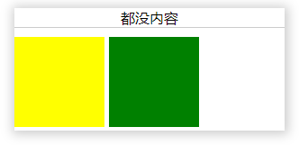
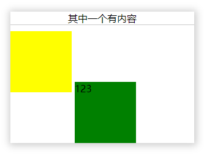
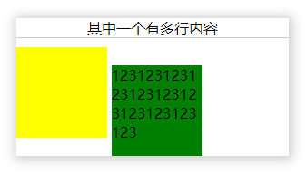
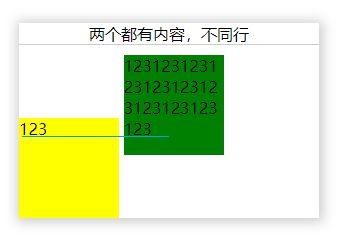
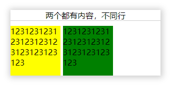

## inline-block的排版

两个设置为inline-block的元素的排布

demo

```html
<div style="display:inline-block"></div>
<div style="display:inline-block"></div>
```

如果两个元素都没内容的时候，如下



当有一个添加了内容



元素错位了，可是为什么没有内容时，不会相互影响呢？这时我们在想肯定是内容影响的，所以我们给两个div都加上内容。

如果给第二个元素多行内容呢



此时发现盒子的排布偏上了

**内容会影响inline-block的排布**

那么为什么会受内容的影响呢

**inline-block元素可以将对象呈递为内联对象，但是对象的内容作为块对象呈递**

1. 同一行的行内元素对齐方式默认是底部对齐，即`vertical-align：baseline`
2. 对于内容为空的`inline-block`元素而言，该元素的基线就是它的`margin`底边缘，否则就是元素的内部最后一行内联元素的基线





解决办法：

1. float浮动，这是备选方案，脱离文档流后页面布局不好控制
2. 给所有元素加内容例如空格符
3. 最实用的就是设置所有内联元素 vertical-align: top/middle/bottom; 属性，改变默认设置
