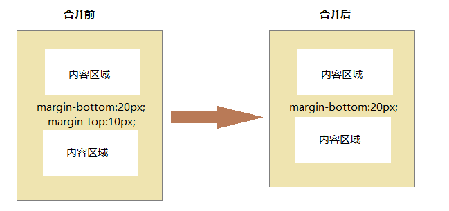
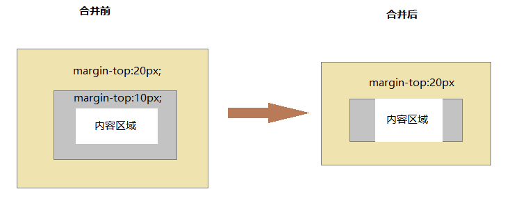
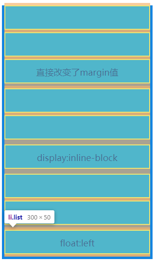
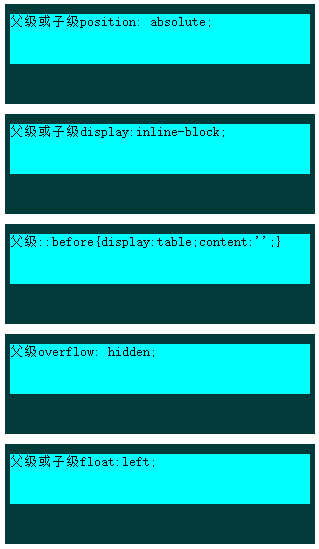

## margin合并和塌陷
> 外边距合并就是，当两个垂直外边距相遇时，它们将形成一个外边距。合并的外边距的高度等于两个发生合并的外边距的高度中的较大者。

发生场景
+ 两个元素是兄弟关系

+ 两个元素是父子关系(没有内边距或边框把外边距分隔开)

+ 一个空元素，没有边框和填充

## 解决办法

+ 兄弟关系的元素
 - 直接改变margin的值
 - 将兄弟元素设置display:inline-block
 - 使用float

 

+ 父子关系

**触发BFC** 
具有 BFC 特性的元素可以看作是隔离了的独立容器，容器里面的元素不会在布局上影响到外面的元素，并且 BFC 具有普通容器所没有的一些特性。 
通俗一点来讲，可以把 BFC 理解为一个封闭的大箱子，箱子内部的元素无论如何翻江倒海，都不会影响到外部。 
只要满足以下任意一条件,将会触发BFC: 

- body根元素
- 浮动元素：float：除none以为的值
- 绝对定位元素：position：absolute/fixed
- display：inline-block/table-cells/flex
- overflow：除了visible以外的值（hidden/auto/scroll)

