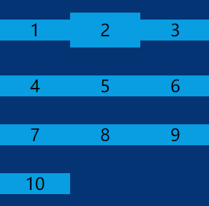

## flex中的direction

关于flex布局中属性flex-direction设置为column或column-reverse，主轴和交叉抽是怎么样的？

**flex-direction**主轴方向
+ row
+ row-reverse
+ column
+ column-reverse
```css
div{
    display:flex;
    flex-direction:row;
    flex-wrap:wrap;
    align-items:center;/*交叉轴的对齐方式*/
    /*justify-content:center 主轴的对齐方式*/
}
```

### row(默认值)
> 主轴为水平方向，起点在左端


### row-reverse
> 主轴为水平方向，起点在右端


### column
> 主轴为垂直方向，起点在上沿


### column-reverse
> 主轴为垂直方向，起点在下沿


