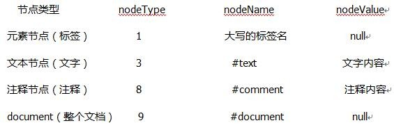

# DOM


@(基础)

## DOM获取元素方法

**通过id获取**

- 如果页面有两个以上相同的id名称，获取第一个
- 在ie6/7中，会将表单元素的name的属性值当做id的名称
- 如果没有获取到返回null
- 注意：通过id获取只能使用document
```js
document.getElementById("box")
```
**通过tagName获取一组元素**

- document上下文获取范围，可以通过改变前缀用来获取一定范围的元素
```js
document.getElementsByTagName("div")
```
**通过class的值获取一组元素**
```js
document.getElementsByClassName("banner")
```
**通过标签属性name的值获取一组元素**
- ie6-9浏览器下只对表单元素起作用
#####获取根元素
```js
document.documentElement
```
**获取body元素**
```js
document.body
```
### DOM节点和关系属性
节点：在页面中出现的所有东西都是节点，元素、注释、文本都是节点

**获取关系属性**
- childNodes获取所有子节点（一组）
- children获取所有元素子节点（一组）
- parentNode获取父亲节点
- previousSibling获取上一个节点
- previousElementSibling获取上一元素节点（不兼容）
- nextSibling获取弟弟节点
- nextElementSibling获取下一元素节点（不兼容）
- firstChild获取子节点中的第一个
- lastChild获取子节点中的最后一个


### DOM的增删改查
#### 1.创建元素
```js
document.createElement("div");
```
#### 2.向指定元素之后添加一个元素
```js
oDiv.appendChild(oList)
```
#### 3.将新元素添加到已有元素之前
```js
oldTag.parentNode.insertBefore(newTag,oldTag)
```
#### 4.创建属性节点
1.创建
```js
createAttribute()
```
2.设置
```js
setAttribute("属性名","属性值")
```
3.获取
```js
getAttribute("属性名")
```
4.删除
```js
removeAttribute("属性名")
```
ie6-8中不能获取className这个属性
#### 5.删除
父级元素.removeChild(删除的对象)
```js
oDiv.parentNode.removeChild(oDiv)
```
#### 6.替换
父级元素.replaceChild(替换的对象，被替换的对象)
```js
oDiv.parentNode.replaceChild(new,old)
```
#### 7.克隆元素
- 如果参数为true，是将当前元素下所有的元素克隆一份，包括内容
- 默认参数为false，只克隆当前元素
```js
oDiv.cloneNode(true)
```
### 获取已生效样式
#### 1.ele.style.opacity
- ele.style.opacity
这种方式只能获取行内样式
#### 2.window.getComputedStyle()
```js
window.getComputedStyle(ele,"before")
```
- 标准浏览器
- 返回一个所有生效样式的对象
- 返回值带单位，字符串，即使是opacity返回也是“0.8”字符串
- 获取伪类样式，第二个参数添加伪类名字
#### 3.ele.currentStyle
```js
ele.currentStyle
```
- 返回值和标准浏览器相同
- 不支持伪类样式

##### 【ps】
- 标准浏览器中，ele是getComputedStyle的一个参数
- ie8下，currentStyle是ele的属性

## 盒子模型


### 盒子模型属性

#### 一、
- clientWidth ： 内容+左右padding
- clientHeight ：内容+上下padding
- clientLeft ：左边框
- clientTop ： 上边框

#### 二、
- offsetWidth ：clientWidth+左右border
- offsetHeight ：clientHeight+上下border
- offsetParent ：offsetParent是谁取决于它的祖先元素是否包含定位属性（relative、absolute、fixed），如果有那么就是直接获取。如果没有继续向上一级祖先元素查找，直到body。
    - body.offsetParent=null
    - document.parentNode=null
- offsetLeft : 当前元素的外边框距离offsetParent的内边框的距离
- offsetTop ： 当前元素的上外边框距离offsetParent的上内边框的距离
     - body.offsetLeft=0
     - body.offsetTop=0
     
#### 三、
- scrollWidth：左padding+内容宽度
- scrollHeight：上padding+内容高度
- scrollLeft：滚动条滚出去的宽度
- scrollTop：滚动条滚出去的高度

**以上盒子模型中，只有scrollLeft和scrollTop支持赋值，并且这个值是有范围的。比如最小值是0，超出范围不生效**