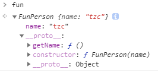
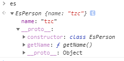

## ES6 Class和Function Class

Function Class
```js
function FunPerson(name){
    this.name=name
}
FunPerson.prototype.getName=function(){
    console.log(this.name)
}
```
ES6 Class
```js
class EsPerson{
    constructor(name){
        this.name=name;
    }
    getName(){
        console.log(this.name)
    }
}
```

浏览器中打印实例

Function Class
```js
let fun=new FunPerson('tzc');
fun;
```


ES6 Class
```js
let es=new EsPerson('tzc');
es;
```


通过图片会发现Function Class中的getName颜色是很清晰的，而ES6 Class的getName是有透明度的；<br>
带有透明度的说明是`不可枚举`字段

### enumerable
`Object.defineProperty(obj, prop, descriptor)`，这个方法又要提起了，第三个参数——属性描述符
+ `configurable`-为true时，该属性描述符才可以被改变
+ `enumerable`-为true时，属性才能够出现在对象的枚举属性中，默认为false
+ `value`-任意javascript值，默认undefined
+ `writable`-当且仅当该属性的writable为true时，value才能被改变
+ `get`-不多说
+ `set`-不多说

**注意：如果一个描述符同时有(value或writable)和(get或set)关键字，将会产生一个异常。**

继续<br>
`Object.getOwnPropertyDescriptor(obj, prop)`
```js
Object.getOwnPropertyDescriptor(fun.__proto__, 'getName');
{
    'configurable': true,
    'enumerable': true,
    'value': ()=>{},
    'writable': true
}
Object.getOwnPropertyDescriptor(es.__proto__, 'getName');
{
    'configurable': true,
    'enumerable': false,//区别
    'value': ()=>{},
    'writable': true
}
```

### 区分ES6 Class 和Function Class
有人会说用`Object.prototype.toString`，但是很遗憾，这个两种的类结果都是一样的
```js
Object.prototype.toString.call(FunPerson) // "[object Function]"
Object.prototype.toString.call(EsPerson) // "[object Function]"
```
**函数和class本身是有toString方法的**
```js
function isES6Class(klass) {
   return klass.toString().startsWith('class')
}
isES6Class(FunPerson) // false
isES6Class(EsPerson) // true
```

面试题：
```js
class Parent{}

class Child extends Parent{constructor(){super()}}

Child.__proto__===Parent
//true
Child.prototype.__proto__===Parent.prototype
//true
Child.__proto__.prototype===Parent.prototype
//true
```

原理：
```js
function _inheritsLoose(subClass, superClass) {
  subClass.prototype = Object.create(superClass.prototype);
  subClass.prototype.constructor = subClass;
  subClass.__proto__ = superClass;
}

var Parent = function Parent() {};

var Child = /*#__PURE__*/ (function(_Parent) {
  _inheritsLoose(Child, _Parent);

  function Child() {
    return _Parent.call(this) || this;
  }

  return Child;
})(Parent);
```

