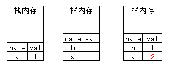
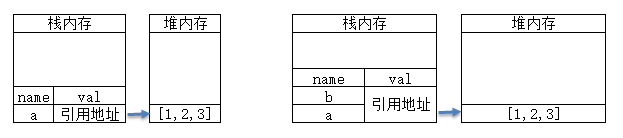

## 堆栈内存及垃圾回收机制

### 栈堆与队列
与c语言这种底层语言不同，JavaScript并没有提供内存管理的接口，而是在创建变量时自动分配内存，当变量不再需要使用时自动释放，也就是我们所常说的垃圾回收机制。<br>
但不管是什么程序语言，内存的声明周期都满足以下三个阶段：
+ 分配你需要的内存空间
+ 使用分配到的内存(读、写)
+ 不需要时将其释放或归还

大部分语言对于第二步是明确的，但对于JavaScript而言三步都是隐含的，也正是因如此才让JavaScript开发者产生了不用关心内存管理的错觉。<br>
JavaScript内存空间分为`栈，堆，池，队列`。其中`栈存放变量，基本类型数据与指向复杂类型数据的引用指针`；`堆存放复杂类型数据`；`池又称为常量池，用于存放常量`；而队列在任务队列也会使用

#### 栈数据结构
栈数据结构具备`FIOL`(first in out last)`先进后出`

在js中数据类型一般分类基本数据类型（Number Boolean Null Undefined String Symbol）与引用数据类型（Object Array Function ...），其中栈一般用于存放基本类型数据，例如以下代码在栈内存中分布：
```js
var a=1;
var b=a;
a=2;
```


可以看到基本类型数据的变量名与值都存放在栈内存中，当我们将变量a复制给b时，栈会新开内存用于存放变量b，且当我们修改变量a时对变量b不会造成任何影响，因为a与b是互不相关的两份数据。

#### 堆数据结构
堆数据结构是一种无序的树状结构，同时它还满足key-value键值对的存储方式；我们只用知道key名，就能通过key查找到对应的value。比较经典的就是书架存书的例子，我们知道书名，就可以找到对应的书籍。<br>
在js中堆内存一般用于存储引用类型的数据，需要注意的是由于引用类型的数据一般可以拓展，数据大小可变，所以存放在堆内存中；但对引用类型数据的引用地址是固定的，所以地址指向还是会存放在栈内存中。
```js
var a=[1,2,3];
var b=a;
a.push(4);
```



当我们创建数组a时，栈内存中只保存了变量a与指向堆内存中数组的地址指针，而当我们将a复制给变量b时，其实只是复制了一份地址指针，两者还是指向同一数组，无论谁修改，都会影响彼此。
[深拷贝与浅拷贝的区别，实现深拷贝的几种方法](https://www.cnblogs.com/echolun/p/7889848.html)

#### 队列
队列具有`FIFO`（First In First Out）`先进先出`的特性，与栈内存不同的是，栈内存只存在一个出口用于数据进栈出栈；而队列有一个入口与一个出口，理解队列一个较为实际的例子就像我们排队取餐，先排队的永远能先取到餐。

在js中使用队列较为突出的就是js执行机制中的event loop事件循环，如果大家对于js事件执行机制有兴趣，可以 [JS执行机制详解，定时器时间间隔的真正含义](https://www.cnblogs.com/echolun/p/10765562.html) 这篇文章

### 垃圾回收机制

#### js的内存回收
在js中，垃圾回收器每隔一段时间就会找出那些不再使用的数据，并释放其所占用的内存空间。<br>
以全局变量和局部变量来说，函数中的局部变量在函数执行结束后这些变量已经不再被需要，所以垃圾回收器会识别并释放它们。<br>
而对于全局变量，垃圾回收器很难判断这些变量什么时候才不被需要，所以尽量少使用全局变量<br>

#### 垃圾回收的两种模式
**引用计数**
引用计数的判断原理很简单，就是看一份数据是否还有指向它的引用，如果没有任何对象再指向它，那么垃圾回收器就会回收，举个例子：
```js
// 创建一个对象，由变量o指向这个对象的两个属性
var o = {
    name: 'tzc',
    age: 12
};
// name虽然设置为了null，但o依旧有name属性的引用
o.name = null;
var s = o;
// 我们修改并释放了o对于对象的引用，但变量s依旧存在引用
o = null;
// 变量s也不再引用，对象很快会被垃圾回收器释放
s = null;
```

引用计数存在一个很大的问题，就是对象间的循环引用，比如如下代码中，对象o1与o2相互引用，即便函数执行完毕，垃圾回收器通过引用计数也无法释放它们。

```js
function f() {
    var o1 = {};
    var o2 = {};
    o1.a = o2; // o1 引用 o2
    o2.a = o1; // o2 引用 o1
    return;
};
f();
```

**标记清除**
标记清除的概念也好理解，从根部出发看是否能达到某个对象，如果能达到则认定这个对象还被需要，如果无法达到，则释放它，这个过程大致分为三步:

+ 垃圾回收器创建roots列表，roots通常是代码中保留引用的全局变量，在js中，我们一般认定全局对象window作为root，也就是所谓的根部。
+ 从根部出发检查所有 的roots，所有的children也会被递归检查，能从root到达的都会被标记为active。
+ 未被标记为active的数据被认定为不再需要，垃圾回收器开始释放它们。

当一个对象零引用时，我们从根部一定无法到达；但反过来，从根部无法到达的不一定是严格意义上的零引用，比如循环引用，所以标记清除要更优于引用计数。

### 避免内存泄漏

+ 减少全局变量
+ 定时器和回调函数(事件)
+ 闭包
+ DOM的引用

参考<br>
[JS 从内存空间谈到垃圾回收机制](https://www.cnblogs.com/echolun/p/11503915.html)