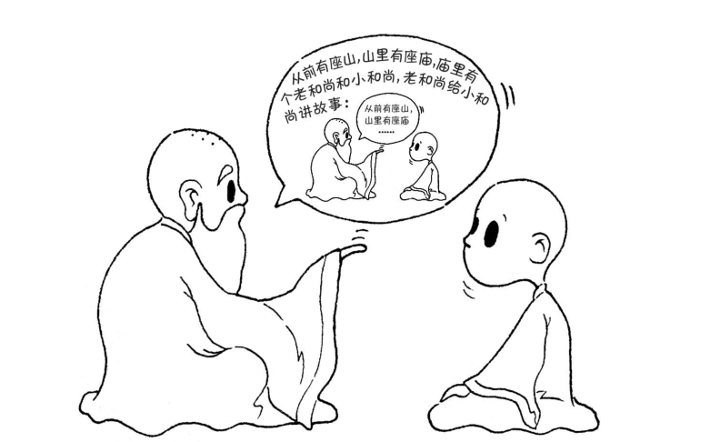
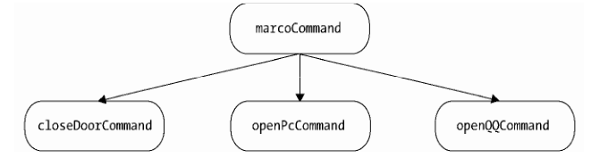

# 组合模式

;

> 组合模式：就是用小的子对象来构建更大的对象，而这些小的子对象本身也许是由更小的“孙对象”构成的。

## 一、回顾宏命令
命令模式中我们介绍了宏命令的结构和作用，宏命令对象包含了一组具体的子命令对象，不管是宏命令对象还是子命令对象，都有一个execute方法负责执行命令；

```js
var closeDoorCommand={
    execute:function(){
        console.log('关门')
    }
};
var openPcCommand={
    execute:function(){
        console.log('开电脑')
    }
};
var openQQCommand={
    execute:function(){
        console.log('打开QQ')
    }
};
var MacroCommand=function(){
    return {
        commandList:[],
        add:function(command){
            this.commadList.push(command);
        },
        execute:function(){
            for (var i=0,command;command=this.commandList[i++]){
                command.execute();
            }
        }
    }
}

var macroCommand=MacroCommand();
macroCommand.add(closeDoorCommand);
macroCommand.add(openPcCommand);
macroCommand.add(openQQCommand);
macroCommand.execute();
```
通过观察这段代码，我们很容易发现，宏命令中包含了一组子命令，它们组成了一个树形结
构，这里是一棵结构非常简单的树
;
