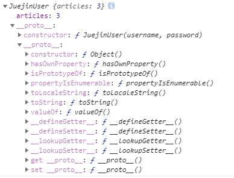
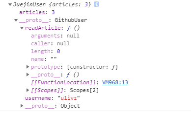
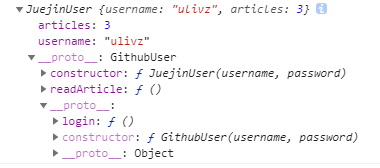

## 深入js继承原理

### 类
我们分别用ES6、TypeScript、ES5写一个类，我们创建一个GithubUser类，它拥有一个login方法，和一个静态方法getPublicServices, 用于获取public的方法列表：
```js
class GithubUser {
    static getPublicServices() {
        return ['login']
    }
    constructor(username, password) {
        this.username = username
        this.password = password
    }
    login() {
        console.log(this.username + '要登录Github，密码是' + this.password)
    }
}
```
实际上，ES6这个类的写法有一个弊病，实际上，密码password应该是Github用户一个私有变量，接下来，我们用TypeScript重写一下：
```js
class GithubUser {
    static getPublicServices() {
        return ['login']
    }
    public username: string
    private password: string
    constructor(username, password) {
        this.username = username
        this.password = password
    }
    public login(): void {
        console.log(this.username + '要登录Github，密码是' + this.password)
    }
}
```
如此一来，password就只能在类的内部访问了。好了，问题来了，如果结合原型讲解那一文的知识，来用ES5实现这个类呢？
```js
function GithubUser(username, password) {
    // private属性
    let _password = password 
    // public属性
    this.username = username 
    // public方法
    GithubUser.prototype.login = function () {
        console.log(this.username + '要登录Github，密码是' + _password)
    }
}
// 静态方法
GithubUser.getPublicServices = function () {
    return ['login']
}
```
**值得注意的是，我们一般都会把`共有`方法放在类的原型上，而不会采用`this.login = function() {}`这种写法。因为只有这样，才能让多个实例引用同一个共有方法，从而避免重复创建方法的浪费。**

是不是很直观！留下2个疑问:

如何实现`private`方法呢?<br>
能否实现`protected`属性/方法呢?

### 继承
掘金的用户都应该知道，我们可以选择直接使用 `Github` 登录，那么，结合上一节，我们如果创建了一个 `JuejinUser` 来继承 `GithubUser`，那么 `JuejinUser` 及其实例就可以调用 `Github` 的 `login` 方法了。首先，先写出这个简单 `JuejinUser` 类：
```js
function JuejinUser(username, password) {
    // TODO need implementation
    this.articles = 3 // 文章数量
    JuejinUser.prototype.readArticle = function () {
        console.log('Read article')
    }
}
```
+ 类式继承
+ 构造函数式继承
+ 组合式继承
+ 原型继承
+ 寄生式继承
+ 寄生组合式继承

#### 类式继承
若通过`new Parent()`创建了`Child`,则 `Child.__proto__ = Parent.prototype`，而原型链则是顺着`__proto__`依次向上查找。因此，可以通过修改子类的原型为父类的实例来实现继承

直觉实现
```js
function GithubUser(username, password) {
    let _password = password 
    this.username = username 
    GithubUser.prototype.login = function () {
        console.log(this.username + '要登录Github，密码是' + _password)
    }
}

function JuejinUser(username, password) {
    this.articles = 3 // 文章数量
    JuejinUser.prototype = new GithubUser(username, password)
    JuejinUser.prototype.readArticle = function () {
        console.log('Read article')
    }
}

const juejinUser1 = new JuejinUser('ulivz', 'xxx', 3)
console.log(juejinUser1)
```

在浏览器中查看原型链：



诶，不对啊，很明显 `juejinUser1.__proto__` 并不是 `GithubUser` 的一个实例。

实际上，这是因为之前我们为了能够在类的方法中读取私有变量，将`JuejinUser.prototype`的重新赋值放在了构造函数中，而此时实例已经创建，其`__proto__`还还指向老的`JuejinUser.prototype`。所以，重新赋值一下实例的__proto__就可以解决这个问题：
```js
function GithubUser(username, password) {
    let _password = password 
    this.username = username 
    GithubUser.prototype.login = function () {
        console.log(this.username + '要登录Github，密码是' + _password)
    }
}

function JuejinUser(username, password) {
    this.articles = 3 // 文章数量
    const prototype = new GithubUser(username, password)
    // JuejinUser.prototype = prototype // 这一行已经没有意义了
    prototype.readArticle = function () {
        console.log('Read article')
    }
    this.__proto__ = prototype
}

const juejinUser1 = new JuejinUser('ulivz', 'xxx', 3)
console.log(juejinUser1)
```
接着查看原型链：



原型链已经出来，问题“好像”得到了完美解决！但实际上还是有明显的问题：<br>
+ 在原型链上创建了属性（一般来说，这不是一种好的实践）
+ 私自篡改`__proto__`，导致 `juejinUser1.__proto__ === JuejinUser.prototype` 不成立！从而导致 `juejinUser1 instanceof JuejinUser` 也不成立。这不应该发生！

造成这种问题的根本原因`在于我们在实例化的时候动态修改了原型`，那有没有一种方法可以在实例化之前就固定好类的原型的refernce呢？<br>
我们可以考虑把类的原型的赋值挪出来
```js
function JuejinUser(username, password) {
    this.articles = 3 // 文章数量
}

// 此时构造函数还未运行，无法访问 username 和 password !!
JuejinUser.prototype =  new GithubUser() 

prototype.readArticle = function () {
    console.log('Read article')
}
```
但是这样做又有更明显的缺点：

+ 父类过早地被创建，导致无法接受子类的动态参数；
+ 仍然在原型上创建了属性，此时，多个子类的实例将共享同一个父类的属性，完蛋, 会互相影响!

```js
function GithubUser(username) {
    this.username = 'Unknown' 
}

function JuejinUser(username, password) {

}

JuejinUser.prototype =  new GithubUser() 
const juejinUser1 = new JuejinUser('ulivz', 'xxx', 3)
const juejinUser2 = new JuejinUser('egoist', 'xxx', 0)

//  这就是把属性定义在原型链上的致命缺点，你可以直接访问，但修改就是一件难事了！
console.log(juejinUser1.username) // 'Unknown'
juejinUser1.__proto__.username = 'U' 
console.log(juejinUser1.username) // 'U'

// 卧槽，无情地影响了另一个实例!!!
console.log(juejinUser2.username) // 'U'
```
由此可见，`类式继承`的两种方式缺陷太多！

#### 构造函数式继承
通过 call() 来实现继承 (相应的, 你也可以用apply)。
```js
function GithubUser(username, password) {
    let _password = password 
    this.username = username 
    GithubUser.prototype.login = function () {
        console.log(this.username + '要登录Github，密码是' + _password)
    }
}

function JuejinUser(username, password) {
    GithubUser.call(this, username, password)
    this.articles = 3 // 文章数量
}

const juejinUser1 = new JuejinUser('ulivz', 'xxx')
console.log(juejinUser1.username) // ulivz
console.log(juejinUser1.username) // xxx
console.log(juejinUser1.login()) // TypeError: juejinUser1.login is not a function
```
本继承方法也存在明显的缺陷—— 构造函数式继承并`没有继承父类原型上的方法`

#### 组合式继承
既然上述两种方法各有缺点，但是又各有所长，那么我们是否可以将其结合起来使用呢？没错，这种继承方式就叫做——组合式继承:
```js
function GithubUser(username, password) {
    let _password = password 
    this.username = username 
    GithubUser.prototype.login = function () {
        console.log(this.username + '要登录Github，密码是' + _password)
    }
}

function JuejinUser(username, password) {
    GithubUser.call(this, username, password) // 第二次执行 GithubUser 的构造函数
    this.articles = 3 // 文章数量
}

JuejinUser.prototype = new GithubUser(); // 第二次执行 GithubUser 的构造函数
const juejinUser1 = new JuejinUser('ulivz', 'xxx')
```
虽然这种方式弥补了上述两种方式的一些缺陷，但有些问题仍然存在：

+ 子类仍旧无法传递动态参数给父类！
+ 父类的构造函数被调用了两次。

本方法很明显`执行了两次父类的构造函数`，因此，这也不是我们最终想要的继承方式。

#### 原型继承
原型继承实际上是对`类式继承`的一种封装，只不过其独特之处在于，定义了一个干净的中间类，如下：
```js
function createObject(o) {
    // 创建临时类
    function f() {
        
    }
    // 修改类的原型为o, 于是f的实例都将继承o上的方法
    f.prototype = o
    return new f()
}
```
熟悉ES5的同学，会注意到，这不就是 Object.create 吗？没错，你可以认为是如此。

既然只是类式继承的一种封装，其使用方式自然如下：
```js
JuejinUser.prototype = createObject(GithubUser)
```
也就仍然没有解决类式继承的一些问题。

#### 寄生继承
`寄生继承`是依托于一个对象而生的一种继承方式，因此称之为寄生
```js
const juejinUserSample = {
    username: 'ulivz',
    password: 'xxx'
}

function JuejinUser(obj) {
    var o = Object.create(obj)
     o.prototype.readArticle = function () {
        console.log('Read article')
    }
    return o;
}

var myComputer = new CreateComputer(computer);
```
由于实际生产中，继承一个单例对象的场景实在是太少，因此，我们仍然没有找到最佳的继承方法

#### 寄生组合式继承
看起来很玄乎，先上代码:
```js
// 寄生组合式继承的核心方法
function inherit(child, parent) {
    // 继承父类的原型
    const p = Object.create(parent.prototype)
    // 重写子类的原型
    child.prototype = p
    // 重写被污染的子类的constructor
    p.constructor = child
}

// GithubUser, 父类
function GithubUser(username, password) {
    let _password = password 
    this.username = username 
}

GithubUser.prototype.login = function () {
    console.log(this.username + '要登录Github，密码是' + _password)
}

// GithubUser, 子类
function JuejinUser(username, password) {
    GithubUser.call(this, username, password) // 继承属性
    this.articles = 3 // 文章数量
}

// 实现原型上的方法
inherit(JuejinUser, GithubUser)

// 在原型上添加新方法
JuejinUser.prototype.readArticle = function () {
    console.log('Read article')
}

const juejinUser1 = new JuejinUser('ulivz', 'xxx')
console.log(juejinUser1)
```
来浏览器中查看结果：



简单说明一下：

+ 子类继承了父类的属性和方法，同时，属性没有被创建在原型链上，因此多个子类不会共享同一个属性。
+ 子类可以传递动态参数给父类！
+ 父类的构造函数只执行了一次！

Nice！这才是我们想要的继承方法。然而，仍然存在一个美中不足的问题：

+ 子类想要在原型上添加方法，必须在继承之后添加，否则将覆盖掉原有原型上的方法。这样的话 若是已经存在的两个类，就不好办了。
所以，我们可以将其优化一下：
```js
function inherit(child, parent) {
    // 继承父类的原型
    const parentPrototype = Object.create(parent.prototype)
    // 将父类原型和子类原型合并，并赋值给子类的原型
    child.prototype = Object.assign(parentPrototype, child.prototype)
    // 重写被污染的子类的constructor
    p.constructor = child
}
```
但实际上，使用Object.assign来进行copy仍然不是最好的方法,

The Object.assign() method is used to copy the values of all enumerable own properties from one or more source objects to a target object. It will return the target object.

上述的继承方法只适用于copy原型链上可枚举的方法，此外，如果子类本身已经继承自某个类，以上的继承将不能满足要求。

#### 终极版继承
为了让代码更清晰，我用ES6的一些API，写出了这个我所认为的最合理的继承方法:

+ 用`Reflect`代替了`Object`；
+ 用`Reflect.getPrototypeOf`来代替`ob.__ptoto__`;
+ 用`Reflect.ownKeys`来读取所有可枚举/不可枚举/Symbol的属性;
+ 用`Reflect.getOwnPropertyDescriptor`读取属性描述符;
+ 用`Reflect.setPrototypeOf`来设置`__ptoto__`。

```js
 
// 不同于object.assign, 该 merge方法会复制所有的源键
// 不管键名是 Symbol 或字符串，也不管是否可枚举
function fancyShadowMerge(target, source) {
    for (const key of Reflect.ownKeys(source)) {
        Reflect.defineProperty(target, key, Reflect.getOwnPropertyDescriptor(source, key))
    }
    return target
}

// Core
function inherit(child, parent) {
    const objectPrototype = Object.prototype
    // 继承父类的原型
    const parentPrototype = Object.create(parent.prototype)
    let childPrototype = child.prototype
    // 若子类没有继承任何类，直接合并子类原型和父类原型上的所有方法
    // 包含可枚举/不可枚举的方法
    if (Reflect.getPrototypeOf(childPrototype) === objectPrototype) {
        child.prototype = fancyShadowMerge(parentPrototype, childPrototype)
    } else {
        // 若子类已经继承子某个类
        // 父类的原型将在子类原型链的尽头补全
        while (Reflect.getPrototypeOf(childPrototype) !== objectPrototype) {
			childPrototype = Reflect.getPrototypeOf(childPrototype)
        }
		Reflect.setPrototypeOf(childPrototype, parent.prototype)
    }
    // 重写被污染的子类的constructor
    parentPrototype.constructor = child
}
```
测试：
```js
// GithubUser
function GithubUser(username, password) {
    let _password = password
    this.username = username
}

GithubUser.prototype.login = function () {
    console.log(this.username + '要登录Github，密码是' + _password)
}

// JuejinUser
function JuejinUser(username, password) {
    GithubUser.call(this, username, password)
    WeiboUser.call(this, username, password)
    this.articles = 3
}

JuejinUser.prototype.readArticle = function () {
    console.log('Read article')
}

// WeiboUser
function WeiboUser(username, password) {
    this.key = username + password
}

WeiboUser.prototype.compose = function () {
    console.log('compose')
}

// 先让 JuejinUser 继承 GithubUser，然后就可以用github登录掘金了
inherit(JuejinUser, GithubUser) 

// 再让 JuejinUser 继承 WeiboUser，然后就可以用weibo登录掘金了
inherit(JuejinUser, WeiboUser)  

const juejinUser1 = new JuejinUser('ulivz', 'xxx')

console.log(juejinUser1)

console.log(juejinUser1 instanceof GithubUser) // true
console.log(juejinUser1 instanceof WeiboUser) // true
```

### 总结
+ 我们可以使用function来模拟一个类；
+ JavaScript类的继承是基于原型的, 一个完善的继承方法，其继承过程是相当复杂的；
+ 虽然建议实际生产中直接使用ES6的继承，但仍建议深入了解内部继承机制。
+ 在ES6中，默认所有类的方法是不可枚举的！

[来源](https://ulivz.com/2016/12/20/javascript-extend/)
