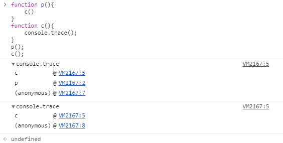

## 详解console

onsole 的功能主要在于控制台打印，它可以打印任何字符、对象、甚至 DOM 元素和系统信息，下面一一介绍。

#### console.log()|info()|debug()|warn()|error()

新版 chrome 控制台可以将打印信息分类：

log() 与 info() 都对应 info，warn() 对应 warnings，error() 对应 errors，而 debug() 对应 verbose，因此建议在合适的场景使用合适的打印习惯，这样排查问题时也可以有针对性的筛选。

比如调试信息可以用 console.debug 仅在调试环境下输出，调试者即便开启了调试参数也不会影响正常 info 的查看，因为调试信息都输出在 verbose 中。

#### 使用占位符
+ `%o`：对象
+ `%s`：字符串
+ `%d`：数字

#### css样式
+ `%c`：对象

#### console.dir()
按 JSON 模式输出。笔者在这里也补充一句：console.log() 会自动判断类型，如果内容是 DOM 属性，则输出 DOM 树，但 console.dir 会强制以 JSON 模式输出，用在 DOM 对象时可强制转换为 JSON 输出。

#### console.table()

#### console.group() & console.groupEnd()

#### console.count()
count() 用来打印调用次数，一般用在循环或递归函数中。接收一个 label 参数以定制输出，默认直接输出 1 2 3 数字。

#### console.assert()
console 版断言工具，当且仅当第一个参数值为 false 时才打印第二个参数作为输出。

#### console.trace()
打印此时的调用栈，在打印辅助调试信息时非常有用。

#### console.time()
打印代码执行时间，性能优化和监控场景比较常见。

#### console.memory

#### console.clear()
清空控制台
