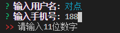
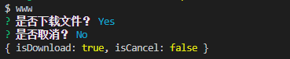
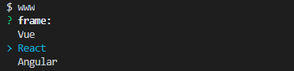
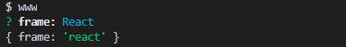
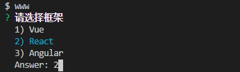
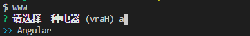
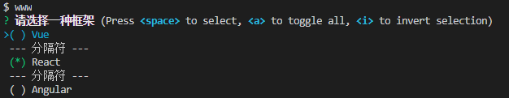

## inquirer.js-用户命令行交互工具

[inquirer.js](https://www.npmjs.com/package/inquirer)
```npm install inquirer```

### 对象

#### Question

+ type：(String),表示提问的类型，包括：`input`, `confirm`, `list`, `rawlist`, `expand`, `checkbox`, `password`, `editor`；
+ name: (String)存储当前问题回答的变量；
+ message：(String|Function)问题的描述；
+ default： (String|Number|Boolean|Array|Function)默认值；
+ choices： (Array|Function)列表选项，在某些type下可用，并且包含一个分隔符(separator)；
+ validate： (Function)对用户的回答进行校验；
+ filter： (Function)对用户的回答进行过滤处理，返回处理后的值；
+ transformer： (Function)对用户回答的显示效果进行处理(如：修改回答的字体或背景颜色)，但不会影响最终的答案的内容；
+ when： (Function)return  Boolean根据前面问题的回答，判断当前问题是否需要被回答；
+ pageSize：(Number)修改某些type类型下的渲染行数；
+ prefix：(String)修改message默认前缀；
+ suffix：(String)修改message默认后缀。
+ askAnswered：(Boolean)如果答案已经存在，则强制提出问题
+ loop:(Boolean)启用列表循环,默认:`true`

#### Answers
+ key: Question对象的name属性
+ value:
  - confirm:(Boolean)
  - input:(Boolean)
  - number:(Boolean)
  - rawlist:(Boolean)

### 方法

#### inquirer.prompt(questions, answers) -> promise

下面我们根据不同的`type`来进行举例

**input**
```js
const promptList = [
  {
    type: 'input',
    message: '设置一个用户名:',
    name: 'name',
    default: "test_user" // 默认值
},{
    type: 'input',
    message: '请输入手机号:',
    name: 'phone',
    validate: function(val) {
        if(val.match(/\d{11}/g)) { // 校验位数
            return val;
        }
        return "请输入11位数字";
    }
}]
inquirer.prompt(promptList).then(answer=>{
  console.log(answer)
})
```



**confirm**

```js
const promptList=[
  {
    type:'confirm',
    name:'isDownload',
    message:'是否下载文件？'
  },{
    type:'confirm',
    name:'isCancel',
    message:'是否取消？',
    when:function(answers){
      return answers.watch
    }
  }
]
```


**list**

```js
const promptList=[
  {
    type:'list',
    name:'frame',
    choices:[
      "Vue",
      "React",
      "Angular"
    ],
    filter: function (val) { // 使用filter将回答变为小写
      return val.toLowerCase();
    }
  }
]
```




**rawlist**

```js
const promptList=[
  {
    type:'rawlist',
    name:'frame',
    message:"请选择框架",
    choices:[
      "Vue",
      "React",
      "Angular"
    ]
  }
]
```


**expand**

```js
const promptList=[
  {
    type:'expand',
    name:'frame',
    message:"请选择一种框架",
    choices:[
     {
       key:'v',
       name:'Vue',
       value:'vue'
     },
     {
       key:'r',
       name:'React',
       value:'react'
     },{
       key:'a',
       name:'Angular',
       value:'angular'
     }
    ]
  }
]
```



**checkbox**

```js
const promptList=[
  {
    type:'checkbox',
    name:'frame',
    message:"请选择一种框架",
    choices:[
     {
       name:'Vue',
     },
     new inquirer.Separator("--- 分隔符 ---"),
     {
       name:'React',
       checked:true
     },
     new inquirer.Separator("--- 分隔符 ---"),
     {
       name:'Angular',
     }
    ]
  }
]
```




#### inquirer.registerPrompt(name, prompt)

注册一个自定义插件

+ name:Question的type
+ prompt:提示对象
#### inquirer.createPromptModule() -> prompt function

创建一个自包含的查询器模块。

```js
var prompt = inquirer.createPromptModule();

prompt(questions).then(/* ... */);
```
