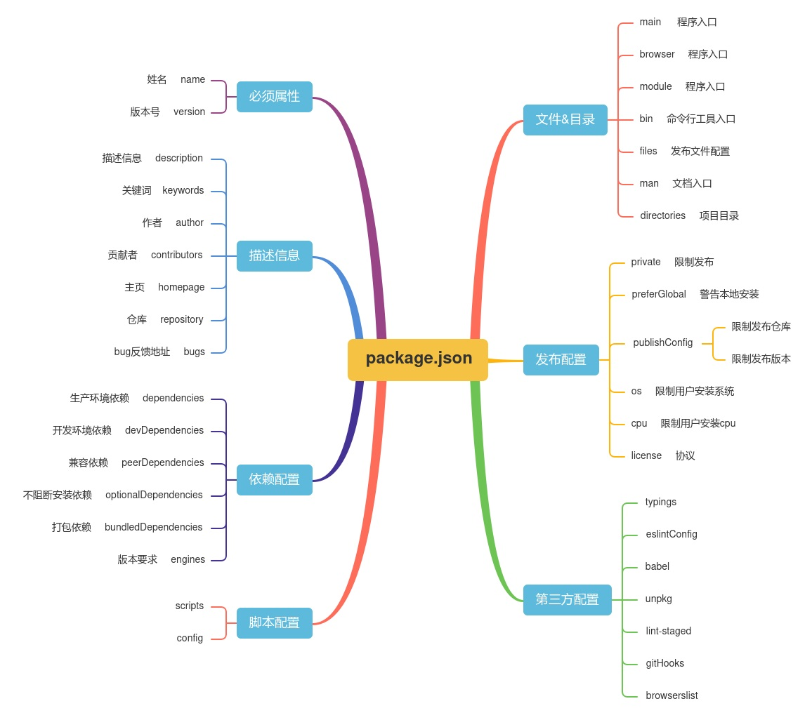

### 一、必须属性
package.json中最重要的两个字段就是name和version，它们都是必须的，如果没有，就无法正常执行npm install命令。npm规定package.json文件是由名称和版本号作为唯一标识符的。

#### 1. name
name很容易理解，就是项目的名称，它是一个字符串。在给name字段命名时，需要注意以下几点：

+ 名称的长度必须小于或等于214个字符，不能以“.”和“_”开头，不能包含大写字母（这是因为当软件包在npm上发布时，会基于此属性获得自己的URL，所以不能包含非URL安全字符（non-url-safe））；
+ 名称可以作为参数被传入require("")，用来导入模块，所以应当尽可能的简短、语义化；
+ 名称不能和其他模块的名称重复，可以使用npm view命令查询模块明是否重复，如果不重复就会提示404
+ 如果npm包上有对应的包，则会显示包的详细信息

实际上，我们平时开发的很多项目并不会发布在npm上，所以这个名称是否标准可能就不是那么重要，它不会影响项目的正常运行。如果需要发布在npm上，name字段一定要符合要求。
#### 2. version
version字段表示该项目包的版本号，它是一个字符串。在每次项目改动后，即将发布时，都要同步的去更改项目的版本号。版本号的使用规范如下：

+ 版本号的命名遵循语义化版本2.0.0规范，格式为：**主版本号.次版本号.修订号**，通常情况下，修改主版本号是做了大的功能性的改动，修改次版本号是新增了新功能，修改修订号就是修复了一些bug；
+ 如果某个版本的改动较大，并且不稳定，可能如法满足预期的兼容性需求，就需要发布先行版本，先行版本通过会加在版本号的后面，通过“-”号连接以点分隔的标识符和版本编译信息：内部版本（alpha）、公测版本（beta）和候选版本（rc，即release candiate）。

可以通过以下命令来查看npm包的版本信息，以react为例：
```js
// 查看最新版本
npm view react version
// 查看所有版本
npm view react versions
```


### 二 描述信息

#### 1. description
description字段用来描述这个项目包，它是一个字符串，可以让其他开发者在 npm 的搜索中发现我们的项目包。
#### 2. keywords
keywords字段是一个字符串数组，表示这个项目包的关键词。和description一样，都是用来增加项目包的曝光率的。
#### 3. author
author顾名思义就是作者，表示该项目包的作者。它有两种形式，一种是字符串格式：
```js
"author": "CUGGZ <xxxxx@xx.com> (https://juejin.cn/user/3544481220801815)"
```
另一种是对象形式：
```js
"author": {
  "name" : "CUGGZ",
  "email" : "xxxxx@xx.com",
  "url" : "https://juejin.cn/user/3544481220801815"
}
```
#### 4. contributors
contributors表示该项目包的贡献者，和author不同的是，该字段是一个数组，包含所有的贡献者，它同样有两种写法：

```js
"contributors": [
  "CUGGZ0 <xxxxx@xx.com> (https://juejin.cn/user/3544481220801815)",
  "CUGGZ1 <xxxxx@xx.com> (https://juejin.cn/user/3544481220801815)"
 ]
```
```js
"contributors": [
  {
   "name" : "CUGGZ0",
   "email" : "xxxxx@xx.com",
   "url" : "https://juejin.cn/user/3544481220801815"
 },
  {
   "name" : "CUGGZ1",
   "email" : "xxxxx@xx.com",
   "url" : "https://juejin.cn/user/3544481220801815"
 }
 ]
```

#### 5. homepage
homepage就是项目的主页地址了，它是一个字符串。
#### 6. repository
repository表示代码的存放仓库地址，通常有两种书写形式。第一种是字符串形式：

```js
"repository": "https://github.com/facebook/react.git"
```
除此之外，还可以显式地设置版本控制系统，这时就是对象的形式：
```js
"repository": {
  "type": "git",
  "url": "https://github.com/facebook/react.git"
}
```
#### 7. bugs
bugs表示项目提交问题的地址，该字段是一个对象，可以添加一个提交问题的地址和反馈的邮箱：
```js
"bugs": { 
  "url" : "https://github.com/facebook/react/issues",
  "email" : "xxxxx@xx.com"
}
```

### 三、依赖配置
通常情况下，我们的项目会依赖一个或者多个外部的依赖包，根据依赖包的不同用途，可以将他们配置在下面的五个属性下：dependencies、devDependencies、peerDependencies、bundledDependencies、optionalDependencies 。下面就来看看每个属性的含义。

#### 1. dependencies
dependencies字段中声明的是项目的生产环境中所必须的依赖包。当使用 npm 或 yarn 安装npm包时，该npm包会被自动插入到此配置项中：

```js
npm install <PACKAGENAME>
yarn add <PACKAGENAME>
```
当在安装依赖时使用--save参数，也会将新安装的npm包写入dependencies属性。
```js
npm install --save <PACKAGENAME>
```
该字段的值是一个对象，该对象的各个成员，分别由模块名和对应的版本要求组成，表示依赖的模块及其版本范围。
```js
"dependencies": { 
   "react": "^17.0.2", 
   "react-dom": "^17.0.2", 
   "react-scripts": "4.0.3",
},
```
这里每一项配置都是一个键值对（key-value）， key表示模块名称，value表示模块的版本号。版本号遵循**主版本号.次版本号.修订号**的格式规定：

+ **固定版本**： 上面的react-scripts的版本4.0.3就是固定版本，安装时只安装这个指定的版本；
+ **波浪号**： 比如~4.0.3，表示安装4.0.x的最新版本（不低于4.0.3），也就是说安装时不会改变主版本号和次版本号；
+ **插入号**： 比如上面 react 的版本^17.0.2，表示安装17.x.x的最新版本（不低于17.0.2），也就是说安装时不会改变主版本号。如果主版本号为0，那么插入号和波浪号的行为是一致的；
+ **latest**：安装最新的版本。

!>需要注意，不要把测试或者过渡性的依赖放在dependencies，避免生产环境出现意外的问题。

#### 2. devDependencies
evDependencies中声明的是开发阶段需要的依赖包，如Webpack、Eslint、Babel等，用于辅助开发。它们不同于 dependencies，因为它们只需安装在开发设备上，而无需在生产环境中运行代码。

当打包上线时并不需要这些包，所以可以把这些依赖添加到 devDependencies 中，这些依赖依然会在本地指定 npm install 时被安装和管理，但是不会被安装到生产环境中。

当使用 npm 或 yarn 安装软件包时，指定以下参数后，新安装的npm包会被自动插入到此列表中：

#### 3. peerDependencies
有些情况下，我们的项目和所依赖的模块，都会同时依赖另一个模块，但是所依赖的版本不一样。比如，我们的项目依赖A模块和B模块的1.0版，而A模块本身又依赖B模块的2.0版。大多数情况下，这不是问题，B模块的两个版本可以并存，同时运行。但是，有一种情况，会出现问题，就是这种依赖关系将暴露给用户。

最典型的场景就是插件，比如A模块是B模块的插件。用户安装的B模块是1.0版本，但是A插件只能和2.0版本的B模块一起使用。这时，用户要是将1.0版本的B的实例传给A，就会出现问题。因此，需要一种机制，在模板安装的时候提醒用户，如果A和B一起安装，那么B必须是2.0模块。

peerDependencies字段就是用来供插件指定其所需要的主工具的版本。
```js
"name": "chai-as-promised",
"peerDependencies": { 
   "chai": "1.x"
}
```
上面代码指定在安装chai-as-promised模块时，主程序chai必须一起安装，而且chai的版本必须是1.x。如果项目指定的依赖是chai的2.0版本，就会报错。

需要注意，从npm 3.0版开始，peerDependencies不再会默认安装了。

#### 4. optionalDependencies
如果需要在找不到包或者安装包失败时，npm仍然能够继续运行，则可以将该包放在optionalDependencies对象中，optionalDependencies对象中的包会覆盖dependencies中同名的包，所以只需在一个地方进行设置即可。

需要注意，由于optionalDependencies中的依赖可能并为安装成功，所以一定要做异常处理，否则当获取这个依赖时，如果获取不到就会报错。

#### 5. bundledDependencies
上面的几个依赖相关的配置项都是一个对象，而bundledDependencies配置项是一个数组，数组里可以指定一些模块，这些模块将在这个包发布时被一起打包。

需要注意，这个字段数组中的值必须是在dependencies, devDependencies两个里面声明过的包才行。
#### 6. engines
当我们维护一些旧项目时，可能对npm包的版本或者Node版本有特殊要求，如果不满足条件就可能无法将项目跑起来。为了让项目开箱即用，可以在engines字段中说明具体的版本号：

```js
"engines": { 
  "node": ">=8.10.3 <12.13.0",  
  "npm": ">=6.9.0"
}
```
需要注意，engines只是起一个说明的作用，即使用户安装的版本不符合要求，也不影响依赖包的安装。

### 四、脚本配置
#### 1. scripts
scripts 是 package.json中内置的脚本入口，是key-value键值对配置，key为可运行的命令，可以通过 npm run 来执行命令。除了运行基本的scripts命令，还可以结合`pre`和`post`完成前置和后续操作。先来看一组scripts：
```js
"scripts": {
  "dev": "node index.js",  
  "predev": "node beforeIndex.js", 
  "postdev": "node afterIndex.js"
}
```
可以看到，三个命令都执行了，执行顺序是predev→dev→postdev。如果scripts命令存在一定的先后关系，则可以使用这三个配置项，分别配置执行命令。

这些脚本是命令行应用程序。可以通过调用 npm run XXX 或 yarn XXX 来运行它们，其中 XXX 是命令的名称。例如：npm run dev。我们可以为命令使用任何的名称，脚本也可以是任何操作。

#### 2. config
onfig字段用来配置scripts运行时的配置参数，如下所示:
```js
"config": { 
  "port": 3000
}
```
如果运行npm run start，则port字段会映射到`npm_package_config_port`环境变量中：
```js
console.log(process.env.npm_package_config_port) // 3000
```
用户可以通过npm config set foo:port 3001 命令来重写port的值。

### 五、文件&目录
#### 1. main
main 字段用来指定加载的入口文件，在 browser 和 Node 环境中都可以使用。如果我们将项目发布为npm包，那么当使用 require 导入npm包时，返回的就是main字段所列出的文件的module.exports 属性。如果不指定该字段，默认是项目根目录下的index.js。如果没找到，就会报错。
该字段的值是一个字符串：
```js
"main": "./src/index.js",
```

#### 2. browser
browser字段可以定义 npm 包在 browser 环境下的入口文件。如果 npm 包只在 web 端使用，并且严禁在 server 端使用，使用 browser 来定义入口文件。
```js
"browser": "./src/index.js" 
```

#### 3. module
module字段可以定义 npm 包的 ESM 规范的入口文件，browser 环境和 node 环境均可使用。如果 npm 包导出的是 ESM 规范的包，使用 module 来定义入口文件。
```js
"module": "./src/index.mjs",
```
需要注意，.js 文件是使用 commonJS 规范的语法(require('xxx'))，.mjs 是用 ESM 规范的语法(import 'xxx')。

上面三个的入口入口文件相关的配置是有差别的，特别是在不同的使用场景下。在Web环境中，如果使用loader加载ESM（ES module），那么这三个配置的加载顺序是browser→module→main，如果使用require加载CommonJS模块，则加载的顺序为main→module→browser。

Webpack在进行项目构建时，有一个target选项，默认为Web，即构建Web应用。如果需要编译一些同构项目，如node项目，则只需将webpack.config.js的target选项设置为node进行构建即可。如果再Node环境中加载CommonJS模块，或者ESM，则只有main字段有效。

#### 4. bin
bin字段用来指定各个内部命令对应的可执行文件的位置：
```js
"bin": {
  "someTool": "./bin/someTool.js"
}
```
这里，someTool 命令对应的可执行文件为 bin 目录下的 someTool.js，someTool.js会建立符号链接node_modules/.bin/someTool。

由于node_modules/.bin/目录会在运行时加入系统的PATH变量，因此在运行npm时，就可以不带路径，直接通过命令来调用这些脚本。因此，下面的写法可以简写：
```js
scripts: {  
  start: './node_modules/bin/someTool.js build'
}

// 简写
scripts: {  
  start: 'someTool build'
}
```
所有node_modules/.bin/目录下的命令，都可以用npm run [命令]的格式运行。

上面的配置在package.json包中提供了一个映射到本地文件名的bin字段，之后npm包将链接这个文件到prefix/fix里面，以便全局引入。或者链接到本地的node_modules/.bin/文件中，以便在本项目中使用。

#### 5. files
files配置是一个数组，用来描述当把npm包作为依赖包安装时需要说明的文件列表。当npm包发布时，files指定的文件会被推送到npm服务器中，如果指定的是文件夹，那么该文件夹下面所有的文件都会被提交。
```js
"files": [  
  "LICENSE",   
  "Readme.md",  
  "index.js",  
  "lib/" 
]
```
如果有不想提交的文件，可以在项目根目录中新建一个.npmignore文件，并在其中说明不需要提交的文件，防止垃圾文件推送到npm上。这个文件的形式和.gitignore类似。写在这个文件中的文件即便被写在files属性里也会被排除在外。比如可以在该文件中这样写：
```js
node_modules
.vsco

debuild

.DS_Store
```

#### 6. man
man 命令是 Linux 中的帮助指令，通过该指令可以查看 Linux 中的指令帮助、配置文件帮助和编程帮助等信息。如果 node.js 模块是一个全局的命令行工具，在 package.json 通过 man 属性可以指定 man 命令查找的文档地址：
```js
"man": [
  "./man/npm-access.1", 
  "./man/npm-audit.1"
]
```
man 字段可以指定一个或多个文件, 当执行man {包名}时, 会展现给用户文档内容。

需要注意：

+ man文件必须以数字结尾，如果经过压缩，还可以使用.gz后缀。这个数字表示文件安装到哪个 man 节中；
+ 如果 man 文件名称不是以模块名称开头的，安装的时候会加上模块名称前缀。

对于上面的配置，可以使用以下命令来执行查看文档：
```js
man npm-access
man npm-audit
```

#### 7. directories
directories字段用来规范项目的目录。node.js 模块是基于 CommonJS 模块化规范实现的，需要严格遵循 CommonJS 规范。模块目录下除了必须包含包项目描述文件 package.json 以外，还需要包含以下目录：

+ bin ：存放可执行二进制文件的目录
+ lib ：存放js代码的目录
+ doc ：存放文档的目录
+ test ：存放单元测试用例代码的目录
+ ...

在实际的项目目录中，我们可能没有按照这个规范进行命名，那么就可以在directories字段指定每个目录对应的文件路径：
```js
"directories": { 
  "bin": "./bin",  
  "lib": "./lib", 
  "doc": "./doc",   
  "test" "./test",  
  "man": "./man"
},
```
这个属性实际上没有什么实际的作用，当然不排除未来会有什么比较有意义的用处。

### 六、发布配置

#### 1. private
private字段可以防止我们意外地将私有库发布到npm服务器。只需要将该字段设置为true：
#### 2. preferGlobal
preferGlobal字段表示当用户不把该模块安装为全局模块时，如果设置为true就会显示警告。它并不会真正的防止用户进行局部的安装，只是对用户进行提示，防止产生误解
```js
"preferGlobal": true
```
#### 3. publishConfig
publishConfig配置会在模块发布时生效，用于设置发布时一些配置项的集合。如果不想模块被默认标记为最新，或者不想发布到公共仓库，可以在这里配置tag或仓库地址。更详细的配置可以参考 npm-config（https://docs.npmjs.com/cli/v7/using-npm/config）。

通常情况下，publishConfig会配合private来使用，如果只想让模块发布到特定npm仓库，就可以这样来配置：
```js
"private": true,
"publishConfig": {
  "tag": "1.1.0", 
  "registry": "https://registry.npmjs.org/",
  "access": "public"
}
```

#### 4. os
os字段可以让我们设置该npm包可以在什么操作系统使用，不能再什么操作系统使用。如果我们希望开发的npm包只运行在linux，为了避免出现不必要的异常，建议使用Windows系统的用户不要安装它，这时就可以使用os配置：
```js
"os" ["linux"]   // 适用的操作系统
"os" ["!win32"]  // 禁用的操作系统
```

#### 5. cpu
该配置和OS配置类似，用CPU可以更准确的限制用户的安装环境：
```js
"cpu" ["x64", "AMD64"]   // 适用的cpu
"cpu" ["!arm", "!mips"]  // 禁用的cpu
```
可以看到，黑名单和白名单的区别就是，黑名单在前面加了一个“!”。

#### 6. license
license 字段用于指定软件的开源协议，开源协议表述了其他人获得代码后拥有的权利，可以对代码进行何种操作，何种操作又是被禁止的。常见的协议如下：

+ MIT ：只要用户在项目副本中包含了版权声明和许可声明，他们就可以拿你的代码做任何想做的事情，你也无需承担任何责任。
+ Apache ：类似于 MIT ，同时还包含了贡献者向用户提供专利授权相关的条款。
+ GPL ：修改项目代码的用户再次分发源码或二进制代码时，必须公布他的相关修改。

可以这样来声明该字段：
```js
"license": "MIT"
```

### 七、第三方配置
package.json 文件还可以承载命令特有的配置，例如 Babel、ESLint 等。它们每个都有特有的属性，例如 eslintConfig、babel 等。它们是命令特有的，可以在相应的命令/项目文档中找到如何使用它们。下面来看几个常用的第三方配置项。
#### 1. typings
typings字段用来指定TypeScript的入口文件：
```js
"typings": "types/index.d.ts",
```
该字段的作用和main配置相同。

#### 2. eslintConfig
eslint的配置可以写在单独的配置文件.eslintrc.json 中，也可以写在package.json文件的eslintConfig配置项中。
```js
"eslintConfig": {   
  "root": true, 
  "env": {   
    "node": true   
  },   
  "extends": [   
    "plugin:vue/essential",   
    "eslint:recommended"   
  ],  
  "rules": {},  
  "parserOptions": {    
    "parser": "babel-eslint"   
  },
}
```
#### 3. babel
babel用来指定Babel的编译配置，代码如下：
```js
"babel": { 
  "presets": ["@babel/preset-env"],
  "plugins": [...]
}
```

#### 4. unpkg
使用该字段可以让 npm 上所有的文件都开启 cdn 服务，该CND服务由unpkg提供：
```js
"unpkg": "dist/vue.js"
```

#### 5. lint-staged
lint-staged是一个在Git暂存文件上运行linters的工具，配置后每次修改一个文件即可给所有文件执行一次lint检查，通常配合gitHooks一起使用。
```js

"lint-staged": { 
  "*.js": [ 
    "eslint --fix", 
    "git add"
  ]
}
```
使用lint-staged时，每次提交代码只会检查当前改动的文件。

#### 6. gitHooks
gitHooks用来定义一个钩子，在提交（commit）之前执行ESlint检查。在执行lint命令后，会自动修复暂存区的文件。修复之后的文件并不会存储在暂存区，所以需要用git add命令将修复后的文件重新加入暂存区。在执行pre-commit命令之后，如果没有错误，就会执行git commit命令：
```js
"gitHooks": {
 "pre-commit": "lint-staged"
}
```
这里就是配合上面的lint-staged来进行代码的检查操作。

#### 7. browserslist
browserslist字段用来告知支持哪些浏览器及版本。Babel、Autoprefixer 和其他工具会用到它，以将所需的 polyfill 和 fallback 添加到目标浏览器。比如最上面的例子中的该字段值：
```js
"browserslist": {
  "production": [
    ">0.2%",
    "not dead",
    "not op_mini all"
  ],
  "development": [
    "last 1 chrome version",
    "last 1 firefox version",
    "last 1 safari version"
  ]
}
```
这里指定了一个对象，里面定义了生产环境和开发环境的浏览器要求。上面的development就是指定开发环境中支持最后一个版本的chrome、Firefox、safari浏览器。

这个属性是不同的前端工具之间共用目标浏览器和 node 版本的配置工具，被很多前端工具使用，比如Babel、Autoprefixer等。