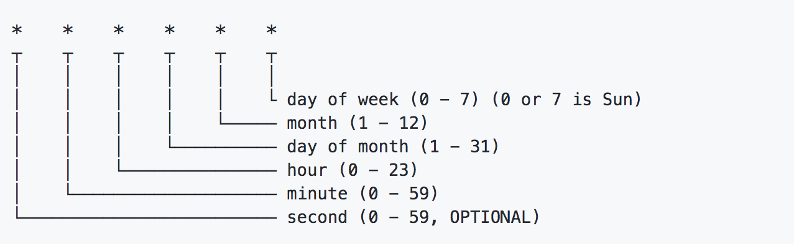
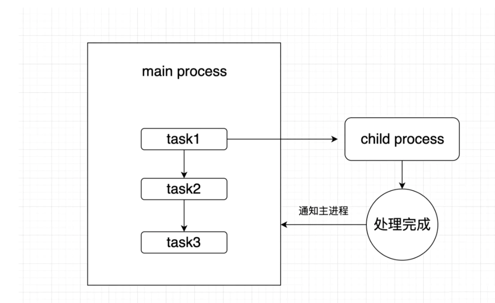

## 一些问题

1. window和mac下设置NODE_ENV变量的问题

我们都知道在前端项目中会根据不同的环境变量来处理不同的逻辑, 在`nodejs`中也一样, 我们需要设置本地开发环境, 测试环境, 线上环境等, 此时有一直设置环境变量的方案是在`package.json`中的`script`属性中设置, 如下:
```js
"scripts": {
   "start": "export NODE_ENV=development && nodemon -w src --exec \"babel-node src\"",
   "build": "babel src --out-dir dist",
   "run-build": "node dist",
   "test": "echo \"Error: no test specified\" && exit 1"
 }
```
从start指令中我们可以发现我们用`export NODE_ENV=development`来定义开发环境的环境变量，由于笔者采用的是`mac`电脑，所以可以用export来定义一个node环境变量. 但是在和朋友合作开发项目时发现执行`yarn start`后会报错, 后面看错误信息才发现window下不识别export, 后面笔者发现window定义环境变量可以用`set`, 所以对于`window`用户, 如果你使用了以上方法设置NODE_ENV, 可以采用如下方式:
```js
"scripts": {
   "start": "set NODE_ENV=development && nodemon -w src --exec \"babel-node src\""
 }
```

2. 执行npm install发生node-gyp报错的问题

`node-gyp`就是在`node`环境中使用的生成不同平台不同编译器的项目文件, 如果你遇到了相同的问题, 我们可以采用如下方案:
```js
npm install -g node-gyp
```
或者直接删除`package-lock.json`或者`yarn.lock`, 然后重新`yarn install`或者`npm install`即可, 笔者清测有效.

3. node + koa2项目中删除已设置的cookie的解决办法

> 由于HTTP是无状态协议，所以需要`cookie`来区分用户之间的身份。 我们可以把`cookie`作为是一个由浏览器和服务器共同协作实现的规范。

`cookie`的处理分为以下3步(基础且重要的知识)：

+ 服务器向客户端发送`cookie`
+ 浏览器将`cookie`保存（可以在后端设置`expires`或者`maxAge`，以`session`形式存在）
+ 每次浏览器都会将之前设置好的`cookie`发向服务器

在开发node后台项目时我们经常涉及用户管理模块, 这意味我们需要对用户进行登录态管理, 在用户退出时能及时删除用户的`cookie`, 好在`koa2`自带了处理`cookie`的方法, 我们可以通过如下的方式设置`cookie`:
```js
router.post(api.validVip,
    async ctx => {
      ctx.cookies.set('vid', 'xuxiaoxi', { maxAge: 24 * 3600 * 1000 });
    }
);
```
以上我们随便设置了一个有效期为1天的cookie, 那如果业务有变动, 需要在有效期内清空此cookie, 我们该如何处理呢? 解析来给出一个相对可用的解决方案:
```js
ctx.cookies.set('vid', '', { maxAge: 0 });
```
此时客户端的`cookie`将在下次请求时自动失效.

4. socket.io如何与koa/egg配合使用

我们都知道完整的`socket.io`通信由两部分组成:

+ 与`NodeJS HTTP` 服务器集成（或安装在其上）的`socket.io`
+ 在浏览器端加载的客户端库`socket.io-client`

如果我们直接使用`koa`或者`egg`, 我们需要将它们内部集成的`http`和`socket.io`做兼容, 此时我们可以这样处理:
```js
import koa from 'koa';
import http from 'http';

const app = new koa();
const server = http.createServer(app.callback());
const io = require('socket.io')(server);
//  正常的业务处理
// io
io.on('connection', (socket) => {
    console.log('a user connected');
    socket.on('doc load', (msg) => {
      console.log('doc load', msg)
      io.emit('getData', users)
    })
  });

server.listen(3000, () => {
    // ...
});
```
通过以上的方式就可以正常的将`koa`和`socket.io` 做兼容. 后面我们就可以正常的开发`IM`应用啦~

5. 由于nodejs第三方模块依赖特定node版本导致的报错解决方案

这个情况笔者之前也遇到过, 主要原因是第三方没有和`node`版本做到很好的向后兼容, 此时解决方案就是更新此第三方包到最新版本(如果还在维护的情况), 或者使用node包管理工具(n)切换到适配的node版本, 如下:
```js
// 更新最新的包
npm i xxx@latest

// 使用包管理工具n
npm i -g n
```
使用n可以很方便的管理`node`版本, 感兴趣可以尝试一下.

6. nodejs如何创建定时任务

定时任务在后端开发中是很常见的功能之一, 其本质是**根据时间规则，系统在后台自动执行相应的任务**. 在`java`, `PHP` 等后台语言中有很丰富的定时任务的支持, 对于`nodejs` 这个兴起之秀来说, 虽然没有那么成熟的生态, 但是仍然有定时任务的模块, 比如`node-schedule`.

> Node Schedule 是用于`Node.js`的灵活的 `cron` 类和非 `cron` 类作业调度程序。它允许我们使用可选的重复规则来安排作业（任意函数）在特定日期执行。它在任何给定时间仅使用一个计时器（而不是每秒钟/分钟重新评估即将到来的作业）。

一个很实用的场景是我们想在每年的双十一或者双十二让`node`程序自动抓取某电商的“商品羊毛”, 并推送到自己的邮箱, 此时我们就可以用`Node Schedule`来开启一个定时任务来执行我们的业务操作, 笔者的很多`node`应用都采用了类似的模式.感兴趣可以互相交流一下.

那什么是cron风格的Scheduling呢? 其github上给出了一个简单的介绍


所以我们可以像如下方式这样来写一个定时任务:
```js
let schedule = require('node-schedule');

let testJob = schedule.scheduleJob('42 * * * *', function(){
  console.log('将在未来的每个时刻的42分时执行此代码, 比如22:42, 23:42');
});
```

7. 在nodejs项目中使用import, export和修饰器@decorator语法

我们都知道现在`nodejs`版本已经到14.0+版本了, 对最新的`es`语法支持的也足够好, 但是目前仍然有一些语法不支持, 比如`es`的模块导入导出(import, export), 装饰器(@decorator)等, 此时我们要在`node`项目中使用这些新特性, 我们就不得不借助工具, 这里笔者采用`babel7`来解决上述问题, 如下:
```js
# .babelrc
{
  "presets": [
    [
      "@babel/preset-env",
      {
        "targets": {
          "node": "current"
        }
      }
    ]
  ],
  "plugins": [
    ["@babel/plugin-proposal-decorators", { "legacy": true }],
    ["@babel/plugin-proposal-class-properties", { "loose" : true }]
  ]
}
```
我们只需要在项目根目录里新建并写入如上文件, 并安装babel对应的模块即可, 如下:
```js
yarn add 
@babel/cli 
@babel/core 
@babel/node 
@babel/plugin-proposal-class-properties 
@babel/plugin-proposal-decorators 
@babel/preset-env
```

8. nodejs中优雅的处理json文件以及提高json读写性能

对于`nodejs`优化方面其实有很多要聊的, 这里主要来说说`json`相关的优化方案. 我们需要从2个方面来优化, 一个就是`json`文件的读写性能, 此时我们可以采用`fast-json-stringify` 来大大提高`json`的读写速度, 其本质是提供了一套`json-schema`约束, 让json结构更加有序, 从而提高`json`的读取查询速度. 如下使用方式:

```js
const fastJson = require('fast-json-stringify')
const stringify = fastJson({
  title: 'H5 Dooring Schema',
  type: 'object',
  properties: {
    firstName: {
      type: 'string'
    },
    lastName: {
      type: 'string'
    },
    age: {
      description: 'Age in years',
      type: 'integer'
    },
    reg: {
      type: 'string'
    }
  }
})
```
比如说在`H5-Dooring`的后台中, 有很多需要频繁读写`json`数据的接口, 此时使用`fast-json-stringify`对读写性能会有很大的提升.

另一方面, 我们在`node` 端操作`json`, 如果用原生的写法会非常麻烦, 此时我们最好自己对`json`读取进行封装来提高代码的简约性, 或者我们直接使用第三方库`jsonfile` 来轻松读写`json`文件, 如下使用案例:
```js
const json = require('jsonfile')
const fileName = 'h5-dooring.json'
const jsonData = jsonFile.readFileSync(fileName)
```

9. nodejs读取大文件报错解决方案

在`nodejs`中 我们可以使用两种方式来读写文件, 如下:

+ `fs.readFile()` 一次性将文件读取进内存中, 如果文件过大会导致node内存不够而报错
+ `fs.createReadStream()` 以文件流的方式读取, 此时可以不用担心文件的大小

由以上介绍可知如果我们要读取的文件可能会很大(比如视频等大文件), 我们一开始就要使用`fs.createReadStream()`, 其实如果我们需要对文件进行解析, 比如要对简历等文件进行逐行解析提取关键语料, 我们可以使用`node`的`readline`模块, 此时我们就可以对文件进行逐行读取并解析, 如下案例:
```js
const fs = require("fs");
const path = require("path");
const readline = require("readline");

const readlineTask = readline.createInterface({
    input: fs.createReadStream(path.join(__dirname, './h5-dooring')),
});
 
readlineTask.on('line', function(chunk) {
  // 读取每一行数据
});
 
readlineTask.on('close', function() {
  //文件读取结束的逻辑
}
```

10. nodejs如何开启gzip优化网站性能

对于`nodejs`开启`gzip` 的操作也属于node性能优化的一部分, 经过这样的处理可以让我们的网站加载更快, 我们可以使用`koa`的`koa-compress`中间件来实现`gzip` 功能. 具体实现如下:
```js
import koa from 'koa';
import compress from 'koa-compress';

const app = new koa();
// 开启gzip
const options = { threshold: 2048 };
app.use(compress(options));
```

当然koa-compress还有很多自定义的配置项, 大家可以感受一下.

11. 解决window和linux系统下路径分隔符不一致的问题

这个问题也是系统之间的差异导致的, 也是需要考虑的问题, 我们都知道在`linux`系统下路径的分隔符为`/`, 比如`h5-dooring/src/pages`, 但是在`window`下解析的可能就是`h5-dooring\\src\\pages`这样的路径, 此时我们需要做适配, 不然我们部署到不同系统上报错是必然的, 所以我们需要全局配置路径通配符, 笔者的解决方案如下:

```js
import os from 'os'
const _$ = (os.platform().toLowerCase() === 'win32') ? '\\' : '/';
```
此时涉及到具体路径的地方我们用`_$ `代替即可, 以上代码我们用到了`node`的`os`模块, 感兴趣的可以研究一下, 我们可以用os模块处理很多有意思的因为系统差异导致的问题.

12. nodejs如何实现父子进程通信

由于`nodejs`是单线程的, 但是有时候我们需要支持处理多个进程的业务, 目前`nodejs`可以通过哦父子进程的模式来模拟多进程, 我们可以用到`child_process`, 大致流程如下:


```js
// child.js
function computedTotal(arr, cb) {
    // 耗时计算任务
}

// 与主进程通信
// 监听主进程信号
process.on('message', (msg) => {
  computedTotal(bigDataArr, (flag) => {
    // 向主进程发送完成信号
    process.send(flag);
  })
});

// main.js
const { fork } = require('child_process');

app.use(async (ctx, next) => {
  if(ctx.url === '/fetch') {
    const data = ctx.request.body;
    // 通知子进程开始执行任务,并传入数据
    const res = await createPromisefork('./child.js', data)
  }
  
  // 创建异步线程
  function createPromisefork(childUrl, data) {
    // 加载子进程
    const res = fork(childUrl)
    // 通知子进程开始work
    data && res.send(data)
    return new Promise(reslove => {
        res.on('message', f => {
            reslove(f)
        })
    })  
  }
  
  await next()
})
```

13. node端实现图片编辑/压缩

图片编辑压缩在很多场景中用前端的技术实现比较常见, 其实在`node`端也有很多需要处理的图片需要, 毕竟客户端处理的质量不好控制, 此时我们可以采用`node-images`, 他是一款`node` 端轻量级跨平台图像编解码库, 其主要特性如下:

+ 轻量级：无需安装任何图像处理库。
+ 跨平台：Windows下发布了编译好的.node文件,下载就能用。
+ 使用简单：jQuery风格的API，简单可依赖

我们可以使用它来裁剪, 压缩图片, 基本使用如下:
```js
const images = require("images");

images("input.jpg")                     //加载图像文件                            
  .size(400)                          //等比缩放图像到400像素宽
     .draw(images("logo.png"), 10, 10)   //在(10,10)处绘制Logo
       .save("output.jpg", {             //保存图片到文件,图片质量为50
        quality : 50                    
       });
```

14. node端解析“命令行指令字符串”实现线上自动打包部署项目

使用了`child_process`模块的`exec`, 具体实现可以参考文章:https://juejin.cn/post/6875120334602371085

```js
const cmdStr = `cd ${outWorkDir} && yarn build ${fid}`
// 解析命令行指令, 实现线上自动打包构建项目
exec(cmdStr, function(err, stdout, stderr){
  if(err) {
    console.log('api error:'+stderr);
    io.emit('htmlWorked', { result: 'error', message: stderr })
  } else {
    // ...
  }
})
```

15. 如何解决node应用崩溃, 负载均衡和进程管理

解决此问题最好的方式就是采用`pm2` 或者`forever`, 其提供了强大的`node`进程管理, 负载均衡的能力, 并提供了一定程度的应用监控, 建议在线上环境使用`pm2` 来管理我们的`node`应用.