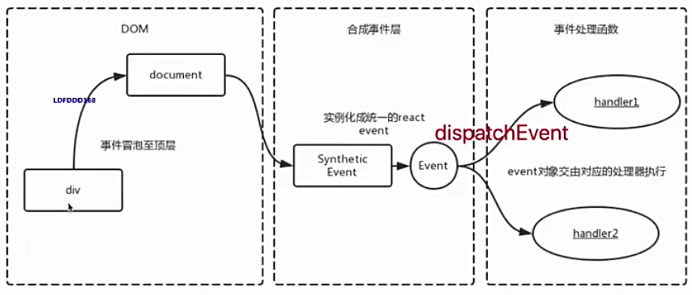
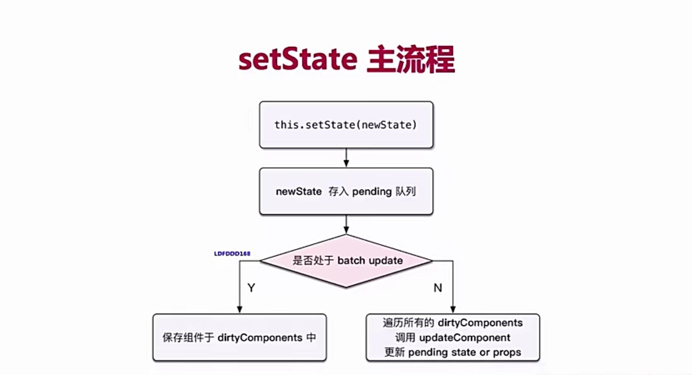
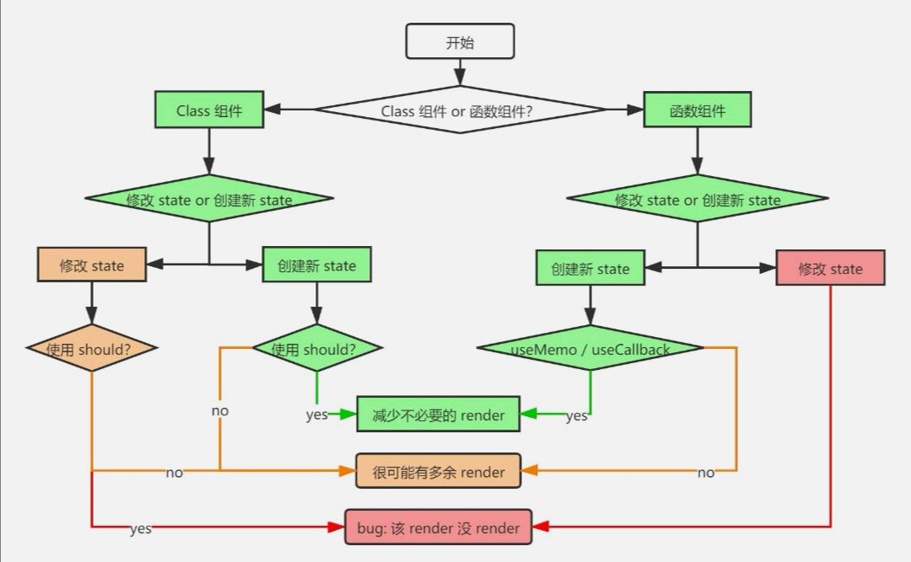
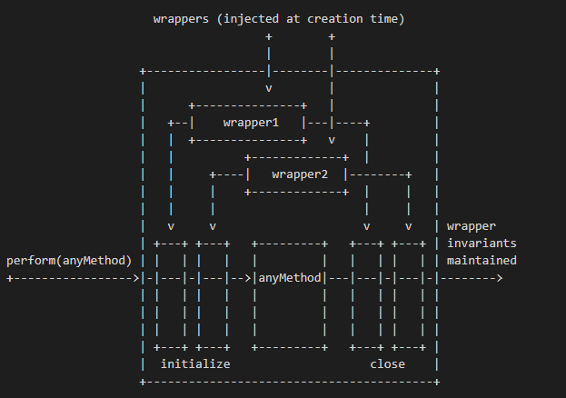

## react


### 函数式编程
#### 纯函数
#### 不可变值

### vdom和diff

### JSX本质

h函数

h(tag,attrs,[...childrens])

### 事件合成机制
1. 所有事件挂在到document上
2. event不是原生的，是SyntheticEvent合成事件对象

```js
{
  clickHandler(event){
    event.preventDefault();//阻止默认行为
    event.stopPropagation();//阻止冒泡
    console.log(event.target)
    console.log(event.currentTarget)
    console.log(event.nativeEvent)
  },
  render(){
    return(
      <div onClick={this.clickHandler}></div>
    )
  }
} 
```


1. 兼容多平台
2. 全挂到document,减少性能消耗，避免频繁解绑
3. 方便事件统一管理

### batchUpdate机制



```js
{
  increase=()=>{
    //isBatchUpdates = true
    this.setState({
      count:this.state.count + 1
    })
    //isBatchUpdates = false
  }
}
```
```js
{
  increase=()=>{
    //isBatchUpdates = true
    setTimeout(()=>{
      this.setState({
      count:this.state.count + 1
    })
    },0)
    //isBatchUpdates = false
  }
}
```
能命中batchUpdate机制：

1. 生命周期(和调用他的函数)
2. Rect中注册的事件(和调用他的函数)
3. React可以"管理"的入口

为什么不能直接修改state?



### transaction事务机制



```js
var OBSERVED_ERROR={}
var TransactionImpl={
  reinitializeTransaction:function(){
    this.transactionWrappers=this.getTransactionWrappers();
    console.log(this.transactionWrappers)
    if(this.wrapperInitData){
      this.wrapperInitData.length=0;
    }else{
      this.wrapperInitData=[]
    }
    this._isInTransaction=false
  },
  _isInTransaction:false,
  getTransactionWrappers:null,
  isInTransaction:function () {
    return !!this._isInTransaction
  },
  perform:function (method,scope,a,b,c,d) {
    var errorThrow;
    var ret;
    try{
      this._isInTransaction=true;
      errorThrow=true
      this.initializeAll(0)
      ret=method.call(scope,a,b,c,d)
      errorThrow=false;
    }catch(e){

    }finally{
      try {
        if(errorThrow){
         try {
           this.closeAll(0)
         } catch (error) {
           
         }
        }else{
          this.closeAll(0)
        }
      } finally {
        this._isInTransaction=false
      }
    }
    return ret
  },
  initializeAll:function(startIndex){
    var transactionWrappers=this.transactionWrappers;
    for(var i=startIndex;i<transactionWrappers.length;i++){
      var wrapper=transactionWrappers[i]
      try{
        this.wrapperInitData[i]=OBSERVED_ERROR;
        this.wrapperInitData[i]=wrapper.initialize?wrapper.initialize.call(this):null
      }finally{
        if(this.wrapperInitData[i]===OBSERVED_ERROR){
          try {
            this.initializeAll(i+1)
          } catch (error) {
            
          }
        }
      }
    }
  },
  closeAll:function (startIndex) {
    var transactionWrappers=this.transactionWrappers;
    for(var i=startIndex;i<transactionWrappers.length;i++){
      var wrapper=transactionWrappers[i]
      var initData=this.wrapperInitData[i]
      var errorThrow;
      try{
        errorThrow=true
        if(initData!==OBSERVED_ERROR&&wrapper.close){
          wrapper.close.call(this)
        }
        errorThrow=false
      }finally{
        if(errorThrow){
          try {
            this.closeAll(i+1)
          } catch (error) {
            
          }
        }
      }
    }
    this.wrapperInitData.length=0
  }
}

function log(){
  console.log('我是要执行的方法',a)
  throw new Error('123')

}

TransactionImpl.getTransactionWrappers=function(){
  return [
    {
      initialize:function(){console.log('前置1')},
      close:function(){console.log('后置1')}
    },
    {
      initialize:function(){console.log('前置2')},
      close:function(){console.log('后置2')}
    }
  ]
}
TransactionImpl.reinitializeTransaction()
TransactionImpl.perform(log)
```

[更多transaction相关](https://segmentfault.com/a/1190000021303172?utm_source=tag-newest)
### 组件更新和渲染的流程

prop state 

render()生成vnode

patch(elem,vnode)


### Fiber

patch两个阶段:

1. diff计算
2. commit 阶段 diff结果渲染

背景问题：
+ JS单线程
+ 计算渲染压力较大
+ 动画卡顿

解决方法：
+ 拆分计算任务
+ DOM渲染时暂停 空闲恢复
+ window.requestIdleCallback

