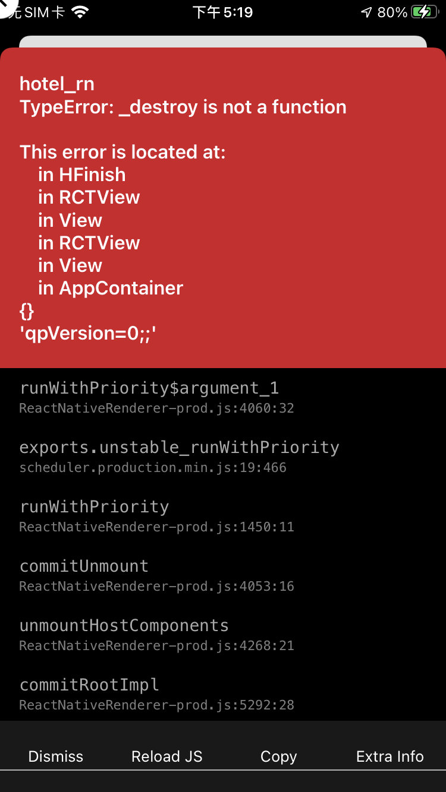

### 记一次useEffect使用问题

错误代码：

```js
const App=()=>{
  useEfect(async ()=>{
    const result = await getData()
  })
}
```
错误提示：



原因：`useEffect`的回调函数如果有返回值，那必须是一个函数

[react issues](https://github.com/facebook/react/issues/14838)