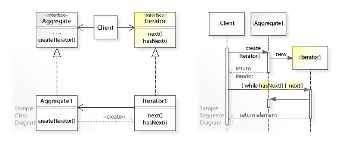

### What's Observable?

要理解Observable之前，我们先谈一下两个设计模式(Design Pattern)，Iterator Pattern 跟 Observer Pattern。今天主要带大家快速了解这两个设计模式，并说明这两个Pattern跟Observable之间的关系以有RxJS中的Observalbe有何不同。

### Observer Pattern

Observer Pattern其实很常遇到，在许多API的设计上都用Observer Pattern模式，最简单的例子就是DOM事件监听

```
function handler(e){
 //...
}
document.body.addEventListener('click'handler)
```

上面的代码，我们先声明了一个`handler`函数，再用DOM的`addEventListener`来监听点击事件，每次使用者在body点击鼠标就会执行一次`handler`，并把`event`事件对象带进来，这就是观察者模式，我们可以对某件事注册监听，并在事件发生时，自动执行我们注册的监听者(listener)

Observer的概念其实就是这么简单，下面通过这段代码带大家了解一下

```

class Producer {
	constructor() {
		this.observers = [];
	}
	addListener(observer) {
		this.observers.push(observer)
	}
	removeListener(listener) {
		this.observers.splice(this.listeners.indexOf(observer), 1)
	}
	notify(message) {
		this.observers.forEach(observer => {
			observer.update(message);
		})
	}
}

```


```
const subject = new Producer()
class Observer {
	constructor(name) {
		this.name = name
	}
	update(message){
		console.log(message + ' ' +this.name)
	}
}
subject.addListener(new Observer('ZF')); // 注册监听
subject.addListener(new Observer('practice'));

subject.notify('A new observer') // 执行
```

```
a new observer Ryan
a new observer Carter
```

每当`subject.notify`执行一次，`Observer`就会被通知更新，而这些`Observer`可以被额外添加，也可以被移除。虽然这段代码很简单，但它很好的说明了Observer  Pattern(观察者模式亦称发布订阅)如何在事件(Event) 跟观察者(obsever)的互动中做到解耦(Decoupling)。

> PS: 观察者与发布订阅设计思想是一致的，实现上略有差异
>
> 参考文章 https://hackernoon.com/observer-vs-pub-sub-pattern-50d3b27f838c  或观看张老师视频：
>
> 链接：https://pan.baidu.com/s/1R6Wi9FRHOkWJoj--yZ1aDA 
> 提取码：byno 

### Iterator Pattern

> 在 [面向对象编程](https://zh.wikipedia.org/wiki/物件導向程式設計)里，**迭代器模式**是一种[设计模式](https://zh.wikipedia.org/wiki/设计模式_(计算机))，是一种最简单也最常见的设计模式。它可以让用户透过特定的接口巡访容器中的每一个元素而不用了解底层的实现。

**迭代器模式解决的问题**

想想看我们平常要列出一个数组中所有的内容，可能会有这样的代码：

```
const data = [1,2,3]
for(let i = 0; i < data.length; ++i){
  console.log(data[i]);
}
```

如果今天我们的数据结构不是数组类型，而是一个树状结构呢？或者尽管是数组类型，但必须着不同的访问规则。这时候就需要自己针对需要的数据结构或访问规则书写代码。虽之而来的问题，如何共享这些规则？这个就是迭代器`Iterator`要处理的问题



图片来自：https://en.wikipedia.org/wiki/Iterator_pattern

**迭代器包含两个角色**

- Iterator：用来存放集合的内容，除此之外列重要的是提供访问集合内容的底层操作，并公开出两个方法
  - next()：用来取得目前集合的下一个元素
  - hasNext()：用来判断是否还有一个元素需要访问，当没有下一个元素需要访问时，代表已经完全访问过全部的元素
- 聚合功能(Aggregate)：用来产生迭代器的角色

```
const createIterator = (data) => {
  let nextIndex = 0;

  return {
    hasNext: () => nextIndex < data.length,
    next: () => data[nextIndex++]
  };
};

// 建立迭代器
const iterator = createIterator(['a', 'b', 'c', 'd']);
// 访问所有元素
while (iterator.hasNext()) {
  const value = iterator.next();
  console.log(value);
}
console.log('end');
```

通过ES6`iterater protocol`协议来实现，https://developer.mozilla.org/en-US/docs/Web/JavaScript/Reference/Iteration_protocols

```
const createIterator = (data) => {
  let nextIndex = 0;

  return {
   [Symbol.iterator]: () => {
   	if(nextIndex < data.length){
    		return {
    			value: data[nextIndex++],
          done: false
    		}
    	} else {
    		 return {
         	done: true,
         	value:void 0
         };
    	}
   }
  };
};
```

之后就可以搭配`javascript`原生的语法来使用

**原生JAVASCRIPT迭代器**

```
const arr = [1, 2, 3];

const iterator = arr[Symbol.iterator]();

iterator.next();
// { value: 1, done: false }
iterator.next();
// { value: 2, done: false }
iterator.next();
// { value: 3, done: false }
iterator.next();
// { value: undefined, done: true }
```

>在 ECMAScript中iterator最早采用的是类似Python的iterator规范，就是iterator在没有元素之后,执行`next`会直接抛出错误，但后来经过一段时间的讨论，决定采用functional的做法，改在取得最后一个元素之后行执行`next`会永远返回`{done:true, value:undefined}`

javascript中的iterator只有一个next方法，这个`next`方法只会回传这两种结果

- 最后一个元素之前 `{done:false, value:element}`
- 最近一个元素之后`{done:true, value:undefined}`

一个简单的Iterator Pattern

```
class MyIterator{
	constructor(arr) {
		this._arr = arr
		this,_cursor = 0
	}
	next(){
		return this._cursor < this._arr.length?{value:this._arr[this._cursor++]:done:false}:{done:true, value:void 0}
	}
}

```

Iterator Pattern带来了两个优势，第一渐进式获取资料的特性可以拿来做延迟运算(Lazy evaluation)，让我们能用它来处理大数据结构，第二是iterator本身是序列，所以可以实现所有数组的运算方法像`map,filter`等

为`MyIterator`增加一个`map`方法

```
class MyIterator{
	constructor(arr) {
		this._arr = arr
		this._cursor = 0
	}
	next(){
		return this._cursor < this._arr.length?{value:this._arr[this._cursor++],done:false}:{done:true, value:void 0}
	}
	map(cb){
		const iterator = new MyIterator(this._arr)
		return {
			next:()=>{
					const {done, value} = iterator.next()
					return {
						done,
						value: done? void 0 : cb(value)
					}
				}
		}
	}
}
const iterator = new MyIterator([1,2,3]);
const newIterator = iterator.map(value => value + 3);

newIterator.next();
// { value: 4, done: false }
newIterator.next();
// { value: 5, done: false }
newIterator.next();
// { value: 6, done: false }
```

#### Lazy evaluation 延迟运算

延迟运算亦或说call-by-need,是一种运算策略(evaluation strategy)，简单来说我们延迟一个表达式的运算时机直到真正需要它的值在做运算

看一个例子

```
function * getCount(words){
	for (const word of words){
		if(/[A-Z]+$/.test(word)){
			 yield word
		}
	}
}
const iterator = getCount('RxJS训练营')
iterator.next()
//{value: "R", done: false}
iterator.next()
//{value: "J", done: false}
iterator.next()
//{value: "S", done: false}
iterator.next()
//{value: undefined, done: true}
```

这里我们写了一个用来抓取字符串中的大写字母，for..of的方式取得每个字母并用正则表达式来判断是不是数值，如果为真就转成数值并回传。当我们把一个字符串丢进`getCount`函数式，并没有马上运算出所有字母，必须等到我们执行`next`时，才会真的做运算，这就是所谓的延迟运算(evaluation strategy)

### Observable 可观察对象


可以总结出Observer和iterator有个共通的特性，就是他们都是渐进式的取的资料，差别只在于Observer是生产者推送数据，而iterator是消费者拉取数据，

更简单的来说，就像官网介绍的那样，Observable 是一个序列，里面的元素会随着时间持续推送


### Observable & Observer & Subscription relation


```
const observable = new Observable(subscriber => {
  subscriber.next('observable execute');
  setTimeout(() => {
    subscriber.complete();
  }, 1000);
});
 

const observer = {
  next(x) { console.log('got value ' + x); },
  error(err) { console.error('something wrong occurred: ' + err); },
  complete() { console.log('done'); }
}
console.log('just before subscribe');
observable.subscribe(observer);
console.log('just after subscribe');
```


### Hot Observable And Cold Observable 

**Cold Observables**

- 推送值的生产者`producer`来自`observable`内部。将会推送什么样的值在`observable`创建时被定义下来，不会改变
- `producer`与`observer`是一对一的关系，即是unicast (单播)的。
- 当有`observer`订阅时，`producer`会把预先定义好的若干值依次推送给每个`observer`

```
const { Observable } = rxjs
const source$ = new Observable(subscriber => {
  console.log('stream 开始');
  subscriber.next(1);
  subscriber.next(2);
  subscriber.next(3);
  subscriber.next(4);
  console.log('steam 结束');
  subscriber.complete();
});
 
source$.subscribe(data => console.log(`Observable 第一次订阅: ${data}`));
// 1, 2, 3, 4
source$.subscribe(data => console.log(`Observable 第二次订阅: ${data}`));
// 1, 2, 3, 4
```

对于每次订阅来说，都是一次新的数据流产生。我们可以把整个数据流当作是一条水管管路设计图，每次订阅时，都是依照这条管路组装出新的水管线路，然后装水打开阀门让水流出，这样的好处是每次订阅都是新数据流的，所以不会互相影响。这种每次订阅都重新开始的流程，称为`Cold Observable`。Cold通常代表被用到时才启动的行为，在这里也是如此，说明这个`Observable`被订阅时才会启动。

> `Cold Observable`每次订阅后就只会有一个观察者， 下一个观察者要进行订阅时是一次新的数据流程，因此`Cold Observable`与`observer`是一对一关系
>
> PS:第二章会介绍建立数据流的`operators`， 这种`operators`基本上都是属于`Cold Observable`。


**Hot Observables**


- 推送值的`producer`来自`observable`外部，何时推送以及推送什么样的值在创建时都是未知的。`producer`与`observer`是一对多的关系，即**multicast** (多播)的。
- 每当有`observer`订阅时，会将`observer`注册到观察者列表中。
- 当外部的`producer`被触发或执行时，会将值同时推送给所有的`observer`

```
const source$ = new Subject();

source$.subscribe(data => console.log(`Subject 第一次订阅: ${data}`));
// 1, 2, 3, 4
  
source$.next(1);
source$.next(2);

source$.subscribe(data => console.log(`Subject 第二次订阅: ${data}`));
// 3, 4

source$.next(3);
source$.next(4);

source$.subscribe(data => console.log(`Subject 第三次订阅: ${data}`));
// (沒收到任何事件就结束了)
source$.complete();
```

一样当作水管线路来看的话，`Subject`就是一条随时可以有数据流过的线路,每次订阅都只是等待这条水管线路传送资料过来而已，而这样的好处是更有弹性，因为不用事先把所有流程准备好，可以随时依照不同的情况在程序内让新的事件发生(调用`next`就好)，所有的观察者都会及时收到这份数据。

随时订阅就是等待最新数据的流程，称为`Hot Observable`，Hot 本身就有随时准备好的意思，因此每次订阅时不用从头来过，只关注最新事件即可。

由于只会有一个`Observable`,在每次事件发生的时都会推送给所有的`observer`， 因此`Hot Observable`与`observer`的关系是一对多的关系

**Warm Observable**

那么有没有办法把`Cold Observable`转成`Hot Observable`呢？严格意义上来说并没有，因为`Cold Observable`一定要有个`开始`的动作才会产生数据流，而`Hot Observable`在被建立的时候就是启动的状态了。但是我们可以透过一些`Multicast`类的`operators`来达到类似目的，例如`share()`。在Rxjs 6或更早的版本中，可能会看到`publish`,内部也是调用`share实现的`，在7中已经`departed`。

在第一次订阅开始前不会启动推送，直到第一次订阅发生启动，所有观察者都是订阅同一个数据流，一对多关系

```
const source$ = new Observable(observe => {
    console.log('stream 开始');
    setTimeout(() => observe.next(1), 100);
    setTimeout(() => observe.next(2), 200);
    setTimeout(() => observe.next(3), 300);
    setTimeout(() => {
        observe.next(4);
        observe.complete();
      console.log('stream 结束');
    }, 400);
  });
  
  const hotSource$ = source$.pipe(
    share()
  );
  
  setTimeout(() => {
    hotSource$.subscribe(data => console.log(`Observable 第一次订阅： ${data}`));
  
    setTimeout(() => {
      hotSource$.subscribe(data => console.log(`Observable 第二次订阅：${data}`));
    }, 200);
  }, 1000);

```

> 这里的`setTimeout`让整个数据发射有比较明显的时间顺序，没有什么特别的作用

```
---1---2---3---(4|)
```

之后我们通过`share()`operator让整个`Observable`变成`multicast`的`Observable`,这时候整个数据流还没开始，必须有第一次订阅的动作，才会开始推送数据。由于必须要先有一次订阅的动作让它启动，因此也称不`Warm Observable`

在上面代码中我们先等待一秒钟才开始订阅，可以到在这段时间不会打印`stream 开始`的文字，直到第一次订阅开始。第二次订阅再次放慢一点进行订阅，已确认收到数据不会重新开始。

整体执行结果如下:

```
stream 开始
Observable 第一次订阅：1
Observable 第一次订阅： 2
Observable 第一次订阅： 3
Observable 第二次订阅：3
Observable 第一次订阅： 4
Observable 第二次订阅：4
stream 结束
```

有些时间我们会设计好一个`Cold Observable`，但又不希望每次订阅时都要重新来过,例如`ajax/websocket`等，很适合把`unicast`转成`multicast`类型的Observable


