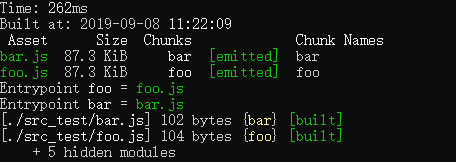

# 代码分片


代码分片是webpack作为打包工具所特有的一项技术。

## 通过入口划分代码

在webpack中每一个入口都将生成一个对应的资源文件，通过入口配置我们可以进行一些简单有效的代码拆分。

对于webpack应用通常会有一些**库或工具是不常变动的**，可以把他们放在一个单独的入口中，该入口生产的资源不会经常更新，因此可以有效的利用客户端缓存，让用户不必在每次请求页面时都重新加载。例：

```js
entry:{
    app:'./app.js',
    lib:['lib-a','lib-b','lib-c']
}
//index.html
<script src='dist/lib.js'></script>
<script src='dist/app.js'></script>
```
上面这种拆分方法主要适合于将接口绑定在全局对象上的库。**但是**，对于多页面应用，虽然也可以是使用入口划分的方法，并不是所有页面都需要这些公共模块。come on ➡

## CommonsChunkPlugin

CommonsChunkPlugin时webpack 4之前**内部**自带的插件。他可以将多个chunk中公共的部分提取出来。几个有点：

* 开发过程中减少了重复模块打包，可以提升开发速度
* 减小整体资源体积
* 合理分片后的代码可以更有效的利用客户端缓存

例子：
```js
//webpack.config.js
modules.exports={
    entry:{
        foo:'./foo.js',
        bar:'./bar.js'
    },
    output:{
        filename:'[name].js'
    }
}

//foo.js
import React from 'react';
document.write('foo.js',React.version);
//bar.js
import React from 'react';
document.write('bar.js',React.version);
```
打包结果：



