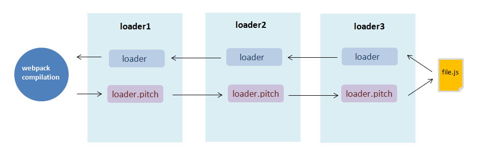

## 揭秘webpack loader
> Loader(加载器) 是 webpack 的核心之一。它用于将不同类型的文件转换为 webpack 可识别的模块。本文将尝试深入探索 webpack 中的 loader，揭秘它的工作原理，以及如何开发一个 loader。

### loader工作原理
webpack只能直接处理javascript格式的代码，任何非js文件都必须被预先转为js代码，才可以参与打包。loader就是这样一个代码转换器。它由webpack的`loader runner`执行调用，接受原始资源数据作为参数(当多个loader联合使用时，上一个的处理结果就是下一个loader的参数)，最终输出js代码给webpack做进一步编译

### loader执行顺序

 loader分为以下几类:
+ pre:前置loader
+ normal:普通loader
+ inline:内联loader
+ post:后置loader
他们的执行优先级：
+  `pre`>`normal`>`inline`>`post`
+ 相同类型的loader遵循`从右到左、从下到上`的顺序

`内联 loader` 可以通过添加不同前缀，跳过其他类型 loader。
+ `!`跳过normal loader
+ `-!`跳过pre和normal loader
+ `!!`跳过pre、normal和post loader

### 如何开发一个loader
> loader是一个导出一个函数的node模块

#### 写一个简单的loader
当只有一个loader应用与资源文件时，他接受源码作为参数，输出转换后的js

```js
modeule.exports=function loader(source){
    console.log('执行一个简单的loader');
    return source;
}
```

测试这个loader
```js
const path=require('path');
module.exports={
    module:{
        rules:[
            {
                test:/\.js$/,
                use:path.resolve(__dirname,'loader/my-loader');//第三方直接写loader的名字即可
            }
        ]
    }
}
```

#### pitch 的 loader

`pitch`是loader上的一个方法，它能阻断loader链

```js
module.exports=function(source){
    console.log('normal execution');
    return source
}
//loader上的方法 非必需
module.exports.pitch=function(){
    console.log('pitch')
}
```
pitch方法不是必须的。如果有pitch，loader的执行会分为两个阶段：
+ pitch阶段
+ normal execution阶段

webpack 会先从左到右执行 loader 链中的每个 loader 上的 pitch 方法（如果有），然后再从右到左执行 loader 链中的每个 loader 上的普通 loader 方法。

假如配置了如下loader<br>
`use:['loader1','loader2','loader3']`

执行顺序：



在这个过程中如果任何 pitch 有返回值，则 loader 链被阻断。webpack 会跳过后面所有的的 pitch 和 loader，直接进入上一个 loader 的 `normal execution`。

#### 简版style-loader
style-loader 通常不会独自使用，而是跟 css-loader 连用。css-loader 的返回值是一个 js 模块，大致长这样：
```js
// 打印 css-loader 的返回值

// Imports
var ___CSS_LOADER_API_IMPORT___ = require("../node_modules/css-loader/dist/runtime/api.js");
exports = ___CSS_LOADER_API_IMPORT___(false);
// Module
exports.push([module.id - Registered at Namecheap.com, "\nbody {\n    background: yellow;\n}\n", ""]);
// Exports
module.exports = exports;
```

style-loader 的作用就是将这段 `css` 代码转成 `style` 标签插入到 `html` 的 `head` 中。

+ style-loader 最终需返回一个 `js` 脚本：在脚本中创建一个 `style` 标签，将 `css` 代码赋给 `style` 标签，再将这个 `style` 标签插入 `html` 的 `head` 中。
+ 难点是获取 `css` 代码，因为 css-loader 的返回值只能在运行时的上下文中执行，而执行 loader 是在编译阶段。换句话说，css-loader 的返回值在 style-loader 里派不上用场。
+ 曲线救国方案：使用获取 `css` 代码的表达式，在运行时再获取 css (类似 `require('css-loader!index.css')`）。
+ 在处理 css 的 loader 中又去调用 `inline loader` require `css` 文件，会产生循环执行 loader 的问题，所以我们需要利用 `pitch` 方法，让 style-loader 在 `pitch` 阶段返回脚本，跳过剩下的 loader，同时还需要内联前缀 `!!` 的加持。

注：pitch 方法有3个参数：
+ remainingRequest：loader链中排在自己后面的 loader 以及资源文件的绝对路径以`!`作为连接符组成的字符串。
+ precedingRequest：loader链中排在自己前面的 loader 的绝对路径以`!`作为连接符组成的字符串。
+ data：每个 loader 中存放在上下文中的固定字段，可用于 pitch 给 loader 传递数据。

**可以利用 `remainingRequest` 参数获取 loader 链的剩余部分。**

实现：
```js
const loaderUtils = require('loader-utils');
module.exports = function(source) {
    // do nothing
}

module.exports.pitch = function(remainingRequest) {
  console.log('simple-style-loader is working');
    // 在 pitch 阶段返回脚本
    return (
      `
      // 创建 style 标签
      let style = document.createElement('style');

      /**
      * 利用 remainingRequest 参数获取 loader 链的剩余部分
      * 利用 ‘!!’ 前缀跳过其他 loader 
      * 利用 loaderUtils 的 stringifyRequest 方法将模块的绝对路径转为相对路径
      * 将获取 css 的 require 表达式赋给 style 标签
      */
      style.innerHTML = require(${loaderUtils.stringifyRequest(this, '!!' + remainingRequest)});
      
      // 将 style 标签插入 head
      document.head.appendChild(style);
      `
    )
}
```
配置webpack
```js
// webpack.config.js
const path = require('path');
const HtmlWebpackPlugin = require('html-webpack-plugin');
module.exports = {
  entry: {...},
  output: {...},
  // 手动配置 loader 路径
  resolveLoader: {
    modules: [path.resolve(__dirname, 'loaders'), 'node_modules']
  },
  module: {
    rules: [
      {
        // 配置处理 css 的 loader
        test: /\.css$/,
        use: ['simple-style-loader', 'css-loader']
      }
    ]
  },
  plugins: [
    // 渲染首页
    new HtmlWebpackPlugin({
      template: './src/index.html'
    })
  ]
}

```

**工具**
+ [ loader-utils](https://www.npmjs.com/package/loader-utils)
+ [schema-utils](https://www.npmjs.com/package/schema-utils)

#### 开发异步 loader

异步 loader 的开发（例如里面有一些需要读取文件的操作的时候），需要通过 this.async() 获取异步回调，然后手动调用它。
```js
module.exports = function(source) {
    console.log('async loader');
    let cb = this.async();
    setTimeout(() => {
      console.log('ok');
      // 在异步回调中手动调用 cb 返回处理结果
      cb(null, source);
    }, 3000);
}
```
>注： 异步回调 cb() 的第一个参数是 `error`，要返回的结果放在第二个参数。

#### raw loader

如果是处理图片、字体等资源的 loader，需要将 loader 上的 raw 属性设置为 true，让 loader 支持二进制格式资源（webpack默认是以 `utf-8` 的格式读取文件内容给 loader）。
```js
// loaders/simple-raw-loader.js
module.exports = function(source) {
  // 将输出 buffer 类型的二进制数据
  console.log(source);
  // todo handle source
  let result = 'results of processing source'
  return `
    module.exports = '${result}'
  `;
}
// 告诉 wepack 这个 loader 需要接收的是二进制格式的数据
module.exports.raw = true;
```
>注：通常 raw 属性会在有文件输出需求的 loader 中使用。

#### 输出文件

在开发一些处理资源文件（比如图片、字体等）的 loader 中，需要拷贝或者生成新的文件，可以使用内部的 `this.emitFile()` 方法.
```js
const loaderUtils = require('loader-utils');
module.exports = function(source) {
  // 获取 loader 的配置项
  let options = loaderUtils.getOptions(this) || {};
  // 获取用户设置的文件名或者制作新的文件名
  // 注意第三个参数，是计算 contenthash 的依据
  let url = loaderUtils.interpolateName(this, options.filename || '[contenthash].[ext]', {content: source});
  // 输出文件
  this.emitFile(url, source);
  // 返回导出文件地址的模块脚本
  return `module.exports = '${JSON.stringify(url)}'`;
}
module.exports.raw = true;
```
>在这个例子中，loader 读取图片内容（buffer），将其重命名，然后调用 `this.emitFile()` 输出到指定目录，最后返回一个模块，这个模块导出重命名后的图片地址。于是当 `require` 图片的时候，就相当于 require 了一个模块，从而得到最终的图片路径。（这就是 file-loader 的基本原理）

### 设计loader原则
+ 保持简单。
+ 利用多个loader链。
+ 模块化输出。
+ 确保loader是无状态的。
+ 使用 loader-utils 包。
+ 标记加载程序依赖项。
+ 解析模块依赖关系。
+ 提取公共代码。
+ 避免绝对路径。
+ 使用 peerDependency 对等依赖项。
