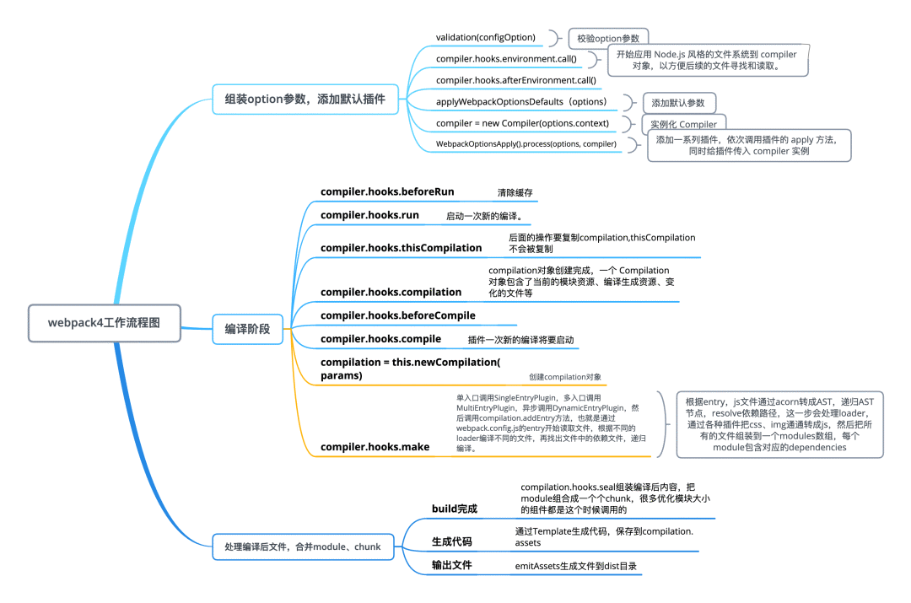

## 实现一个简易的webpack

我们使用react建立一个项目依赖关系，来模拟webpack追踪以来进行打包

```js
//index.js根组件
import React from 'react';
import ReactDOM from 'react-dom';
import App from './App.jsx';

ReactDOM.render(
  <React.StrictMode>
    <App />
  </React.StrictMode>,
  document.getElementById('root')
);
```

```js
//App.jsx
import React, {useState,useEffect,useCallback} from 'react';
function useSize(){
    const [size,setSize] = useState({
        width:document.documentElement.clientWidth,
        height:document.documentElement.clientHeight
    })
    const onResize = useCallback(()=>{
        setSize({
            width:document.documentElement.clientWidth,
            height:document.documentElement.clientHeight
        })
    },[])
    useEffect(() => {
        window.addEventListener('resize',onResize,false);
        return () => {
            window.removeEventListener('resize',onResize,false)
        }
    }),[]
    return size
}
function App(){
      const size = useSize();
      return (
          <div>
              <p>width:{size.width}</p>
              <p>height:{size.height}</p>
          </div>
      )
}
export default App
```

我们还需要一个配置文件，在根目录下新建`webpack.config.js`

```js
//webpack.config.js
const resolve=dir=>require('path').join(__dirname,dir);

module.exports={
    entry:'./src/index.js',
    output:{
        path:resolve('/dist'),
        filename:'bundle.js'
    },
    module:{
        rules:[
            {
                test:/\.(js|jsx)$/,
                include:[resolve('src')],
                use:'babel-loader'
            }
        ]
    },
    plugins:[new HtmlWebpackPlugin()]
}
```

`webpack`本身只识别`.js`、`.json`两种类型的文件，通过loader来处理其他合适的文件。

`react`的`jsx`语法需要转换成`js`语法，也就是`react`中`createElement`方法。

而至于 `plugin` 则是一些插件，这些插件可以将对编译结果的处理函数注册在 `Webpack` 的生命周期钩子上，在生成最终文件之前对编译的结果做一些处理。比如大多数场景下我们需要将生成的 `JS` 文件插入到 `Html` 文件中去。就需要使用到 `html-webpack-plugin` 这个插件。

**接下来我们就开始工具的尝试**

打包的流程



[参考](https://aotu.io/notes/2020/07/17/webpack-analize/)