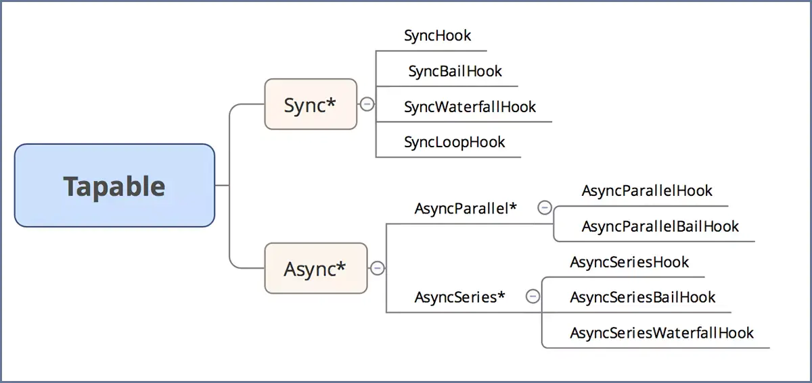

## tapable事件流机制


>Webpack 本质上是一种事件流的机制，它的工作流程就是将各个插件串联起来，而实现这一切的核心就是 `tapable`，Webpack 中最核心的，负责编译的 `Compiler` 和负责创建 `bundles` 的 `Compilation` 都是 `tapable` 构造函数的实例

阅读中经常遇见一下代码
```js
const {
    SyncHook,
    SyncBailHook,
    SyncWaterfullHook,
    SyncLoopHook,
    AsyncParallelHook,
    AsyncParallelBailHook,
    AsyncSeriesHook,
    AsyncSeriesBailHook,
    AsyncSeriesWaterfullHook
} = require('tapable')
```
这些以`Sync`、`Async`开头，以`Hook`结尾的方法，为我们提供不同的事件流机制，分为**同步**和**异步**。<br>
**异步**又分为**并行**、**串行**；
**同步**都是**串行**

### Sync类型
#### 1、SyncHook
`SyncHook`为串行同步执行，不关心事件处理函数的返回值，触发事件后会按照事件注册的先后顺序执行所有的处理函数
```js
const {SyncHook} = require("tapable");
//创建实例
let syncHook = new SyncHook(["name","age"]);
//注册事件
syncHook.tap("1",(name,age)=>console.log("1",name,age));
syncHook.tap("2",(name,age)=>console.log("2",name,age));
syncHook.tap("3",(name,age)=>console.log("3",name,age));
//触发事件
syncHook.call("teddy",20)
// 1 teddy 20
// 2 teddy 20
// 3 teddy 20
```
在 tapable 解构的 SyncHook 是一个类，注册事件需先创建实例，创建实例时支持传入一个数组，数组内存储事件触发时传入的参数，实例的 tap 方法用于注册事件，支持传入两个参数，第一个参数为事件名称，在 Webpack 中一般用于存储事件对应的插件名称（名字随意，只是起到注释作用）， 第二个参数为事件处理函数，函数参数为执行 call 方法触发事件时所传入的参数的形参。

尝试模拟：

#### 2、SyncBailHook
`SyncBailHook`同样是串行同步执行，事件处理函数执行时有一个返回值不为空，跳出剩下未执行的处理函数。
```js
const {SyncBailHook} = require("tapable");
//创建实例
let syncBailHook = new SyncBailHook(["name","age"]);
//注册事件
syncBailHook.tap("1",(name,age)=>console.log("1",name,age));
syncBailHook.tap("2",(name,age)=>{
    console.log("1",name,age);
    return "2"
});
syncBailHook.tap("3",(name,age)=>console.log("3",name,age));
//触发事件
syncBailHook.call("teddy",20);
// 1 teddy 20
// 2 teddy 20
```

尝试模拟：

#### 3、SyncWaterfallHook
`SyncWaterfallHook` 为串行同步执行，上一个事件处理函数的返回值作为参数传递给下一个事件处理函数，依次类推，正因如此，只有第一个事件处理函数的参数可以通过 call 传递，而 call 的返回值为最后一个事件处理函数的返回值。
```js
const { SyncWaterfallHook } = require("tapable");
// 创建实例
let syncWaterfallHook = new SyncWaterfallHook(["name", "age"]);
// 注册事件
syncWaterfallHook.tap("1", (name, age) => {
    console.log("1", name, age);
    return "1";
});
syncWaterfallHook.tap("2", data => {
    console.log("2", data);
    return "2";
});
syncWaterfallHook.tap("3", data => {
    console.log("3", data);
    return "3"
});

// 触发事件，让监听函数执行
let ret = syncWaterfallHook.call("teddy", 20);
console.log("call", ret);

// 1 teddy 20
// 2 1
// 3 2
// call 3
```
#### 4、SyncLoopHook
`SyncLoopHook` 为串行同步执行，事件处理函数返回 `true` 表示继续循环，即循环执行当前事件处理函数，返回 `undefined` 表示结束循环，`SyncLoopHook` 与 `SyncBailHook` 的循环不同，`SyncBailHook` 只决定是否继续向下执行后面的事件处理函数，而 `SyncLoopHook` 的循环是指循环执行每一个事件处理函数，直到返回 `undefined` 为止，才会继续向下执行其他事件处理函数，执行机制同理
```js
const { SyncLoopHook } = require("tapable");

// 创建实例
let syncLoopHook = new SyncLoopHook(["name", "age"]);

// 定义辅助变量
let total1 = 0;
let total2 = 0;

// 注册事件
syncLoopHook.tap("1", (name, age) => {
    console.log("1", name, age, total1);
    return total1++ < 2 ? true : undefined;
});

syncLoopHook.tap("2", (name, age) => {
    console.log("2", name, age, total2);
    return total2++ < 2 ? true : undefined;
});

syncLoopHook.tap("3", (name, age) => console.log("3", name, age));

// 触发事件，让监听函数执行
syncLoopHook.call("teddy", 20);

// 1 teddy 20 0
// 1 teddy 20 1
// 1 teddy 20 2
// 2 teddy 20 0
// 2 teddy 20 1
// 2 teddy 20 2
// 3 teddy 20
```
**注意**:通过上面的执行结果可以清楚的看到 `SyncLoopHook` 的执行机制，但有一点需要注意，返回值必须`严格是 true` 才会触发循环，多次执行当前事件处理函数，必须严格返回 `undefined`，才会结束循环，去执行后面的事件处理函数，如果事件处理函数的返回值不是 true 也不是 undefined，则会死循环。

### Async类型
`Async` 类型可以使用 `tap`、`tapSync` 和 `tapPromise` 注册不同类型的插件 “钩子”，分别通过 `call`、`callAsync` 和 `promise` 方法调用

[https://www.jianshu.com/p/273e1c9904d2](https://www.jianshu.com/p/273e1c9904d2)