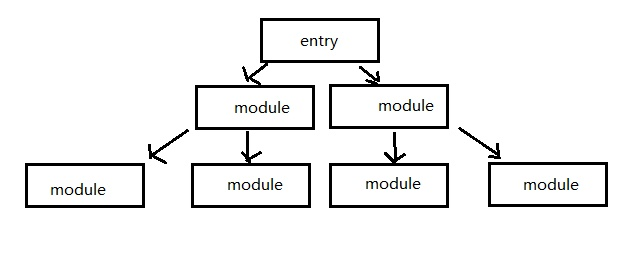
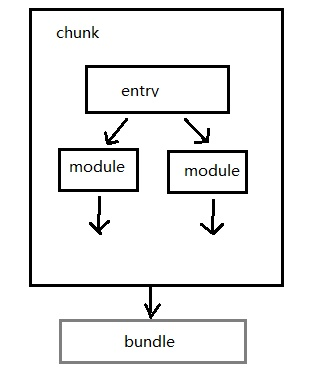
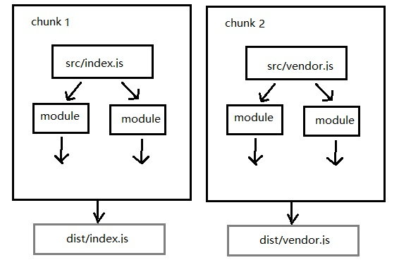

# 资源输入输出

## 资源处理流程

一切流程的开始，都需要我们制定一个或多个入口，从这个入口开始，存在依赖关系的模块会被封装为一个**chunk**,由chunk得到打包产物**bundle**。

**chunk**字面意思代码块，在webpack中可以理解成被抽象和包装过后的一些模块。一个工程打包时可能会产生一个或多个chunk

依赖树


entry、chunk、bundle的关系


entry和bundle的对应关系


## 配置资源入口

webpack通过**context**和**entry**这两个配置项来共同决定入口文件路径，配置入口时，实际上做了两件事：
* 确定入口模块位置
* 定义chunk name。如果工程只有一个入口chunk name默认为'main'。

### context 

context,只能是**字符串**，可以理解为资源入口的路径前缀，在配置时必须使用**绝对路径**的形式
```js
module.exports={
    context:path.join(__dirname,'./src'),
    entry:'./script/index.js'
};
module.exports={
    context:path.join(__dirname,'./src/script'),
    entry:'./index.js'
}
```
context配置可以省略，默认值为当前工程的根目录，适用于多入口情况。

### entry
与context只能为字符串不同，entry的配置可以有多种形式：字符串、数组、对象、函数。

#### 1、字符串类型入口
```js
module.exports={
    entry:'./src/index.js',
    output:{
        filename:'bundle.js'
    },
    mode:'development',
};
```
#### 2、数组类型入口

传入一个数组的作用是将多个资源预先合并，再打包时webpack会将数组中最后一个作为实际的入口文件路径。
```js
module.exports={
    entry:['babel-polyfill','./src/index.js']
}
```
上面的配置相当于
```js
//webpack.config.js
module.exports={
    entry:'./src/index.js'
}

//index.js
import 'babel-polyfill';
```

#### 3、对象类型入口

如果想定义多入口就必须使用对象的形式，对象的属性名(key)是chunkname，属性值(value)是入口路径。
```js
module.exports={
    entry:{
        index:'./src/index.js',
        lib:'./src/lib.js'
    }
}
```
对象的属性值也可以是字符串或数组,如：
```js
module.exports={
    entry:{
        index:['babel-polyfill','./src/index.js'],
        lib:'./src/lib.js'
    }
}
```

#### 4、函数类型入口

用函数定义入口时，只要返回上面任何配置形式即可。
```js
//返回字符串类型
module.exports={
    entry:()=>'./src/index.js'
}

//返回一个对象类型
module.exports={
    entry:()=>({
        index:['babel-polyfill','./src/index.js'],
        lib:'./src/lib.js'
    })
}
```
函数类型的好处就是我们可以在函数体里添加一些**动态**的逻辑来获取工程的入口。也支持返回一个Promise来进行异步操作，例如：
```js
module.exports={
    entry:()=>new Promise((resolve)=>{
        setTimeout(()=>{
            resolve('./src/index.js');
        },1000);
    })
}
```

### 实例

#### 1、单页应用
单页应用(SPA)，一般定义一个单一入口即可

* 好处：依赖关系清晰
* 弊端：资源体积过大，降低用户页面渲染速度

webpack默认配置中，当一个bundle大于250kB时(压缩前)，就认为过大了。


#### 2、提取vendor

在webpack中vendor一般是指工程所使用的库、框架等第三方模块集中打包而产生的bundle

```js
module.exports={
    context:path.join(__dirname,'./src'),
    entry:{
        app:'./src/app.js',
        vendor:['react','react-dom','react-router']
    }
}
```
问题：我们并没有为vendor设置入口路径，webpack要如何打包呢？

这时我们可以用CommonChunkPlugin(webpack4之后被废弃，可以采用optimization.splitChunks),将app与vendor这两个chunk中的公共模块提取出来。

由于vendor仅仅包含第三方模块，不会经常变动，因此可以有效的利用客户端缓存，在用户后续请求页面时会加快整体渲染速度。

#### 3、多页面应用

对于多页面应用，为了尽可能减小资源体积，每个页面都只加载各自必要的逻辑，因此每个页面都需要有一个独立的bundle
```js
module.exports={
    entry:{
        pageA:'./src/pageA.js',
        pageB:'./src/pageB.js',
    }
}
```
vendor提取
```js
module.exports={
    entry:{
        pageA:'./src/pageA.js',
        pageB:'./src/pageB.js',
        vendor:['react','react-dom']
    }
}
```

## 配置资源出口

所有的与出口相关的配置都集中在output对象里

```js
module.exports={
    entry:'./sr/app.js',
    output:{
        filename:"bundle.js",
        path:path.join(__dirname,'assets'),
        publicPath:'/dist/'
    }
}
```

### filename

filename的作用是控制输出资源的文件名，其形式为字符串。如：
```js
module.exports={
    entry:'./src/app.js',
    output:{
        filename:"bundle.js"
    }
}
```
filename可以不仅仅是bundle的名字，还可以是一个相对路径，即便路径中的目录不存在也没关系，webpack会在输出时创建该目录，例子：
```js
module.exports={
    entry:"./src/app.js",
    output:{
        filename:"./js/bundle.js"
    }
}
```

多入口场景中，我们需要为对应的每个bundle指定不同的名字。webpack支持使用一种类似模板语言的形式**动态**的生成文件名，如：
```js
module.exports={
    entry:{
        app:'./src/app.js',
        vendor:'./src/vendor.js'
    },
    output:{
        filename:'[name].js'
    }
}
```
上面配置中[name]会被替换为chunk name，除此外，还有其他集中模板可以用于filename的配置中

|变量名称|功能描述|
|:------|:------|
|[hash]|指代webpack此次打包所有资源生成的hash|
|[chunkhash]|指代当前chunk内容的hash|
|[id]|指代当前chunk的id|
|[query]|指代filename配置项中的query|


* 当有多个页chunk存在时对不同chunk的区分，如[name]、[chunkhash]、[id]对于每一个chunk来说都是不同的。
* 控制客户端缓存。最精确的让客户端缓存得到更新：
```js
module.exports={
    entry:{
        app:'./src/app.js',
        vendor:'./src/vendor.js'
    },
    output:{
        filename:'[name]@[chunkhash].js'
    }
}
```

### path

path可以指定资源输出的位置，要求值必须为**绝对路径**如：
```js
const path=require('path');
module.exports={
    entry:'./src/app.js',
    output:{
        filename:'bundle.js',
        path:path.join(__dirname,'dist')
    }
}
```
上面配置将资源输出位置设置为工程的dist目录，webpack4之后默认为dist目录

### publicPath

功能上来说，path用来指定资源的输出位置，而publicPath用来指定资源的请求位置。
* 输出位置：打包完成后产生的目录，一般将其指定为工程中的dist目录。
* 请求位置：由js或css所请求的间接资源路径，页面的资源分为两种，一种：html页面直接请求的，另一种：由js或css请求的，publicPath指定这部分间接资源的请求位置

publicPath有三种形式

#### 1、HTML相关
与HTML相关，也就是说我们可以将publicPath指定为HTML的相对路径。
```js
//假设当前HTML地址为 https://example.com/app/index.html
//异步加载的资源为0.chunk.js
publicPath:''//实际路径https://example.com/app/0.chunk.js
publicPath:'./js'//实际路径https://example.com/app/js/0.chunk.js
publickPath:'../assets'//实际路径https://example.com/assets/0.chunk.js
```

#### 2、Host相关
若pulickPath的值以'/'开始，代表此时publicPath时以当前页面的host name为基础路径的，如：
```js
//假设当前HTML地址为 https://example.com/app/index.html
//异步加载资源名为0.chunk.js
publicPath:'/' //实际路径https://example.com/0.chunk.js
publicPath:'/js' //实际路径https://example.com/js/0.chunk.js
publicPath:'/dist/' //实际路径https://example.com/dist/0.chunk.js
```
#### 3、CDN相关

上面两种配置都是相对路径，我们也可以使用绝对路径的形式配置publicPath，这种情况一般发生于静态资源放在CDN上面时，由于其域名与当前页面的域名不一致，需要以绝对路径的形式进行指定。
```js
//假设当前HTML地址为 https://example.com/app/index.html
publicPath:'http://cdn.com/'  //实际路径http://cdn.com/0.chunk.js
publicPath:'https://cdn.com/'  //实际路径https://cdn.com/0.chunk.js
publicPath:'https://cdn.com/assets/'  //实际路径https://cdn.com/assets/0.chunk.js

```

**注意：**
在webpack-dev-server的配置中也有一个publicPath，值得注意的是，这个publicPath与webpack配置项含义不同，他的作用是指定webpack-dev-server的静态资源服务路径。
```js
const path=require('path');
module.exports={
    entry:'./src/app.js',
    output:{
        filename:'bundle.js',
        path:path.join(__dirname,'dist')
    },
    devServer:{
        publicPath:'/assets',
        port:3000
    }
}
```
上面例子中bundle.js应该生成在dist目录，但是我们启动webServer服务后localhost:3000/dist/bundle.js得到404。这时因为devServer的配置将资源位置指向了localhost:3000/assets/,只有访问localhost:3000/assets/bundle.js才能得到我们想要的。

为了避免开发环境和生产环境不一致，我们可以将webpack-dev-server的publicPath与webpack的output.path保持一致。

```js
const path=require('path');
mmodule.exports={
    entry:'./src/app.js',
    output:{
        filename:"bundle.js",
        path:path.join(__dirname,'dist')
    },
    devServer:{
        publicPath:'/dist/',
        port:3000
    }
}
```
