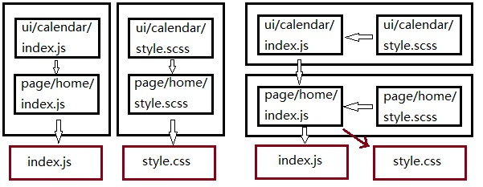

# 预处理器

## 一切皆模块

一个web工程通常会包含HTML、JS、CSS、模板、图片、字体等多种静态资源，并且这些资源之间都存在着某种联系。对于webpack来说，所有这些静态资源都是模块，我们可以像加载一个JS文件一样去加载他们，如index.js中加载style.css:
```js
//index.js
import './style.css';
```
使用webpack前后依赖关系对比


使用webpack将SCSS通过JS来引入，这样更清晰的描述了资源之间的关系。当移除这个组件时，也只要移除组件JS的引用即可，**代码维护性更强**

## loader概述

每个loader的本质都是一个**函数**。
* Webpack 4之前，函数的输入输出必须为**字符串**；
* Webpack 4之后，loader也同时支持抽象语法树AST的传递，减少重复代码的解析。

公式：```output=loader(input) ```

* **input**可能是工程源文件的字符串，也可能是上一个loader转化后的结果(也是字符串类型)、source map、以及AST对象；
* **output**同样包含这几种信息，转化后的文件字符串、source map、以及AST。

如果这时最后一个loader，结果将直接被送到Webpack进行后续处理，否则将作为下一个loader的输入向后传递。
例子：使用babel-loader将ES6+转化为ES5时的公式
```ES5=babel-loader(ES6+) ```。

loader可以是一个链式的。用公式表达``` output=loaderA(loaderB(loaderC(input))) ```

工程编译SCSS时我们就需要如下loader:

```Style标签=style-loader(css-loader(sass-loader(SCSS)))```

为了更好的理解loader是如何工作的，来看下loader源码结构

```js
module.exports=function(content,map,meta){
    var callback=this.async();
    var result=handler(content,map,meta);
    callback(
        null,           //error
        result.content, //转换后的内容
        result.map,     //转换后的source-map
        result.meta     //转换后的AST
    );
}
```

## loader的配置

loader的字面意思是装载器，在Webpack中更像是一个预处理器。Webpack本身只认识JavaScript，对于其他类型的资源必须预先定义一个或多个loader，对其进行转译输出Webpack能够接收的形式再继续进行。

### loader的引入

loader都是一些第三方模块，使用loader的第一步就是先安装。
```npm install css-loader```

接下来引入
```js
module.exports={
    module:{
        rules:[{
            test:/\.css$/,
            use:['css-loader']
        }]
    }
}
```
loader相关的配置都在module对象中，其中module.rules代表了模块的处理规则。这里我们只使用了最重要的两项

* test 可接受一个正则表达式或一个元素为正则表达式的数组，只有正则匹配的模块才会使用这条规则。
* use 可接受一个数组，在只有一个loader时也可以简化为**字符串**'css-loader'。

css-loader的作用仅仅处理CSS的各种加载语法(@import和url()函数等)。

style-loader来把样式字符串包装成style标签插入页面。

### 链式loader

很多时候，在处理某一类资源时我们需要多个loader，如：
```js
module.exports={
    module:{
        rules:[
            {
                test:/\.css$/,
                use:['style-loader','css-loader']
            }
        ]
    }
}
```
Webpack打包时是按照数组**从后往前**的顺序将资源交给loader处理的，因此要把最后生效的放在前面。

### loader options

loader 作为预处理器通常会给开发者提供一些配置项，在引入loader的时候可以通过options将他们传入，如：

```js
rules:[
    {
        test:'\.css$',
        use:[
            'style-loader',
            {
                loader:'css-loader',
                options:{
                    //css-loader配置项
                }
            }
        ]
    }
]
```
有些loader可能会使用query来代替options。

### 更多配置

#### 1、exclude与include

exclude与include是用来排除或包含指定目录下的模块，可接受**正则表达式**或**字符串(文件的绝对路径)**

exclude例子：
```js
rules:[
    {
        test:/\.css$/,
        use:['style-loader','css-loader'],
        exclude:/node_modules/,
    }
]
```
上面例子exclude的含义是，所有被正则匹配到的模块都排除在该规则之外，也就是说node_modules中的模块不会执行这条规则。改配置项通常是必加的，否则影响打包速度。

include例子：
```js
rules:[
    {
        test:/\.css$/,
        use:['style-loader','css-loader'],
        include:/src/
    }
]
```
include 代表该规则只对正则匹配到的模块生效。

exclude和include同时存在，**exclude优先级更高**。

例子：
```js
rules:[
    {
        test:/\.css$/,
        use:['style-loader','css-loader'],
        exclude:/src\/lib/,
        include:/src/
    }
]
```
通过include，我们将该配置为仅对src目录生效，但是仍然通过exclude排除其中的src/lib目录。

#### 2、resource与issuer

resource与issuer可用于更加精确的确定模块规则的作用范围

Webpack中，resource是被加载模块，加载者是issuer。


```js
//index.js
import './style.css';

//resource为/path/app/style.css;
//issuer为/path/app/index.js;
rules:[
    {
        test:/\.css$/,
        use:['style-loader','css-loader'],
        exclude:/node_modules/,
        issuer:{
            test:/\.js/,
            include:/src/pages/
        }
    }
]
```

上面例子只有/src/pages/目录下的JS文件引用css文件，这条规则才会生效；

将上面优化可读性:
```js
rules:[
    {
        use:['style-loader','css-loader'],
        resource:{
            test:/\.css$/,
            exclude:/node_modules/
        },
        issure:{
            test:/\.js$/,
            exclude:/node_modules/
        }
    }
]
```
#### 3、enforce

enforce用来指定一个loader的种类，只接受'pre'或'post'两种字符串类型的值。
Webpack中的loader按照执行顺序可分为pre、inline、normal、post四种类型，上面我们直接定义的loader都属于normal类型，inline类型官方不推荐使用，pre、post需要enforce来指定。

例子：
```js
rules:[
    {
        test:/\.js$/,
        use:'eslint-loader',
        enforce:'pre'
    }
]
```

* pre，代表它将在所有正常loader之前执行。
* post, 指定一个loader在所有loader之后执行。

## 常用loader介绍

### babel-loader

安装：

```
npm install babel-loader @babel/core @babel/preset-env
```
* babel-loader:使Babel与Webpack协同工作的模块。
* @babel/core:它是Babel编译器的核心模块。
* @babel/preset-env:它是Babel官方推荐的欲置器，可根据用户设置的目标环境自动添加所需的插件和补丁来编译ES6+代码

在配置babel-loader时需要注意：
```js
rules:[
    {
        test:/\.js$/,
        exclude:/node_modules/,
        use:{
            loader:'babel-loader',
            options:{
                cacheDirectory:true,
                preset:[[
                    'env',{
                        modules:false
                    }
                ]]
            }
        }
    }
]
```

* 1、由于babel-loader通常属于对所有JS后缀文件的设置规则，所有需要在exclude中添加node_modules，否则它会编译其中的所有模块，这将严重拖慢打包速度，并且有可能改变第三方模块的原有行为。
* 2、对于babel-loader我们添加了cacheDirectory配置项，它会启用缓存机制，加快打包速度。接受一个**字符串**类型的路径作为缓存路径，值也可以为true，此时缓存目录为node_modules/.cache/babel-loader。
* 3、由于babel-preset-env会将ES6 Module转化为CommonJS的形式，这会使Webpack中的tree-shaking特性失效，将@babel/preset-env的modules配置项设置为false会禁用模块语句转化，而将ES6 Module的语法交给Webpack本身处理。

babel-loader支持从.babelrc文件中读取Babel配置，因此可以将preset和plugins从Webpack配置文件中提取出来，也能达到相同的效果。

### ts-loader

ts-loader与babel-loader的性质类似，它是用于连接Webpack与TypeScript的模块

```
npm install ts-loader typescript
```
配置：
```js
rules:[
    test:/\.ts$/,
    use:'ts-loader'
]
```

**注意：**

TypeScript本身的配置并不在ts-loader中，而是必须要放在工程目录下的tsconfig.json中

### html-loader

html-loader用于将HTML文件转化为字符串并进行格式化，这使得我们可以把一个HTML片段通过JS加载进来。

```js
//webpacl配置
rules:[
    {
        test:/\.html$/,
        use:'html-loader'
    }
]

//header.html
<header>
<h1>header</h1>
</header>
//index.js
import headerHtml from './header.html';
document.write(headerHtml);
```
### handlebars-loader

用于处理handlebars模板，需要额外安装handlebars。

```js
//webpack配置
rules:[
    {
        test:/\.handlebars$/,
        use:'handlebars-loader'
    }
]

//content.candlebars
<div class="entry">
    <h1>{{title}}</h1>
    <div class='body'>{{body}}</div>
</div>

//index.js
import contentTemplate from './content.handlebars';
const div=document.createElement('div');
div.innerHTML=contentTemplate({
    title:'Title',
    body:'天气真不错',
})
document.body.appendChild(div);
```
handlebars文件加载后得到的是一个函数，可以接受一个变量并返回最终的字符串

### file-loader
file-loader 用于打包文件类型的资源，并返回其publicPath。

```js
const path=require('path');
module.exports={
    entry:'./app.js',
    output:{
        path:path.join(__dirname,'dist'),
        filename:'bundle.js',
    },
    module:{
        rules:[
            {
                test:/\.(png|jpg|gif)$/,
                use:'file-loader'
            }
        ]
    }
}
```
output.path是资源的打包输出路径，output.publicPath是资源引用路径。打包完成后dist目录会生成图片文件，由于配置没有指定output.publicPath，因此这里打印出的图片路径只是文件名，默认为文件的hash值加上文件后缀。

添加output.publicPath后
```js
const path=require('path');
module.exports={
    entry:'./app.js',
    output:{
        path:path.join(__dirname,'dist'),
        filename:'bundle.js',
        publicPath:'./assets/'
    },
    module:{
        rules:[
            {
                test:/\.(png|jpg|gif)$/,
                use:'file-loader'
            }
        ]
    }
}
```
此时图片路径会成为如下形式：
```js
import avatarImage from './avatar.jpg';
console.log(avatarImage);//./assets/c8ds7c8ds78df9sdc.jpg
```

file-loader也支持配置文件名以及publicPath(这里的publicPath会覆盖原有的output.publicPath)；

```js
const path=require('path');
module.exports={
    entry:'./app.js',
    output:{
        path:path.join(__dirname,'dist'),
        filename:'bundle.js',
        publicPath:'./assets/'
    },
    module:{
        rules:[
            {
                test:/\.(png|jpg|gif)$/,
                use:{
                    loader:'file-loader',
                    options:{
                        name:'[name]-[ext]',
                        publicPath:'./another-path/'
                    }
                }
            }
        ]
    }
}
```

### url-loader

与file-loader的作用类似，唯一不同在于用户可以设置一个文件大小的阈值，当大于该阈值时与file-loader一样返回publicPath,而小于阈值时返回文件base64形式编码。
```js
rules:[
    {
        test:/\.(png|jpg|gif)/,
        use:{
            loader:'url-loader',
            options:{
                limit:10240,
                name:'[name]-[ext]',
                publicPath:'/assets-path'
            }
        }
    }
]
```

### vue-loader
vue-loader用于处理vue组件，可以将组件的模板、JS及样式进行拆分，还需要安装**vue-template-compiler**来编译Vue模板


## 自定义loader

#### 1、loader初始化

我们将实现一个loader，它会为所有JS文件启用严格模式，也就是说会在文件头部加上'use strict';

创建一个force-strict-loader目录
```npm init -y```

```js
module.exports=function(content){
    var useStrictPrefix='\'use strict\';\n\n';
    return useStrictPrefix+content;
}
```

#### 2、启用缓存
当文件输入和其依赖没有发生变化时，应该让loader直接使用缓存，而不是重复进行转换工作，在Webpack中可以使用this.cacheable进行控制。
```js
module.exports=function(content){
    if(this.cacheable){
        this.cacheable();
    }
    var useStrictPrefix='\'use strict\';\n\n';
    return useStrictPrefix+content;
}
```
启用缓存可以加快webpack打包速度，并保证相同的输入产生相同的输出。

#### 3、获取options

```js
rules:[
    {
        test:/\.js$/,
        use:{
            loader:'force-strict-loader',
            options:{
                sourceMap:true
            }
        }
    }
]
```
上面我们自定义的loader传入了一个配置项sourceMap,我们获取它需要安装一个依赖loader-utils。它主要提供一些帮助函数；

```js
npm install loader-utils
module.exports=function(content){
    if(this.cacheable){
        this.cacheable();
    }
    var options=loaderUtils.getOptions(this)||{};
    console.log('options',options);
    var useStrictPrefix='\'use strict\';\n\n';
    return useStrictPrefix+content;
}
```

#### 4、source-map

可以便于实际开发者在浏览器控制台查看源码。

继续改进
```js
var loaderUtils=require('loader-utils');
var SourceNode=require("source-map").Node;
var SourceMapConsumer=require("source-map").SourceMapConsumer;
module.exports=function(content){
    if(this.cacheable){
        this.cacheable();
    }
    var options=loaderUtils.getOptions(this)||{};
    console.log('options',options);
    if(options.sourceMap&&sourceMap){
        var currentRequest=loaderUtils.getCurrentRequest(this);
        var node=SourceNode.fromStringWithSourceMap(content,new SourceMapConsumer(sourceMap));
        node.prepend(useStrictPrefix);
        var result=node.toStringWithSourceMap({file:currentRequest});
        var callback=this.async();
        callback(null,result.node,result.map,result.map.toJSON());
    }
    //不支持source-map情况
    return useStrictPrefix+content;
}
```


