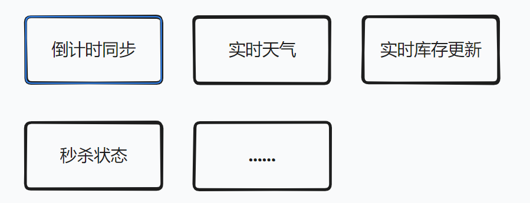
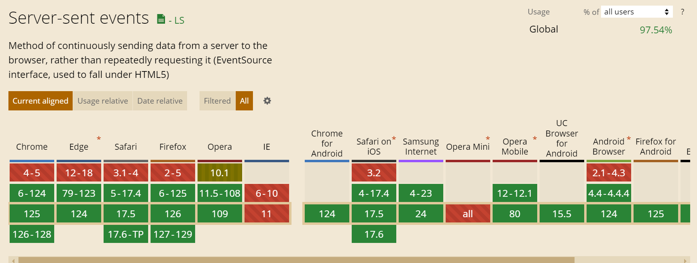

## 什么是 SSE 流式传输

> SSE 全称为  Server-sent events , 是一种基于 HTTP 协议的通信技术，允许服务器主动向客户端（通常是 Web 浏览器）发送更新。
> 它是 HTML5 标准的一部分，设计初衷是用来建立一个单向的服务器到客户端连接，使得服务器可以实时地向客户端发送数据。
> 这种服务端实时向客户端发送数据的传输方式，其实就是流式传输。

## SSE 流式传输的好处

长轮询最大的弊端是当服务端响应请求之前，客户端发送的所有请求都不会被受理。并且服务端发送响应的前提是客户端发起请求。

前后端通信过程中，我们常采用 ajax 、axios 来异步获取结果，这个过程，其实也是长轮询的过程。

而同为采用 http 协议通信方式的 SSE 流式传输，相比于长轮询模式来说，优势在于可以在不需要客户端介入的情况下，多次向客户端发送响应，直至客户端关闭连接

## SSE 技术原理

### 参数设置

前文说到，SSE 本质是一个基于 http 协议的通信技术。

因此想要使用  SSE  技术构建需要服务器实时推送信息到客户端的连接，只需要将传统的  http 响应头的 contentType 设置为 text/event-stream 。

并且为了保证客户端展示的是最新数据，需要将  Cache-Control 设置为 no-cache 。

在此基础上，SSE  本质是一个 TCP 连接，因此为了保证 SSE 的持续开启，需要将  Connection 设置为 keep-alive 。

### SSE Demo

服务端代码：

```js
const express = require("express");
const app = express();
const PORT = 3000;

app.use(express.static("public"));

app.get("/events", function (req, res) {
  res.setHeader("Content-Type", "text/event-stream");
  res.setHeader("Cache-Control", "no-cache");
  res.setHeader("Connection", "keep-alive");

  let startTime = Date.now();

  const sendEvent = () => {
    // 检查是否已经发送了10秒
    if (Date.now() - startTime >= 10000) {
      res.write("event: close\ndata: {}\n\n"); // 发送一个特殊事件通知客户端关闭
      res.end(); // 关闭连接
      return;
    }

    const data = { message: "Hello World", timestamp: new Date() };
    res.write(`data: ${JSON.stringify(data)}\n\n`); // 每隔2秒发送一次消息

    setTimeout(sendEvent, 2000);
  };

  sendEvent();
});

app.listen(PORT, () => {
  console.log(`Server running on http://localhost:${PORT}`);
});
```

客户端代码：

```html
<!DOCTYPE html>
<html lang="en">
  <head>
        
    <meta charset="UTF-8" />
        
    <title>SSE Example</title>
  </head>

  <body>
        
    <h1>Server-Sent Events Example</h1>
        
    <div id="messages"></div>

        
    <script>
      const evtSource = new EventSource("/events");
      const messages = document.getElementById("messages");

      evtSource.onmessage = function (event) {
        const newElement = document.createElement("p");
        const eventObject = JSON.parse(event.data);
        newElement.textContent = "Message: " + eventObject.message + " at " + eventObject.timestamp;
        messages.appendChild(newElement);
      };
    </script>
  </body>
</html>
```

## SSE 应用场景

SSE 作为基于 http 协议由服务端向客户端单向推送消息的通信技术，对于需要服务端主动推送消息的场景来说



## SSE 兼容性


可以发现，除了 IE 和低版本的主流浏览器，目前市面上绝大多数浏览器都支持 SSE 通信

## SSE 与 WebSocket 对比

| 特性/因素      | SSE                                                           | WebSockets                                      |
| -------------- | ------------------------------------------------------------- | ----------------------------------------------- |
| 协议           | 基于 HTTP，使用标准 HTTP                                      | 连接单独的协议（ws:// 或 wss://），需要握手升级 |
| 通信方式       | 单向通信（服务器到客户端）                                    | 全双工通信数据格式                              |
| 文本           | （UTF-8 编码）                                                | 文本或二进制                                    |
| 重连机制       | 浏览器自动重连                                                | 需要手动实现重连机制实                          |
| 时性           | 高（适合频繁更新的场景）                                      | 非常高（适合高度交互的实时应用）                |
| 浏览器支持     | 良好（大多数现代浏览器支持）                                  | 非常好（几乎所有现代浏览器支持）                |
| 适用场景       | 实时通知、新闻 feed、股票价格等需要从服务器推送到客户端的场景 | 在线游戏、聊天应用、实时交互应用                |
| 复杂性         | 较低，易于实现和维护                                          | 较高，需要处理连接的建立、维护和断开            |
| 兼容性和可用性 | 基于 HTTP，更容易通过各种中间件和防火墙                       | 可能需要配置服务器和网络设备以支持 WebSocket    |
| 服务器负载     | 适合较低频率的数据更新                                        | 适合高频率消息和高度交互的场景                  |
