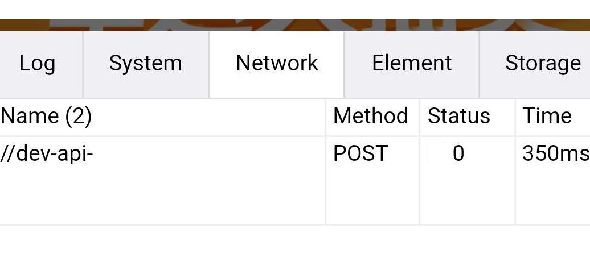
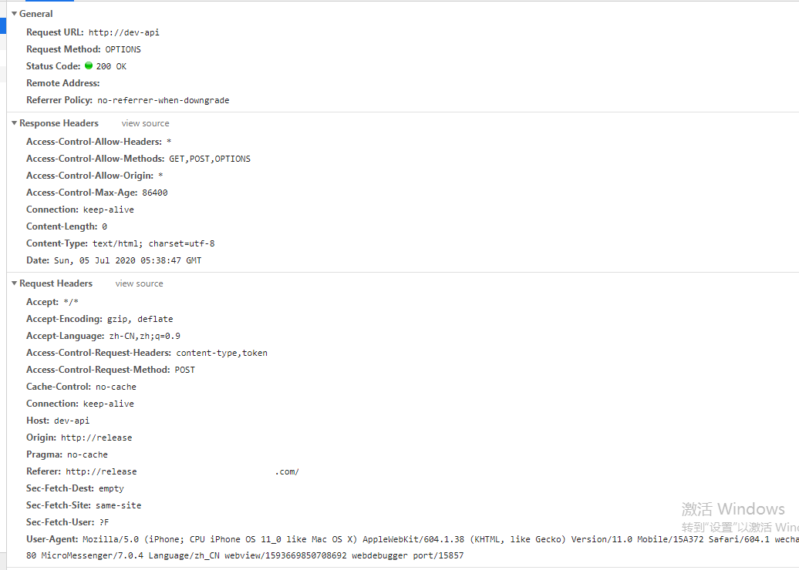
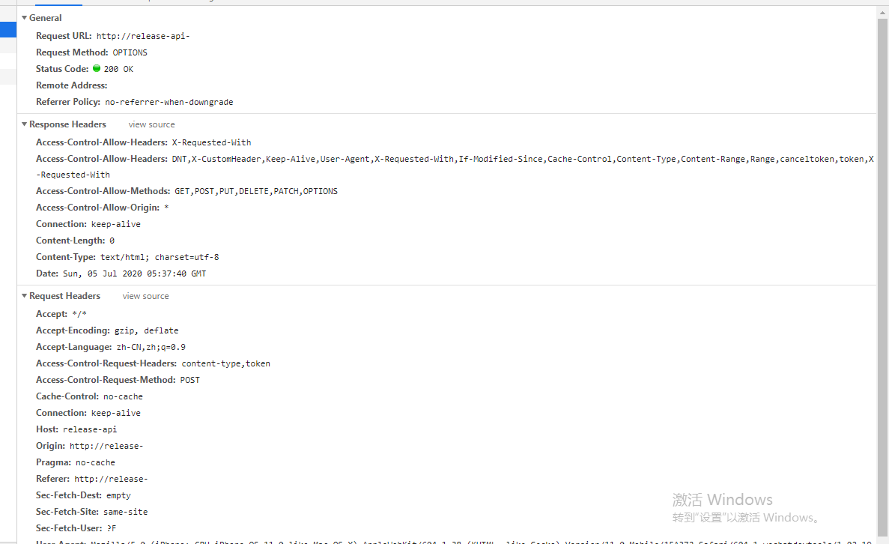

## axios请求status为0

自定义了请求头，联调微信服务号H5页面时，部分设备optiosn请求后没有发送post请求，请求状态为0 
[VConsole](https://www.npmjs.com/package/vconsole)调试显示:

#### 一、
+ 1、保证了网络协议一致
+ 2、nginx配置允许options请求配置

#### 二、检查header头

**dev环境** `有问题的`环境

**release环境正常**

**`Access-Control-Allow-Headers`**
因为后台设置的headers为`*`，可能 **ios13/安卓10一下**浏览器识别不出来后台允许有自定义请求头的存在。

将后台的**`Access-Control-Allow-Headers:*`**改为具体允许的自定义请求头
