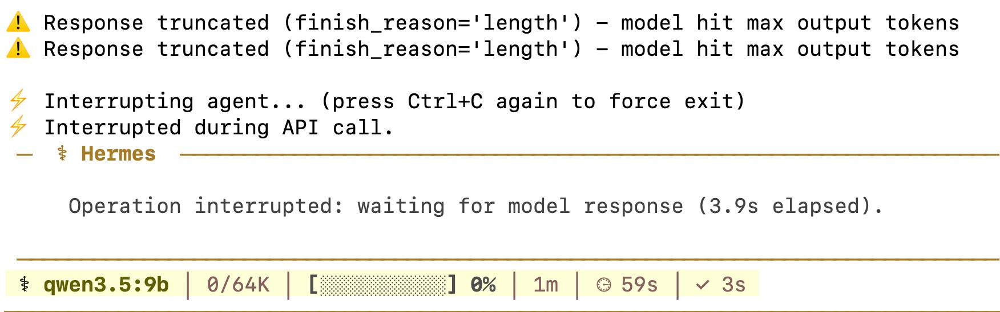
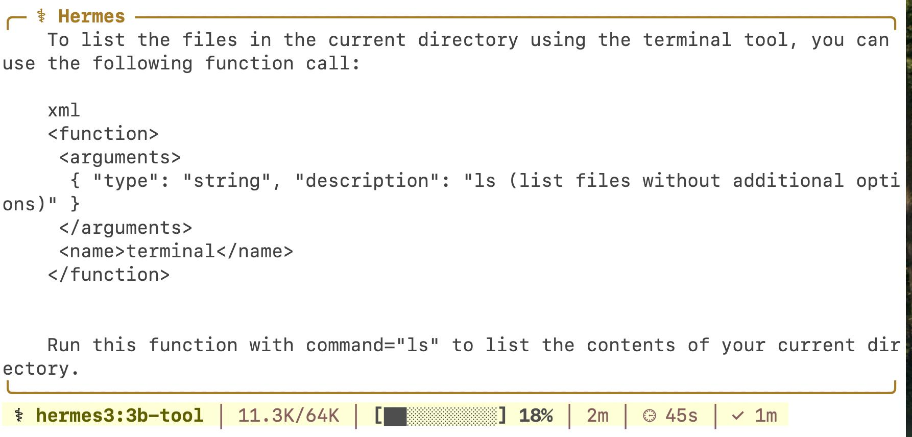

# 本地模型常见问题

注意：ollama选择模型一定要支持工具调用

## 上下文报错问题
- hermes 需要的模型上下文至少64k 
- 可以设置model.context_length: 64000

## 模型返回长度问题


这个报错的核心是模型单次输出的 token 数量触达了上限，没输出完就被强制截断，连续触发两次说明当前输出长度限制完全不够用。
状态栏显示 0/64K，说明不是输入上下文溢出，纯纯是「输出生成长度」配额不够。
根因有两个：
- Ollama 默认 num_predict（最大输出 token）通常只有 512~1024，Agent 场景下工具调用 + 推理内容很容易超标；
- 模型自带推理思考文本，大段思考内容会先吃掉输出配额，导致正经的工具指令 / 回答还没写完就被截断

### 解决方法1 重建模型，永久放大输出配额
```bash
cat > Modelfile <<EOF
FROM qwen3.5:9b
# 核心：放大单次最大输出token，解决截断
PARAMETER num_predict 4096
# 上下文保持64K不变
PARAMETER num_ctx 65536
# 降低随机性，减少冗余啰嗦输出
PARAMETER temperature 0.1
# 强制精简输出，禁止大段思考废话
SYSTEM """
你是极简自动化助手，严格输出工具调用指令，禁止多余解释、禁止大段推理文字，回答极度精简。
"""
EOF
```
```bash
ollama create qwen3.5:9b-fast -f Modelfile
```

### 方案 2：临时快速修复（不用重建模型）
直接在 Hermes 配置的额外参数里透传输出长度限制：

```bash
hermes config set model.extra_params '{"num_predict": 4096}'
```

关闭不常用工具
```bash
# 仅保留终端工具，按需调整
hermes tools disable browser computer_use image_generation tts vision
```
修改后执行 /new 开新会话生效。

## 工具调用问题
hermes3:3b


- 3B 参数量太小，指令遵循 + 格式对齐能力弱，很容易混淆「工具定义说明」和「实际工具调用指令」；
- 对话模板 / 工具注入格式不匹配，Hermes3 原生训练用的是 <tool_call> 标准标签，当前注入格式不对，模型跑偏输出了自定义 <function> 标签；
- 工具描述 + 上下文冗余，超出 3B 模型的指令承载上限，模型开始复读 / 解释工具定义，而不是执行调用

```bash
hermes config set model.provider ollama
```

现在使用`qwen3.5:9b`,重建模型后可调用工具了
