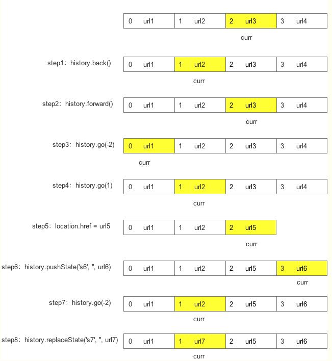

## window.history
> 最近项目中遇到了处理页面跳转相关问题，发现对history API还是有所‘怀疑’，所以记录此篇。

### 属性
+ `length`:查看历史记录栈中一共有多少个记录点：window.history.length;
+ `state`

### 方法

#### `back()`
回退到上一个访问记录; 在历史记录中后退：window.history.back();

#### `forward()`
前进到下一个访问记录; 在历史记录中前进：window.history.forward();

#### `go(num)`
跳转到相应的访问记录;其中num大于0，则前进;小于0，则后退; 例如：后退一页window.history.go(-1); 向前移动一页window.history.go(1);

#### `pushState(stateDate,title,url)`
在history中创建一个新的访问记录，不能跨域，且不造成页面刷新;

#### `replaceState(stateDate,title,url)`
修改当前的访问记录，不能跨域，且不造成页面刷新;

### 事件
#### `window.onpopstate`
当调用history.go()、history.back()、history.forward()时触发;pushState()\replaceState()方法不触发。

#### `window.onhashchange`
当前 URL 的锚部分(以 '#' 号为开始) 发生改变时触发。触发的情况如下：
+ 通过设置Location 对象 的 location.hash 或 location.href 属性修改锚部分;

+ 使用不同history操作方法到带hash的页面;

+ 点击链接跳转到锚点。

### history与浏览器的行为

前四步均为获取history记录中的url的方法 
步骤5：使用location.href创建了新的url记录，并将创建前url之后的记录清空，history.length也会改变，`刷新页面` 
步骤6：使用pushState方法创建新的url记录，也是清空，`不刷新页面` 
步骤8：使用replaceState方法修改了当前记录，不会产生新的记录。

#### 参考：
[https://www.kmbox.cn/html/help/362.html](https://www.kmbox.cn/html/help/362.html)

