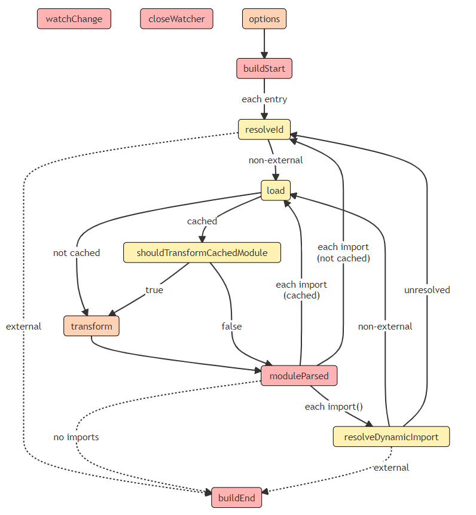

# rollup

## JavaScript API
+ rollup.rollup
  - inputOptions object
  - outputOptions object
+ rollup.watch
  - watchOptions
  - Programmatically loading a config file
  
## rollup plugin

### Build Hooks

为了与构建过程进行交互，您的插件对象包括“钩子”。挂钩是在构建的各个阶段调用的函数。挂钩可以影响构建的运行方式、提供有关构建的信息或在完成后修改构建。有不同种类的钩子
+ `async`:该钩子还可能返回一个解析为相同类型值的 Promise；否则，钩子被标记为同步
+ `first`:如果有几个插件实现了这个钩子，这些钩子会按顺序运行，直到一个钩子返回一个不是 null 或 undefined 的值。
+ sequential:如果有几个插件实现了这个钩子，它们都将按照指定的插件顺序运行。如果一个钩子是异步的，那么后续的这种钩子将等到当前的钩子被解决。
+ `parallel`:如果有几个插件实现了这个钩子，它们都将按照指定的插件顺序运行。如果一个钩子是异步的，那么后续的这种钩子将并行运行，而不是等待当前的钩子

构建钩子在构建阶段运行，由 `rollup.rollup(inputOptions)` 触发。它们主要关注在 `Rollup` 处理输入文件之前定位、提供和转换输入文件。构建阶段的第一个钩子是选项，最后一个始终是 `buildEnd`。如果存在构建错误，则将在此之后调用 `closeBundle`。

#### watchChange
+ Type: watchChange: (id: string, change: {event: 'create' | 'update' | 'delete'}) => void
+ Kind: async, parallel
+ Previous/Next Hook: 这个钩子可以在构建和输出生成阶段的任何时候触发。如果是这种情况，当前构建仍将继续，但是一旦当前构建完成，将安排新构建开始，并使用选项重新开始.

每当汇总检测到在 --watch 模式下对受监视文件的更改时通知插件。如果返回一个 Promise，Rollup 将等待 Promise 解决，然后再安排另一个构建。这个钩子不能被输出插件使用。第二个参数包含更改事件的其他详细信息。

#### closeWatcher
+ Type: () => void
+ Kind: async, parallel
+ Previous/Next Hook: 这个钩子可以在构建和输出生成阶段的任何时候触发。如果是这种情况，当前构建仍将继续，但不会触发任何新的 `watchChange` 事件。

当观察者进程关闭时通知插件，以便所有打开的资源也可以关闭。如果返回 `Promise`，`Rollup` 将等待 `Promise` 解决，然后再关闭进程。这个钩子不能被输出插件使用。

#### options
+ Type: (options: InputOptions) => InputOptions | null
+ Kind: async, sequential
+ Previous Hook: 这是构建阶段的第一个钩子
+ Next Hook: `buildStart`

替换或操作传递给 rollup.rollup 的选项对象。返回 null 不会替换任何内容。如果您只需要阅读选项，建议使用 buildStart 钩子，因为在考虑所有选项钩子的转换后，该钩子可以访问选项。

这是唯一一个无法访问大多数插件上下文实用程序函数的钩子，因为它在完全配置汇总之前运行。

#### buildStart
+ Type: (options: InputOptions) => void
+ Kind: async, parallel
+ Previous Hook: `options`
+ Next Hook: `resolveId` 并行解析每个入口点

在每个 `rollup.rollup` 构建中调用。当您需要访问传递给 `rollup.rollup()` 的选项时，推荐使用此钩子，因为它考虑了所有选项钩子的转换，并且还包含未设置选项的正确默认值。
#### resolveId
+ Type: (source: string, importer: string | undefined, options: {isEntry: boolean, custom?: {[plugin: string]: any}) => string | false | null | {id: string, external?: boolean | "relative" | "absolute", moduleSideEffects?: boolean | "no-treeshake" | null, syntheticNamedExports?: boolean | string | null, meta?: {[plugin: string]: any} | null}
+ Kind: async, first
+ Previous Hook:如果我们正在解析入口点，则 `buildStart`，如果我们正在解析导入，则为 `moduleParsed`，或者作为 `resolveDynamicImport` 的后备。此外，这个钩子可以在插件钩子的构建阶段通过调用 `this.emitFile` 来发出一个入口点，或者在任何时候通过调用 `this.resolve` 来手动解析一个 `id`。
+ Next Hook:如果解析的 `id` 尚未加载，则`load`，否则 `buildEnd`。

#### load
+ Type: (id: string) => string | null | {code: string, map?: string | SourceMap, ast? : ESTree.Program, moduleSideEffects?: boolean | "no-treeshake" | null, syntheticNamedExports?: boolean | string | null, meta?: {[plugin: string]: any} | null}
+ Kind: async, first
+ Previous Hook: `resolveId` 或 `resolveDynamicImport` 解析加载的 `id` 的位置。此外，这个钩子可以随时从插件钩子中触发，方法是调用 `this.load` 来预加载对应于 `id` 的模块。
+ Next Hook:如果没有使用缓存，或者没有具有相同代码的缓存副本，则 `transform` 转换加载的文件，否则应该`TransformCachedModule`。

#### transform
+ Type: (code: string, id: string) => string | null | {code?: string, map?: string | SourceMap, ast? : ESTree.Program, moduleSideEffects?: boolean | "no-treeshake" | null, syntheticNamedExports?: boolean | string | null, meta?: {[plugin: string]: any} | null}
+ Kind: async, sequential
+ Previous Hook: 当前处理的文件的加载位置`load`.  如果使用缓存并且有该模块的缓存副本，`shouldTransformCachedModule` 插件对该钩子返回 true.
+ Next Hook: `moduleParsed` 一旦文件被处理和解析.

#### shouldTransformCacheModule
+ Type: ({id: string, code: string, ast: ESTree.Program, resoledSources: {[source: string]: ResolvedId}, meta: {[plugin: string]: any}, moduleSideEffects: boolean | "no-treeshake", syntheticNamedExports: string | boolean}) => boolean
+ Kind: async, first
+ Previous Hook: `load` 加载缓存文件以将其代码与缓存版本进行比较的位置
+ Next Hook: 如果没有插件返回 true `moduleParsed`, 否则 `transform`.

如果使用 Rollup 缓存（例如，在监视模式下或通过 JavaScript API 显式），如果在加载钩子之后，加载的代码与缓存副本的代码相同，则 Rollup 将跳过模块的转换钩子。为了防止这种情况，丢弃缓存的副本并转换一个模块，插件可以实现这个钩子并返回 true。

这个钩子也可以用来找出哪些模块被缓存并访问它们缓存的元信息。

如果一个插件没有返回 true，Rollup 将为其他插件触发这个钩子，否则将跳过所有剩余的插件。

#### moduleParsed
+ Type: (moduleInfo: ModuleInfo) => void
+ Kind: async, parallel
+ Previous Hook: `transform` 当前处理的文件被转换的地方.
+ Next Hook: `resolveId` 和 `resolveDynamicImport` 并行解析所有发现的静态和动态导入（如果存在），否则 `buildEnd`

每次 Rollup 完全解析模块时都会调用此钩子。与 transform 挂钩相比，此挂钩从不缓存，可用于获取有关缓存和其他模块的信息，包括元属性的最终形状、代码和 ast

#### resolveDynamicImport
+ Type: (specifier: string | ESTree.Node, importer: string) => string | false | null | {id: string, external?: boolean}
+ Kind: async, first
+ Previous Hook: ` moduleParsed `用来于导入文件.
+ Next Hook: 如果钩子使用尚未加载的 `id` 解析，则加载，如果动态导入包含字符串且未由钩子解析，则为 `resolveId`，否则为 `buildEnd`。

为动态导入定义自定义解析器。返回错误信号，表明导入应该保持原样，而不是传递给其他解析器，从而使其成为外部的。与 resolveId 挂钩类似，您还可以返回一个对象以将导入解析为不同的 id，同时将其标记为外部。

如果动态导入传递了一个字符串作为参数，则从此钩子返回的字符串将被解释为现有模块 id，而返回 null 将推迟到其他解析器并最终解析为 resolveId。

如果动态导入未传递字符串作为参数，则此挂钩可以访问原始 AST 节点以进行分析，并在以下方面表现略有不同:

+ 如果所有插件都返回 null，则导入将被视为外部而不发出警告。

+ 如果返回字符串，则该字符串不会被解释为模块 id，而是用作 import 参数的替换。插件负责确保生成的代码有效。

+ 要解析对现有模块的此类导入，您仍然可以返回一个对象 {id, external}。

注意这个钩子的返回值之后不会传递给`resolveId`；如果您需要访问静态解析算法，可以在插件上下文中使用 `this.resolve(source, importer)`

#### buildEnd

+ Type: (error?: Error) => void
+ Kind: async, parallel
+ Previous Hook:`moduleParsed`, `resolveId` or `resolveDynamicImport`.
+ Next Hook: `outputOptions` 在输出生成阶段，因为这是构建阶段的最后一个钩子

在 `rollup` 完成捆绑时调用，但在调用 `generate` 或 `write` 之前调用；你也可以返回一个 `Promise`。如果在构建过程中发生错误，则将其传递给此钩子

### Output Generation Hooks

#### outputOptions

#### renderStart

#### banner

#### footer

#### intro

#### outro

#### renderDynamicImport

#### augmentChunkHash

#### resolveFileUrl

#### removeImportMeta

#### renderChunk

#### generateBundle

#### writeBundle

#### renderError

#### closeBUndle

### Plugin Context

#### this.addWatchFile
#### this.emitFile
#### this.error
#### this.getCombinedSourcemap
#### this.getFileName
#### this.getModuleIds
#### this.getModuleInfo
#### this.getWatchFiles
#### this.load
#### this.meta
#### this.parse
#### this.resolve
#### this.setAssetSource
#### this.warn