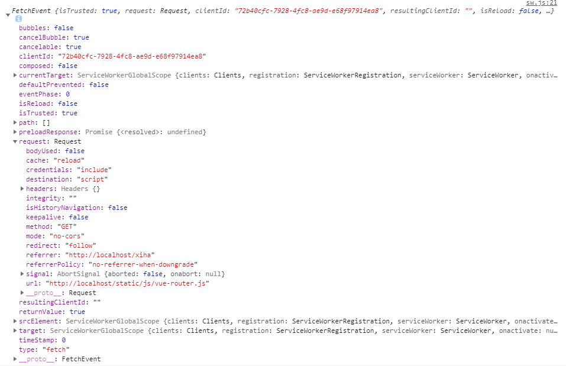

## service worker
[MDN](https://developer.mozilla.org/zh-CN/docs/Web/API/Service_Worker_API)这样介绍:

Service workers 本质上充当Web应用程序与浏览器之间的代理服务器，也可以在网络可用时作为浏览器和网络间的代理。它们旨在（除其他之外）使得能够创建有效的离线体验，拦截网络请求并基于`网络是否可用`以及`更新的资源是否驻留在服务器上`来采取适当的动作。他们还允许访问推送通知和后台同步API。

Service worker是一个注册在指定源和路径下的事件驱动worker。它采用JavaScript控制关联的页面或者网站，`拦截并修改访问和资源请求`，细粒度地缓存资源。你可以完全控制应用在特定情形（最常见的情形是网络不可用）下的表现。

Service worker运行在worker上下文，因此它`不能访问DOM`。相对于驱动应用的主JavaScript线程，它运行在其他线程中，所以不会造成阻塞。它设计为完全异步，同步API（如XHR和localStorage）不能在service worker中使用。

出于安全考量，Service workers只能由`HTTPS承载`，毕竟修改网络请求的能力暴露给中间人攻击会非常危险。在Firefox浏览器的用户隐私模式，Service Worker不可用。

+ **注册** 使用 ServiceWorkerContainer.register() 方法首次注册service worker。如果注册成功，service worker就会被下载到客户端并尝试安装或激活（见下文），这将作用于整个域内用户可访问的URL，或者其特定子集。
+ **下载** 用户首次访问service worker控制的网站或页面时，service worker会`立刻`被下载。
在以下情况下会进行更新：
   - 一个前往作用域内页面的导航
   - 在service worker上的一个事件被触发并且过去24小时没有被下载
+ **安装** 第一次在页面或网站遇到service worker，如果下载的文件是新的，安装就会尝试进行。
+ **激活** 如果这是首次启用service worker，页面会首先尝试安装，安装成功后它会被激活。如果现有service worker已启用，新版本会在后台安装，但不会被激活，这个时序称为worker in waiting。直到所有已加载的页面不再使用旧的service worker才会激活新的service worker。只要页面不再依赖旧的service worker，新的service worker会被激活（成为active worker）。

*注意: 因为oninstall和onactivate完成前需要一些时间，service worker标准提供一个waitUntil方法，当oninstall或者onactivate触发时被调用，接受一个promise。在这个 promise被成功resolve以前，功能性事件不会分发到service worker。*

### Cache

+ 为缓存的 Request / Response  对象对提供存储机制
+ 暴露在 window 作用域下
+ 一个域可以有多个命名 Cache 对象。
+ 非明确地更新缓存，否则缓存将不会被更新；除非删除，否则缓存数据不会过期。
+ 使用 `CacheStorage.open(cacheName)` 打开一个Cache 对象，再使用 Cache 对象的方法去处理缓存.

#### 方法

+ `Cache.match(request, options)`
返回一个 Promise对象，resolve的结果是跟 Cache 对象匹配的第一个已经缓存的请求。
+ `Cache.matchAll(request, options)`
返回一个Promise 对象，resolve的结果是跟Cache对象匹配的所有请求组成的数组。
+ `Cache.add(request)`
抓取这个URL, 检索并把返回的response对象添加到给定的Cache对象.这在功能上等同于调用 fetch(), 然后使用 Cache.put() 将response添加到cache中.
+ `Cache.addAll(requests)`
抓取一个URL数组，检索并把返回的response对象添加到给定的Cache对象。
+ `Cache.put(request, response)`
同时抓取一个请求及其响应，并将其添加到给定的cache。
+ `Cache.delete(request, options)`
搜索key值为request的Cache 条目。如果找到，则删除该Cache 条目，并且返回一个resolve为true的Promise对象；如果未找到，则返回一个resolve为false的Promise对象。
+ `Cache.keys(request, options)`
返回一个Promise对象，resolve的结果是Cache对象key值组成的数组。

### CacheStorage
通过 caches 属性访问 CacheStorage .
#### 方法
+  `CacheStorage.match()`
检查给定的 Request 是否是 CacheStorage 对象跟踪的任何 Cache 对象的键，并返回一个resolve为该匹配的 Promise .
+ `CacheStorage.has()`
如果存在与 cacheName 匹配的 Cache 对象，则返回一个resolve为true的 Promise .
+ `CacheStorage.open()`
返回一个 Promise ，resolve为匹配  cacheName （如果不存在则创建一个新的cache）的 Cache 对象
+ `CacheStorage.delete()`
查找匹配 cacheName 的 Cache 对象，如果找到，则删除 Cache 对象并返回一个resolve为true的 Promise 。如果没有找到 Cache 对象，则返回 false.
+ `CacheStorage.keys()`
返回一个 Promise ，它将使用一个包含与 CacheStorage 追踪的所有命名 Cache 对象对应字符串的数组来resolve. 使用该方法迭代所有 Cache 对象的列表。

### InstallEvent
该参数传递到 oninstall 事件处理程序，InstallEvent接口表示一个 ServiceWorker 的 ServiceWorkerGlobalScope 上分派的安装操作。作为 ExtendableEvent 的一个子类，它确保在安装期间不调度诸如 FetchEvent 之类的功能事件。

该接口继承自 ExtendableEvent 接口。`Event < ExtendableEvent < InstallEvent`

#### 属性
+ `InstallEvent.activeWorker` 返回当前处于激活状态，控制页面的ServiceWorker

#### 方法 继承ExtendableEvent

**提示：** 只有当全局范围是 ServiceWorkerGlobalScope 时，此接口才可用。当它是一个 Window 或其他类型 worker 的作用域时，它不可用。

+ `ExtendableEvent.waitUntil()`方法扩展了事件的生命周期。在服务工作线程中，延长事件的寿命从而阻止浏览器在事件中的异步操作完成之前终止服务工作线程。它将在service worker 的 install 和 activate 事件中被调用。

使用：`event.waitUntil(promise)`

###  FetchEvent

#### 属性
+ `FetchEvent.isReload` 
+ `FetchEvent.request`
+ `FetchEvent.clientId`

#### 方法
+ `FetchEvent.respondWith()`

