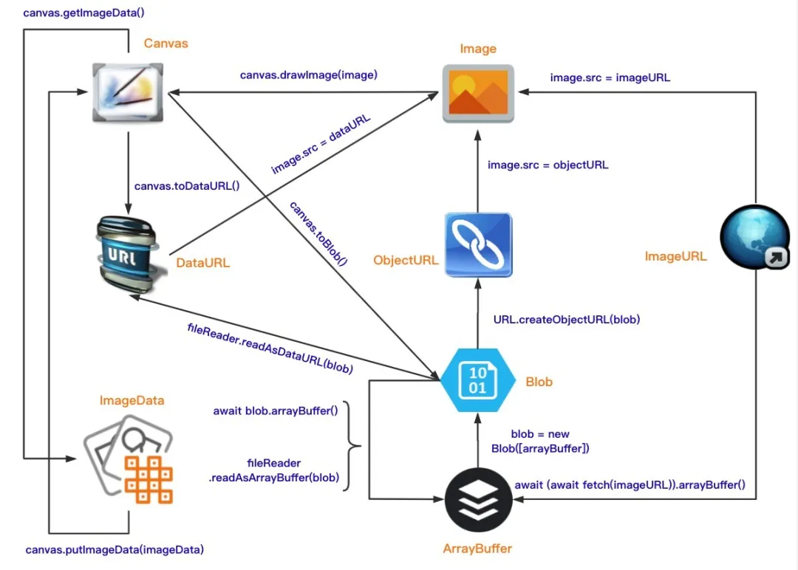
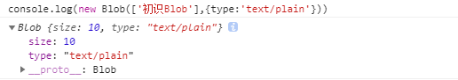

## 了解Blob



开发过程中经常遇到的Blob对象是个啥，今天一探究竟

### 什么是Blob
Blob（Binary Large Object）表示二进制类型的大对象。在数据库管理系统中，将二进制数据存储为一个单一个体的集合。Blob 通常是影像、声音或多媒体文件。在 JavaScript 中 Blob 类型的对象表示不可变的类似文件对象的原始数据。 为了更直观的感受 Blob 对象，我们先来使用 Blob 构造函数，创建一个 myBlob 对象


如你所见，myBlob 对象含有两个属性：`size` 和 `type`。其中 size 属性用于表示数据的大小（以字节为单位），type 是 `MIME` 类型的字符串。Blob 表示的不一定是 JavaScript 原生格式的数据。比如 File 接口基于 Blob，继承了 blob 的功能并将其扩展使其支持用户系统上的文件。

### Blob的API
Blob 由一个可选的字符串 type（通常是 MIME 类型）和 blobParts 组成：

Blob= image/png + blob/ArrayBuffer/DOMString

?> MIME（Multipurpose Internet Mail Extensions）多用途互联网邮件扩展类型，是设定某种扩展名的文件用一种应用程序来打开的方式类型，当该扩展名文件被访问的时候，浏览器会自动使用指定应用程序来打开。多用于指定一些客户端自定义的文件名，以及一些媒体文件打开方式。<br>
常见的 MIME 类型有：超文本标记语言文本 .html text/html、PNG图像 .png image/png、普通文本 .txt text/plain 等

**构造函数**

```js
new Blob(blobParts,options)
```
+ blobParts：它是一个由 ArrayBuffer，ArrayBufferView，Blob，DOMString 等对象构成的数组。DOMStrings 会被编码为 UTF-8。
+ options：一个可选的对象，包含以下两个属性：
    - type —— 默认值为 ""，它代表了将会被放入到 blob 中的数组内容的 MIME 类型。
    - endings —— 默认值为 "transparent"，用于指定包含行结束符 \n 的字符串如何被写入。它是以下两个值中的一个："native"，代表行结束符会被更改为适合宿主操作系统文件系统的换行符，或者 "transparent"，代表会保持 blob 中保存的结束符不变。

**属性**

两个属性：`size`和`type`
+ size（只读）：表示 Blob 对象中所包含数据的大小（以字节为单位）。
+ type（只读）：一个字符串，表明该 Blob 对象所包含数据的 MIME 类型。如果类型未知，则该值为空字符串。

**方法**

+ slice([start[, end[, contentType]]])：返回一个新的 Blob 对象，包含了源 Blob 对象中指定范围内的数据。
+ stream()：返回一个能读取 blob 内容的 ReadableStream。
+ text()：返回一个 Promise 对象且包含 blob 所有内容的 UTF-8 格式的 USVString。
+ arrayBuffer()：返回一个 Promise 对象且包含 blob 所有内容的二进制格式的 ArrayBuffer。

这里我们需要注意的是，Blob 对象是不可改变的。我们不能直接在一个 Blob 中更改数据，但是我们`可以对一个 Blob 进行分割`，从其中创建新的 Blob 对象，将它们混合到一个新的 Blob 中。这种行为类似于 JavaScript 字符串：我们无法更改字符串中的字符，但可以创建新的更正后的字符串。

### 使用场景

**分片上传**

File 对象是特殊类型的 Blob，且可以用在任意的 Blob 类型的上下文中。所以针对大文件传输的场景，我们可以使用 slice 方法对大文件进行切割，然后分片进行上传，具体示例如下：
```js
const file = new File(["a".repeat(1000000)], "test.txt");

const chunkSize = 40000;
const url = "/upFile";

async function chunkedUpload() {
  for (let start = 0; start < file.size; start += chunkSize) {
      const chunk = file.slice(start, start + chunkSize + 1);
      const fd = new FormData();
      fd.append("data", chunk);

      await fetch(url, { method: "post", body: fd }).then((res) =>
        res.text()
      );
  }
}
```

**下载数据**

```js
const downloadBlob = (url, callback) => {
 const xhr = new XMLHttpRequest()
 xhr.open('GET', url)
 xhr.responseType = 'blob'
 xhr.onload = () => {
    callback(xhr.response)
 }
 xhr.send(null)
}
```

当然除了使用 XMLHttpRequest API 之外，我们也可以使用 fetch API 来实现以流的方式获取二进制数据。这里我们来看一下如何使用 fetch API 获取线上图片并本地显示，具体实现如下
```js
const myImage = document.querySelector('img');
const myRequest = new Request('flowers.jpg');

fetch(myRequest)
  .then(function(response) {
    return response.blob();
  })
 .then(function(myBlob) {
   let objectURL = URL.createObjectURL(myBlob);
   myImage.src = objectURL;
});
```

当 fetch 请求成功的时候，我们调用 `response` 对象的 `blob()` 方法，从 response 对象中读取一个 `Blob` 对象，然后使用 `createObjectURL()` 方法创建一个 `objectURL`，然后把它赋值给 img 元素的 src 属性从而显示这张图片。

**作为URL**

Blob 可以很容易的作为 `<a>`、`` 或其他标签的 URL，多亏了 `type` 属性，我们也可以上传/下载 Blob 对象。下面我们将举一个 Blob 文件下载的示例，不过在看具体示例前我们得简单介绍一下 Blob URL。

`Blob URL/Object URL`是一种伪协议，允许 `Blob` 和 `File` 对象用作图像，下载二进制数据链接等的 URL 源。在浏览器中，我们使用 `URL.createObjectURL` 方法来创建 `Blob URL`，该方法接收一个 `Blob` 对象，并为其创建一个唯一的 URL，其形式为 `blob:<origin>/<uuid>`

浏览器内部为每个通过 `URL.createObjectURL` 生成的 URL 存储了一个 `URL → Blob` 映射。因此，此类 URL 较短，但可以访问 Blob。生成的 URL 仅在当前文档打开的状态下才有效。它允许引用 `、<a>` 中的 Blob，但如果你访问的 Blob URL 不再存在，则会从浏览器中收到 404 错误。

上述的 Blob URL 看似很不错，但实际上它也有副作用。虽然存储了 `URL → Blob` 的映射，但 Blob 本身仍驻留在内存中，浏览器无法释放它。映射在文档卸载时自动清除，因此 Blob 对象随后被释放。

但是，如果应用程序寿命很长，那不会很快发生。因此，如果我们创建一个 Blob URL，即使不再需要该 Blob，它也会存在内存中。

针对这个问题，我们可以调用 `URL.revokeObjectURL(url)` 方法，从内部映射中删除引用，从而允许删除 Blob（如果没有其他引用），并释放内存。

**Blob 转换为 Base64**
URL.createObjectURL 的一个替代方法是，将 Blob 转换为 base64 编码的字符串。Base64 是一种基于 64 个可打印字符来表示二进制数据的表示方法，它常用于在处理文本数据的场合，表示、传输、存储一些二进制数据，包括 MIME 的电子邮件及 XML 的一些复杂数据。

在 MIME 格式的电子邮件中，`base64` 可以用来将二进制的字节序列数据编码成 `ASCII` 字符序列构成的文本。使用时，在传输编码方式中指定 base64。使用的字符包括`大小写拉丁字母各 26 个`、`数字 10 个`、`加号 + `和`斜杠 /`，共 64 个字符，`等号 = `用来作为后缀用途。

Data URLs 由四个部分组成：前缀（data:）、指示数据类型的 MIME 类型、如果非文本则为可选的 base64 标记、数据本身：

    data:[<mediatype>][;base64],<data>

`mediatype` 是个 MIME 类型的字符串，例如 "image/jpeg" 表示 JPEG 图像文件。如果被省略，则`默认值为 text/plain;charset=US-ASCII`。如果数据是文本类型，你可以直接将文本嵌入（根据文档类型，使用合适的实体字符或转义字符）。如果是二进制数据，你可以将数据进行 base64 编码之后再进行嵌入。比如嵌入一张图片：

    

利用 `FileReader API`，我们也可以方便的实现图片本地预览功能

```js
<input type="file" accept="image/*" onchange="loadFile(event)">


<script>
  const loadFile = function(event) {
    const reader = new FileReader();
    reader.onload = function(){
      const output = document.querySelector('output');
      output.src = reader.result;
    };
    reader.readAsDataURL(event.target.files[0]);
  };
</script>
```

在完成本地图片预览之后，我们可以直接把图片对应的 Data URLs 数据提交到服务器。针对这种情形，服务端需要做一些相关处理，才能正常保存上传的图片，这里以 Express 为例，具体处理代码如下：

```js
const app = require('express')();

app.post('/upload', function(req, res){
    let imgData = req.body.imgData; // 获取POST请求中的base64图片数据
    let base64Data = imgData.replace(/^data:image\/\w+;base64,/, "");
    let dataBuffer = Buffer.from(base64Data, 'base64');
    fs.writeFile("image.png", dataBuffer, function(err) {
        if(err){
          res.send(err);
        }else{
          res.send("图片上传成功！");
        }
    });
});
```

更多[FileReader](https://developer.mozilla.org/zh-Cn/docs/Web/API/FileReader)的介绍

**图片压缩**

关于图片压缩请看[这篇文章](/杂谈/图片压缩和视频截取帧图片)
我们可以利用 Canvas 对象提供的 toDataURL() 方法，该方法接收 type 和 encoderOptions 两个可选参数。
+ type 表示图片格式，默认为 image/png。
+ encoderOptions 用于表示图片的质量，在指定图片格式为 image/jpeg 或 image/webp 的情况下，可以从 0 到 1 的区间内选择图片的质量。如果超出取值范围，将会使用默认值 0.92，其他参数会被忽略。

### Blob 与 ArrayBuffer 的区别
?> ArrayBuffer 对象用于表示通用的，固定长度的原始二进制数据缓冲区。你不能直接操纵 ArrayBuffer 的内容，而是需要创建一个类型化数组对象或 DataView 对象，该对象以特定格式表示缓冲区，并使用该对象读取和写入缓冲区的内容。

?> Blob 类型的对象表示不可变的类似文件对象的原始数据。Blob 表示的不一定是 JavaScript 原生格式的数据。File 接口基于 Blob，继承了Blob 功能并将其扩展为支持用户系统上的文件

+ 除非你需要使用 ArrayBuffer 提供的写入/编辑的能力，否则 Blob 格式可能是最好的。
+ Blob 对象是不可变的，而 ArrayBuffer 是可以通过 TypedArrays 或 DataView 来操作。
+ ArrayBuffer 是存在内存中的，可以直接操作。而 Blob 可以位于磁盘、高速缓存内存和其他不可用的位置。
+ 虽然 Blob 可以直接作为参数传递给其他函数，比如 window.URL.createObjectURL()。但是，你可能仍需要 FileReader 之类的 File API 才能与 Blob 一起使用。
+ Blob 与 ArrayBuffer 对象之间是可以相互转化的：
    - 使用 FileReader 的 readAsArrayBuffer() 方法，可以把 Blob 对象转换为 ArrayBuffer 对象；
    - 使用 Blob 构造函数，如 new Blob([new Uint8Array(data]);，可以把 ArrayBuffer 对象转换为 Blob 对象。

**参考**
+ [https://mp.weixin.qq.com/s/DoipkAca00MuXon8wRYPgQ](https://mp.weixin.qq.com/s/DoipkAca00MuXon8wRYPgQ)
+ [https://mp.weixin.qq.com/s/MPTTMUXLRK0boeMDYzmaLA](https://mp.weixin.qq.com/s/MPTTMUXLRK0boeMDYzmaLA)