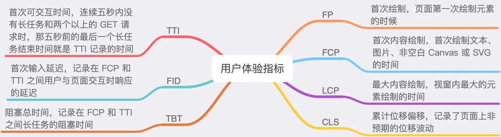
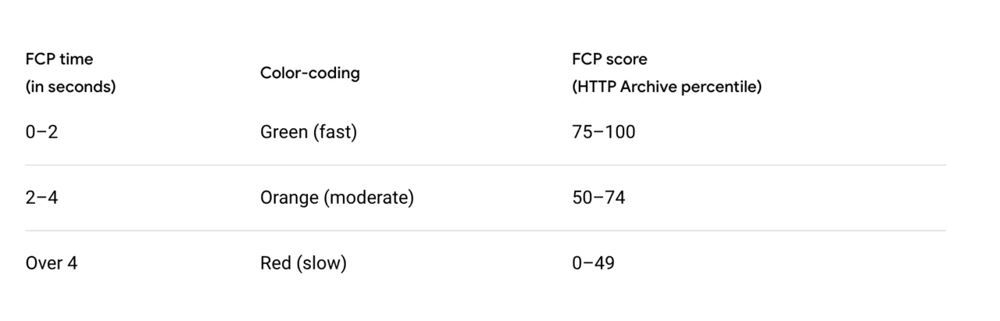
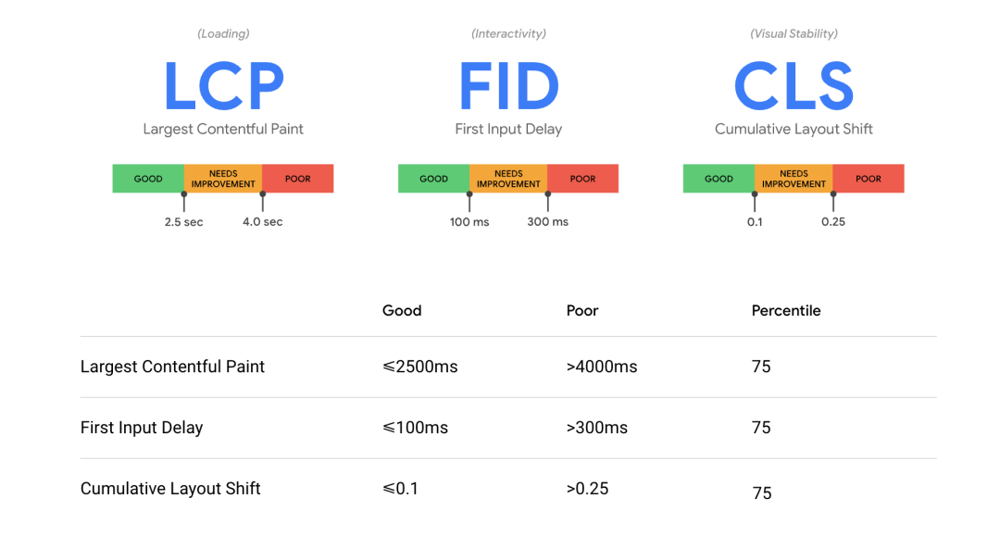
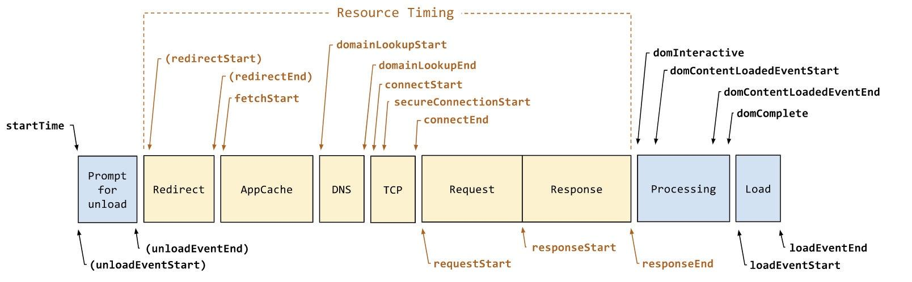

## 网站性能监控

### 性能监控的一些指标

#### FP & FCP

FP 发生的时间一定小于等于 FCP

FP 指的是绘制像素，比如说页面的背景色是灰色的，那么在显示灰色背景时就记录下了 FP 指标。但是此时 DOM 内容还没开始绘制，可能需要文件下载、解析等过程，只有当 DOM 内容发生变化才会触发，比如说渲染出了一段文字，此时就会记录下 FCP 指标。因此说我们可以把这两个指标认为是和白屏时间相关的指标，所以肯定是最快越好

#### TTI

首次可交互时间，TTI（Time to Interactive）。这个指标计算过程略微复杂，它需要满足以下几个条件
1. 从 FCP 指标后开始计算
2. 持续 5 秒内无长任务（执行时间超过 50 ms）且无两个以上正在进行中的 GET 请求
3. 往前回溯至 5 秒前的最后一个长任务结束的时间

!> 这里你可能会疑问为什么长任务需要定义为 50ms 以外？

对于用户交互（比如点击事件），推荐的响应时间是 100ms 以内。那么为了达成这个目标，推荐在空闲时间里执行任务不超过 50ms（W3C 也有这样的标准规定），这样能在用户无感知的情况下响应用户的交互，否则就会造成延迟感。

#### TBT

阻塞总时间，TBT（Total Blocking Time），记录在 FCP 到 TTI 之间所有长任务的阻塞时间总和。

假如说在 FCP 到 TTI 之间页面总共执行了以下长任务（执行时间大于 50ms）及短任务（执行时间低于 50ms）
#### LCP & FID & CLS

`LCP` 代表了页面的速度指标，虽然还存在其他的一些体现速度的指标，但是上文也说过 LCP 能体现的东西更多一些。一是指标实时更新，数据更精确，二是代表着页面最大元素的渲染时间，通常来说页面中最大元素的快速载入能让用户感觉性能还挺好。

`FID` 代表了页面的交互体验指标，毕竟没有一个用户希望触发交互以后页面的反馈很迟缓，交互响应的快会让用户觉得网页挺流畅。

`CLS` 代表了页面的稳定指标，尤其在手机上这个指标更为重要。因为手机屏幕挺小，CLS 值一大的话会让用户觉得页面体验做的很差。

获取三个指标  [官方web-vitals库](https://github.com/GoogleChrome/web-vitals)、[官方插件web-vitals-extension ](https://github.com/GoogleChrome/web-vitals-extension)

### Perfoemance
#### performance.timing
[MDN performance.timing](https://developer.mozilla.org/en-US/docs/Web/Performance/Navigation_and_resource_timings#performance_timings)

参考：

https://juejin.cn/post/6850037270729359367

https://juejin.cn/post/6919295789630455815

https://blog.csdn.net/qiwoo_weekly/article/details/106449805

https://web.dev/vitals/

https://web.dev/lcp/

https://web.dev/fid/

https://web.dev/cls/