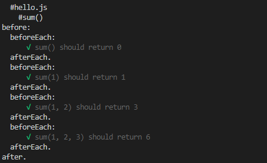

## 单元测试-Mocha

> 单元测试是用来对一个模块、一个函数或者一个类来进行正确性检验的测试工作。

mocha的特点主要有：

+ 既可以测试简单的JavaScript函数，又可以测试异步代码，因为异步是JavaScript的特性之一；
+ 可以自动运行所有测试，也可以只运行特定的测试；
+ 可以支持before、after、beforeEach和afterEach来编写初始化代码。

### 编写测试

假如我们有个`main.js`模块

```js
module.exports=function sum(...rest) {
  var sum = 0;
  for (let n of rest) {
      sum += n;
  }
  return sum;
};
```

我们可以使用`NodeJs`的`assert`模块断言
```js
const assert = require('assert');
const sum = require('./hello');

assert.strictEqual(sum(), 0);
assert.strictEqual(sum(1), 1);
assert.strictEqual(sum(1, 2), 3);
assert.strictEqual(sum(1, 2, 3), 6);
```

>!缺点： 单独写一个test.js的缺点是没法自动运行测试，而且，如果第一个assert报错，后面的测试也执行不了了

### mocha test

**安装**

首先安装`mocha`不建议全局安装:

`npm install mocha -D`，


**编写测试**

创建`test`目录，并再目录下创建`test.js`

mocha默认会执行test目录下的所有测试，不要去改变默认目录。

```js
const assert = require('assert');

const sum = require('../main');

describe('#main.js', () => {

    describe('#sum()', () => {
        it('sum() should return 0', () => {
            assert.strictEqual(sum(), 0);
        });

        it('sum(1) should return 1', () => {
            assert.strictEqual(sum(1), 1);
        });

        it('sum(1, 2) should return 3', () => {
            assert.strictEqual(sum(1, 2), 3);
        });

        it('sum(1, 2, 3) should return 6', () => {
            assert.strictEqual(sum(1, 2, 3), 6);
        });
    });
});
```

这里我们使用`mocha`默认的`BDD-style`的测试。`describe`可以任意嵌套，以便把相关测试看成一组测试。

每个`it("name", function() {...})`就代表一个测试。


**运行**

我们在`package.json`中添加`npm`命令：

```json
"scripts": {
    "test": "mocha"
  },
```

执行：`npm run test`

**before和after**
在测试前初始化资源，测试后释放资源是非常常见的。mocha提供了before、after、beforeEach和afterEach来实现这些功能。

```js
describe('#hello.js', () => {
    describe('#sum()', () => {
        before(function () {
            console.log('before:');
        });

        after(function () {
            console.log('after.');
        });

        beforeEach(function () {
            console.log('  beforeEach:');
        });

        afterEach(function () {
            console.log('  afterEach.');
        });

        it('sum() should return 0', () => {
            assert.strictEqual(sum(), 0);
        });

        it('sum(1) should return 1', () => {
            assert.strictEqual(sum(1), 1);
        });

        it('sum(1, 2) should return 3', () => {
            assert.strictEqual(sum(1, 2), 3);
        });

        it('sum(1, 2, 3) should return 6', () => {
            assert.strictEqual(sum(1, 2, 3), 6);
        });
    });
});
```



### 异步测试

如果要测试同步函数，我们传入无参数函数即可：

```js
it('test sync function', function () {
    // TODO:
    assert(true);
});
```

如果要测试异步函数，我们要传入的函数需要带一个参数，通常命名为`done`

```js
it('test async function', function (done) {
    fs.readFile('filepath', function (err, data) {
        if (err) {
            done(err);
        } else {
            done();
        }
    });
});
```

测试异步函数需要在函数内部手动调用done()表示测试成功，done(err)表示测试出错。

支持`Async/Await`

```js
it('#async function', async () => {
    let r = await hello();
    assert.strictEqual(r, 15);
});
```


