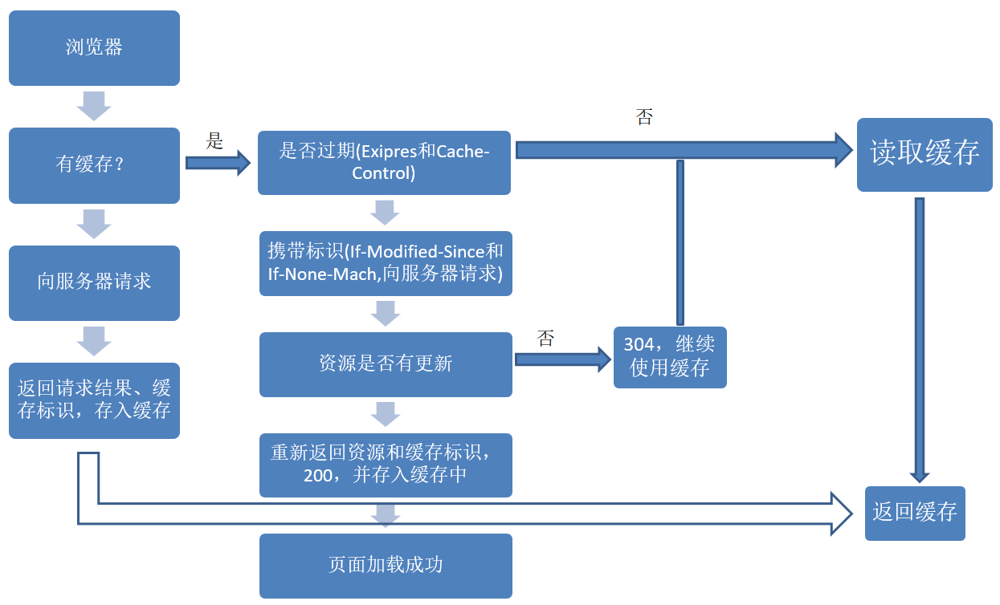
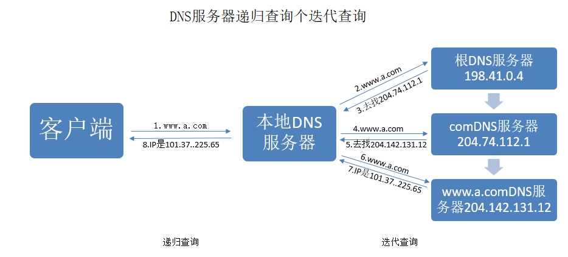
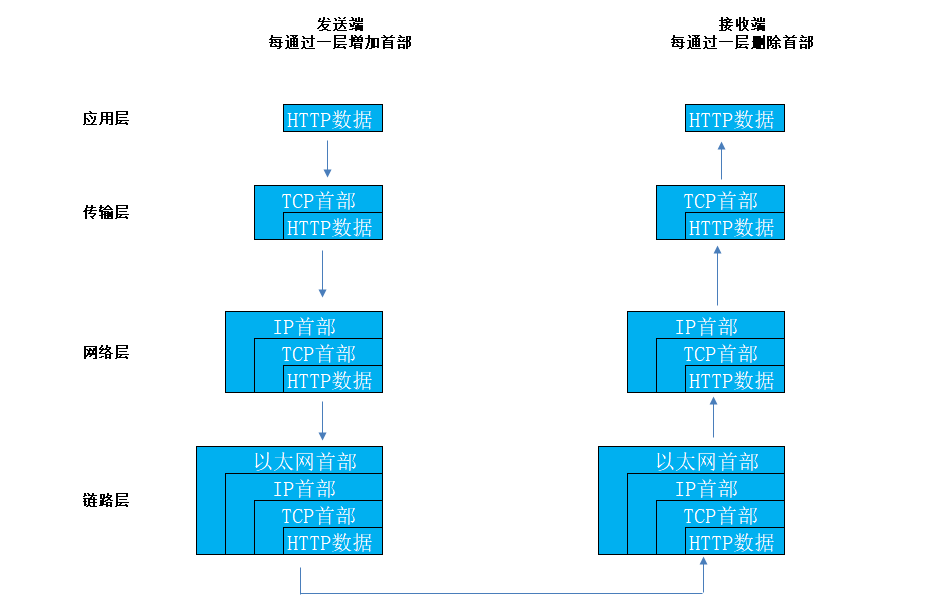
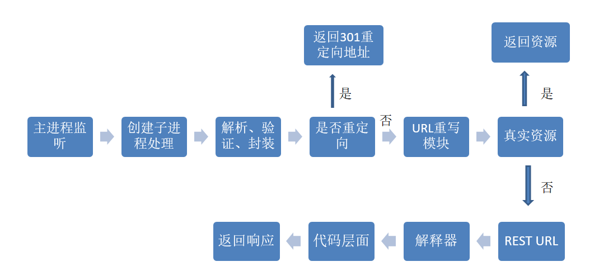
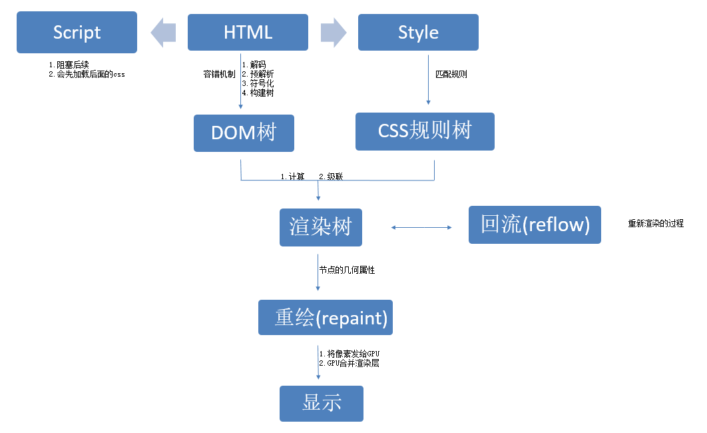
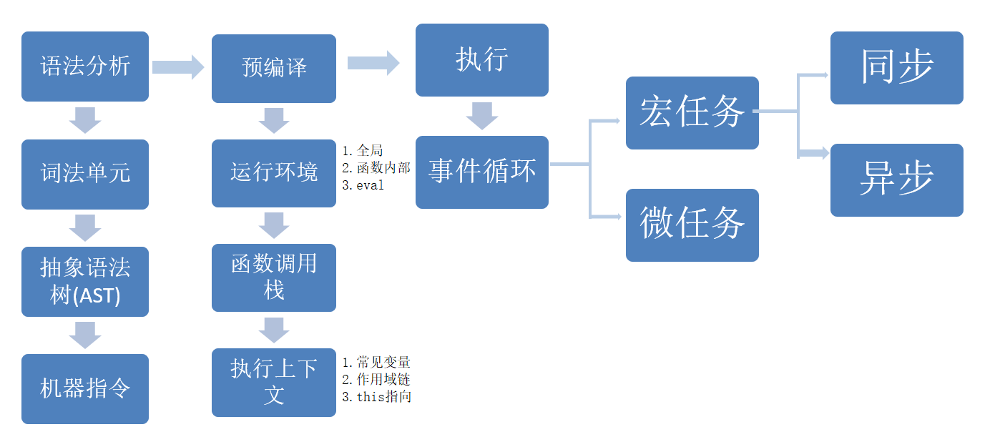
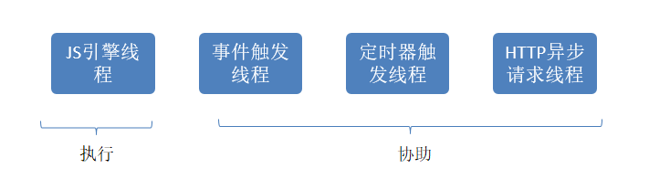

# 在浏览器输入URL回车之后发生了什么？

## 大致流程


## 一、URL解析
**地址解析：**

首先判断你输入的是一个合法的 URL 还是一个待搜索的关键词，并且根据你输入的内容进行自动完成、字符编码等操作。

**HSTS**

由于安全隐患，会使用 HSTS 强制客户端使用 HTTPS 访问页面。详见：你所不知道的 HSTS。

**其他操作**

浏览器还会进行一些额外的操作，比如安全检查、访问限制（之前国产浏览器限制 996.icu）。

**检查缓存**


## 二、DNS查询

**基本步骤**


**1、浏览器缓存**

浏览器会先检查是否在缓存中，没有则调用系统库函数进行查询。
**2、操作系统缓存**

操作系统也有自己的 DNS缓存，但在这之前，会向检查域名是否存在本地的 Hosts 文件里，没有则向 DNS 服务器发送查询请求。

**3、路由器缓存**

路由器也有自己的缓存。

**4、ISP DNS缓存**

ISP DNS 就是在客户端电脑上设置的首选 DNS 服务器，它们在大多数情况下都会有缓存。

**根域名服务器查询**

在前面所有步骤没有缓存的情况下，本地 DNS 服务器会将请求转发到互联网上的根域，下面这个图很好的诠释了整个流程：


**需要注意的点**

1、递归方式：一路查下去，中间不返回，得到最终结果才返回信息（浏览器到本地DNS服务器的过程）<br>
2、迭代方式：就是本地DNS服务器到根域名的方式<br>
3、什么是DNS劫持<br>
4、前端dns-prefetch优化<br>

## 三、TCP连接

TCP/IP 分为四层，在发送数据时，每层都要对数据进行封装：


### 1、应用层：发送HTTP请求

在前面的步骤我们已经得到服务器的 IP 地址，浏览器会开始构造一个 HTTP 报文，其中包括：

+ 请求报头（Request Header）：请求方法、目标地址、遵循的协议等等
+ 请求主体（其他参数）

其中需要注意的点：

+ 浏览器只能发送 GET、POST 方法，而打开网页使用的是 GET 方法


### 2、传输层：TCP传输报文

传输层会发起一条到达服务器的 TCP 连接，为了方便传输，会对数据进行分割（以报文段为单位），并标记编号，方便服务器接受时能够准确地还原报文信息。

在建立连接前，会先进行 TCP 三次握手。
>关于 TCP/IP 三次握手，网上已经有很多段子和图片生动地描述了。

>相关知识点：
1.SYN 泛洪攻击
### 3、网络层：IP协议查询Mac地址

将数据段打包，并加入源及目标的IP地址，并且负责寻找传输路线。

判断目标地址是否与当前地址处于同一网络中，是的话直接根据 Mac 地址发送，否则使用路由表查找下一跳地址，以及使用 ARP 协议查询它的 Mac 地址。

>注意：在 OSI 参考模型中 ARP 协议位于链路层，但在 TCP/IP 中，它位于网络层。
### 4、链路层：以太网协议

**以太网协议**

根据以太网协议将数据分为以“帧”为单位的数据包，每一帧分为两个部分：
+ 标头：数据包的发送者、接受者、数据类型
+ 数据：数据包具体内容

**Mac地址**

以太网规定了连入网络的所有设备都必须具备“网卡”接口，数据包都是从一块网卡传递到另一块网卡，网卡的地址就是 Mac 地址。每一个 Mac 地址都是独一无二的，具备了一对一的能力。

**广播**

发送数据的方法很原始，直接把数据通过 ARP 协议，向本网络的所有机器发送，接收方根据标头信息与自身 Mac 地址比较，一致就接受，否则丢弃。

**注意**：接收方回应是单播
> 相关知识点：
1.ARP 攻击

**服务器接受请求**

接受过程就是把以上步骤逆转过来，参见上图。

## 四、服务器处理请求

**大致流程**


**HTTPD**

最常见的 HTTPD 有 Linux 上常用的 Apache 和 Nginx，以及 Windows 上的 IIS。

它会监听得到的请求，然后开启一个子进程去处理这个请求

**处理请求**
接受 TCP 报文后，会对连接进行处理，对HTTP协议进行解析（请求方法、域名、路径等），并且进行一些验证：

+ 验证是否配置虚拟主机
+ 验证虚拟主机是否接受此方法
+ 验证该用户可以使用该方法（根据 IP 地址、身份信息等）

**重定向**
假如服务器配置了 HTTP 重定向，就会返回一个 301永久重定向响应，浏览器就会根据响应，重新发送 HTTP 请求（重新执行上面的过程）。

**URL重写**

然后会查看 URL 重写规则，如果请求的文件是真实存在的，比如图片、html、css、js文件等，则会直接把这个文件返回。

否则服务器会按照规则把请求重写到 一个 REST 风格的 URL 上。

然后根据动态语言的脚本，来决定调用什么类型的动态文件解释器来处理这个请求。

以 PHP 语言的 MVC 框架举例，它首先会初始化一些环境的参数，根据 URL 由上到下地去匹配路由，然后让路由所定义的方法去处理请求。

## 五、浏览器接收响应

浏览器接收到来自服务器的响应资源后，会对资源进行分析。

首先查看 Response header，根据不同状态码做不同的事（比如上面提到的重定向）。

如果响应资源进行了压缩（比如 gzip），还需要进行解压。

然后，对响应资源做缓存。

接下来，根据响应资源里的 MIME 类型去解析响应内容（比如 HTML、Image各有不同的解析方式）。

## 六、渲染页面

**浏览器内核**

**基本流程**


### 1.HTML 解析
首先要知道浏览器解析是从上往下一行一行地解析的。

解析的过程可以分为四个步骤：

**1. 解码（encoding）**

传输回来的其实都是一些二进制字节数据，浏览器需要根据文件指定编码（例如UTF-8）转换成字符串，也就是HTML 代码。

**2. 预解析（pre-parsing）**

预解析做的事情是提前加载资源，减少处理时间，它会识别一些会请求资源的属性，比如img标签的src属性，并将这个请求加到请求队列中。

**3. 符号化（Tokenization）**

符号化是词法分析的过程，将输入解析成符号，HTML 符号包括，开始标签、结束标签、属性名和属性值。

它通过一个状态机去识别符号的状态，比如遇到<，>状态都会产生变化。

**4. 构建树（tree construction）**

>注意：符号化和构建树是并行操作的，也就是说只要解析到一个开始标签，就会创建一个 DOM 节点。

在上一步符号化中，解析器获得这些标记，然后以合适的方法创建DOM对象并把这些符号插入到DOM对象中。

```
<html>
<head>
    <title>Web page parsing</title>
</head>
<body>
    <div>
        <h1>Web page parsing</h1>
        <p>This is an example Web page.</p>
    </div>
</body>
</html>
```

**浏览器容错进制**

你从来没有在浏览器看过类似"语法无效"的错误，这是因为浏览器去纠正错误的语法，然后继续工作。

**事件**

当整个解析的过程完成以后，浏览器会通过DOMContentLoaded事件来通知DOM解析完成。

### 2. CSS 解析
一旦浏览器下载了 CSS，CSS 解析器就会处理它遇到的任何 CSS，根据语法规范解析出所有的 CSS 并进行标记化，然后我们得到一个规则表。

CSS 匹配规则

在匹配一个节点对应的 CSS 规则时，是按照从右到左的顺序的，例如：div p { font-size :14px }会先寻找所有的p标签然后判断它的父元素是否为div。

所以我们写 CSS 时，尽量用 id 和 class，千万不要过度层叠。

### 3. 渲染树
其实这就是一个 DOM 树和 CSS 规则树合并的过程。

> 注意：渲染树会忽略那些不需要渲染的节点，比如设置了display:none的节点。
**计算**

通过计算让任何尺寸值都减少到三个可能之一：auto、百分比、px，比如把rem转化为px。

**级联**

浏览器需要一种方法来确定哪些样式才真正需要应用到对应元素，所以它使用一个叫做specificity的公式，这个公式会通过：

+ 1.标签名、class、id
+ 2.是否内联样式
+ 3.!important

然后得出一个权重值，取最高的那个。

**渲染阻塞**

当遇到一个script标签时，DOM 构建会被暂停，直至脚本完成执行，然后继续构建 DOM 树。

但如果 JS 依赖 CSS 样式，而它还没有被下载和构建时，浏览器就会延迟脚本执行，直至 CSS Rules 被构建。

所有我们知道：

+ CSS 会阻塞 JS 执行
+ JS 会阻塞后面的 DOM 解析

为了避免这种情况，应该以下原则：

+ CSS 资源排在 JavaScript 资源前面
+ JS 放在 HTML 最底部，也就是 </body>前

另外，如果要改变阻塞模式，可以使用 defer 与 async

### 4. 布局与绘制
确定渲染树种所有节点的几何属性，比如：位置、大小等等，最后输入一个盒子模型，它能精准地捕获到每个元素在屏幕内的准确位置与大小。

然后遍历渲染树，调用渲染器的 paint() 方法在屏幕上显示其内容。

### 5. 合并渲染层
把以上绘制的所有图片合并，最终输出一张图片。

### 6. 回流与重绘

**回流(reflow)**

当浏览器发现某个部分发现变化影响了布局时，需要倒回去重新渲染，会从html标签开始递归往下，重新计算位置和大小。

reflow基本是无法避免的，因为当你滑动一下鼠标、resize 窗口，页面就会产生变化。

**重绘(repaint)**

改变了某个元素的背景色、文字颜色等等不会影响周围元素的位置变化时，就会发生重绘。

每次重绘后，浏览器还需要合并渲染层并输出到屏幕上。

回流的成本要比重绘高很多，所以我们应该尽量避免产生回流。

比如：

+ display:none 会触发回流，而 visibility:hidden 只会触发重绘。

### 7. JavaScript 编译执行



可以分为三个阶段：

**1. 词法分析**
JS 脚本加载完毕后，会首先进入语法分析阶段，它首先会分析代码块的语法是否正确，不正确则抛出“语法错误”，停止执行。

几个步骤：

+ 分词，例如将var a = 2，，分成var、a、=、2这样的词法单元。
+ 解析，将词法单元转换成抽象语法树（AST）。
+ 代码生成，将抽象语法树转换成机器指令。

**2. 预编译**
JS 有三种运行环境：

+ 全局环境
+ 函数环境
+ eval
每进入一个不同的运行环境都会创建一个对应的执行上下文，根据不同的上下文环境，形成一个函数调用栈，栈底永远是全局执行上下文，栈顶则永远是当前执行上下文。

**创建执行上下文**

创建执行上下文的过程中，主要做了以下三件事：

+ 创建变量对象
  - 参数、函数、变量


+ 建立作用域链
  - 确认当前执行环境是否能访问变量


+ 确定 This 指向

**3. 执行**

虽然 JS 是单线程的，但实际上参与工作的线程一共有四个：


> 其中三个只是协助，只有 JS 引擎线程是真正执行的
+ JS 引擎线程：也叫 JS 内核，负责解析执行 JS 脚本程序的主线程，例如 V8 引擎
+ 事件触发线程：属于浏览器内核线程，主要用于控制事件，例如鼠标、键盘等，当事件被触发时，就会把事件的处理函数推进事件队列，等待 JS 引擎线程执行
+ 定时器触发线程：主要控制setInterval和setTimeout，用来计时，计时完毕后，则把定时器的处理函数推进事件队列中，等待 JS 引擎线程。
+ HTTP 异步请求线程：通过XMLHttpRequest连接后，通过浏览器新开的一个线程，监控readyState状态变更时，如果设置了该状态的回调函数，则将该状态的处理函数推进事件队列中，等待JS引擎线程执行。

**注：浏览器对同一域名的并发连接数是有限的，通常为 6 个**


