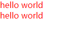
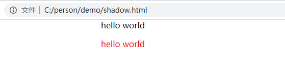

## 影子DOM

### 简介 
Shadow DOM 为Web组件中的 DOM和 CSS提供了封装。Shadow DOM 使得这些东西与主文档的DOM保持分离。你也可以在一个Web组件外部使用 Shadow DOM本身。

### Element.attachShadow() 来附加影子DOM

```html
<div>
    <p>hello world</p>
    <div>
        <p>hello world</p>
    </div>
</div>
<script>
    let style=document.createElement('style');
    style.textContent="div{color:red;}";
    shadow.appendChild(style);
</script>
```
以上代码的结果导致父级`div`下的`p`标签文字也变成红色




附加影子

```html
<div>
    <p>hello world</p>
    <div id='shadow'>
        
    </div>
</div>
<script>
    var shadowEl=shadow.attachShadow({mode:"open"})
    let style=document.createElement('style');
    style.textContent="p{color:red;}";
    let p=document.createElement('p');
    p.textContent="hello world"
    shadowEl.appendChild(style)
    shadowEl.appendChild(p)
    
</script>
```



### Shadow Dom的组成

+ `Element.attachShadow()` 方法给指定的元素挂载一个Shadow DOM，并且返回对 ShadowRoot 的引用。
        参数：{Object}
            mode:open/closed
        还可以接受一个布尔值

+ `Element.getDestinationInsertionPoints()`
+ `Element.shadowRoot`
        Element.shadowRoot 是只读属性，表示元素挂载的shadow root。
        可以使用 Element.attachShadow 给一个已存在的元素添加shadow root。
        但如果一个shadow root的 mode被设置为 closed那么它的值将会是 null
+ `<content>` 元素
+ `<shadow>` 元素