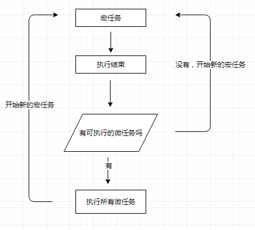

## 微任务(Microtask)和宏任务(Macrotask)

我们先对宏任务微任务做个大概分类：

macro-task(宏任务)：script环境  setTimeout、setInterval、I/O、事件、postMessage、 MessageChannel、setImmediate (Node.js)

micro-task(微任务)：Promise，process.nextTick，MutaionObserver

宏任务队列可以有多个，但是微任务队列只有一个

明明是定时器先进的异步处理模块，结果promise.then还要早于定时器先执行,`微任务优先级总是高于宏任务`,如下：

```js
setTimeout(() => console.log('我第一'), 2000);
let p1 = Promise.resolve('我第二');
p1.then(resp => console.log(resp));
setTimeout(() => console.log('我第三'), 1000);
let p2 = Promise.resolve('我第四');
p2.then(resp => console.log(resp));
//我第二
//我第四
//我第三
//我第一
```

script整体环境都是一个宏任务，所以微任务由宏任务执行过程中产生，除去同步代码执行完毕后，微任务执行优先级总是要优于剩余的异步宏任务。



### 定时器
`setTimeout(() => console.log('我第一'), 3000);`3000ms并不代表执行时间，而是`将回调函数加入任务队列的时间`

```js
setTimeout(() => console.log('我第一'), 3000);
setTimeout(() => console.log('我第二'), 3000);
```
首先遇到第一个定时器，告诉异步处理模块，等待三秒后将回调加入任务队列，然后又调用了第二个定时器，同样是3秒后将回调加入任务队列。

等到执行栈为空，去任务队列拿任务，执行第一个console，这要不了多久，于是几乎无时差的又去任务队列拿第二个任务，这也导致了为什么2次输出几乎在同时进行。

两个定时器等待时间相同，但第一个定时器回调还是先进入任务队列，所以先触发，这也印证了任务队列先进先出的规则。

(https://juejin.cn/post/6844903618999500808)[https://juejin.cn/post/6844903618999500808]