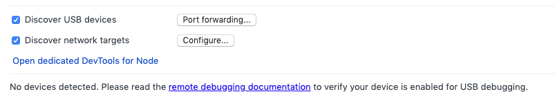
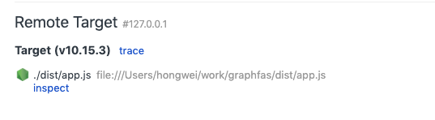
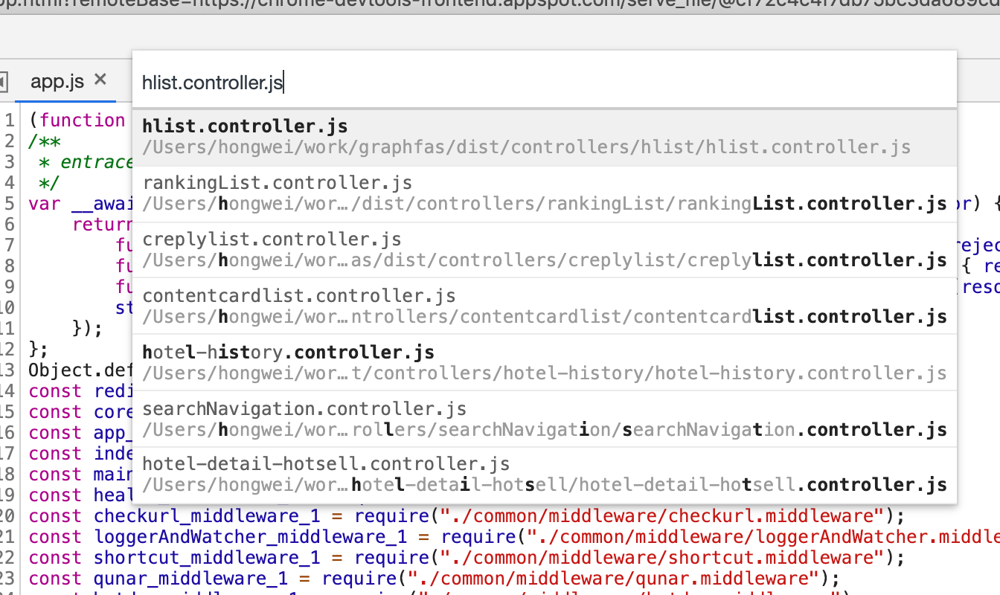
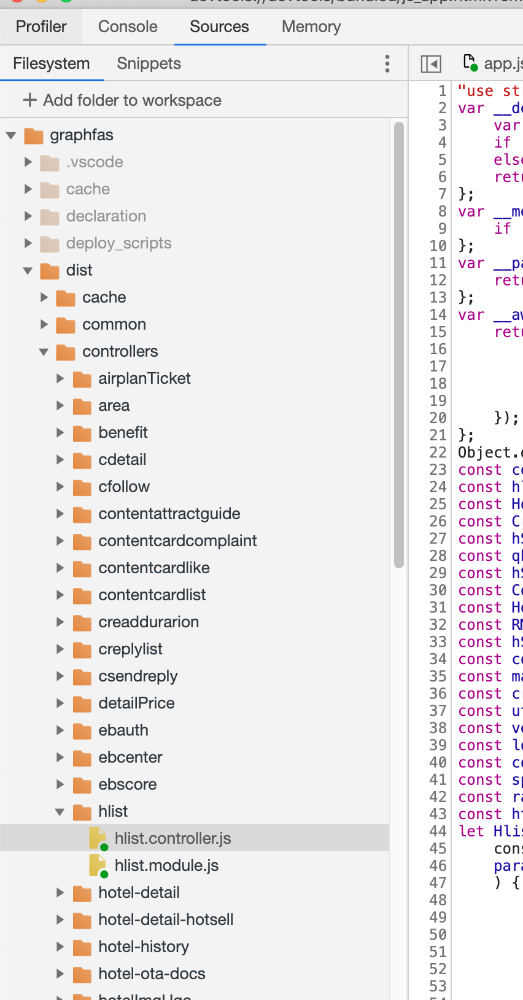
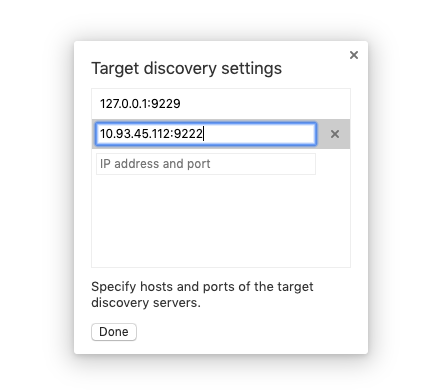

## JS本地debug
在nodejs 8.x版本之后，nodejs内置了inspect，不再需要安装node-inspect才能调试了，方便很多  

chrome devtools
这种调试方式稍微麻烦一点，但是好处是依赖的环境很简单，只需要chrome浏览器就可以，不需要安装复杂的IDE

本地启动服务时需要添加参数（拿fas举例，因为fas是ts工程，调试js需要使用编译后的代码，在dist目录下）

1. 启动服务
node --inspect ./dist/app.js    // 正常启动服务

或者 node --inspect-brk ./dist/app.js    // 启动服务，并且在在第一行代码处打上断点


2.打开chrome inspect 
新开chrome标签，在地址栏输入 chrome://inspect/#devices ，打开调试窗口


在 Configure里添加 127.0.0.1:9229 (node inspect会默认在本地开启9229端口进行调试，如果本地启动时有改动端口号，这里也要做修改)，可以出现下面的界面，点击inspect就可以打开调试窗口


3.添加断点 
正常启动服务后，需要在 Sources - Filesystem里展示文件才能添加断点，这里有两种方式

1.快捷键 command+p (mac) ，通过查找找到文件，在文件对应代码处打断点。


2. 左侧，add folder to workspace，把本地文件添加到目录，直接在目录里找到文件打断点




JS 远程 Debug
远程调试和本地调试的原理是类似的，nodejs会通过ws接口同步debug信息

chrome devtools
1.启动服务
node服务线上都是通过pm2启动的，并且启动的时候不带inspect参数。如果要远程调试，需要把原来的进程停掉，使用node --inspect ./dist/app.js 或者 node --inspect-brk ./dist/app.js的方式启动服务

和本地调试不一样的地方在于需要设置inspect的ip和端口

sudo node --inspect-brk=0.0.0.0:9222 ./dist/app.js  

或者 sudo node --inspect-brk=10.93.45.112:9222 ./dist/app.js  // 10.93.45.112 是远程服务器的ip


2.打开chrome inspect 
和本地调试一样，在configure里添加远程服务器debug的ip:port （10.93.45.112:9222），然年就可以像在本地调试一样使用了


3.添加断点
和本地调试类似，可以通过快捷键的方式找到文件然后设置断点

把本地文件添加到source-filesystem并且和远程服务器上的脚本关联起来，这个还没有找到方法（网上N多的教程说点开inspect时在source里就有所有的文件，但是目前没有看到）


 vscode
比较简单，vscode里配置lanuch.json就可以 

需要注意的是，本地IDE debug时最好保证本地代码和服务器代码是一致的，否则debug时可能会出现跳行

```js
{
    "type": "node",
    "request": "attach",
    "name": "remote debug",
    "address": "10.93.45.112", // 远程服务的ip
    "port": 9222, // 远程服务启动时设置的debug端口号
    "localRoot": "${workspaceFolder}/dist", // 本地脚本的地址
    "remoteRoot": "/home/q/www/h_graphfas/webapps/dist", //  服务器脚本地址
    "skipFiles": [
        "node_modules/**"
    ]
}
```

一些文档

https://nodejs.org/en/docs/guides/debugging-getting-started/#enabling-remote-debugging-scenarios

https://github.com/jiajianrong/documents/blob/master/node/nodejs%20debug%20-%20%E6%AD%A5%E9%AA%A4%E5%8F%8A%E5%8E%9F%E7%90%86.md

https://zhuanlan.zhihu.com/p/30264842

http://www.ruanyifeng.com/blog/2018/03/node-debugger.html

https://code.visualstudio.com/docs/editor/debugging#_launch-configurations