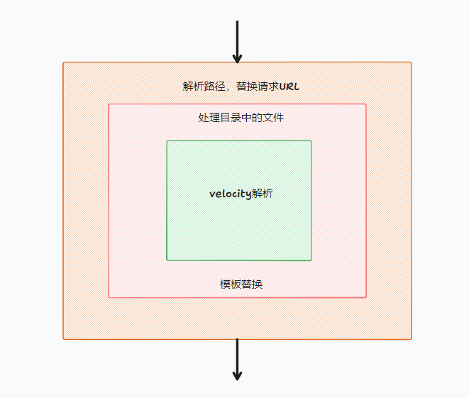

# dev-server
## 背景
前后端不分离项目，前端使用jQuery,后端java,路由由后端分发，转到前端对应的html文件，项目结构如下：
```
├── cbs-fund-web
│   ├── src
│   │   ├── main
│   │   │   ├── java
│   │   │   ├── webapp
│   │   │   │   ├── resources
│   │   │   │   ├── WEB-INF
│   │   │   │   ├── index.html
│   │   │   │   └── package.json  //工具配置
```

## 问题
- 本地启动项目对前端不友好，繁琐复杂。
- 开发调试不方便，修辞修改后几乎是盲改
- 后端灌入的数据无法渲染到前端页面

## 应用方法
前端根目录下的`package.json`中添加`proxy`字段，启动本地服务
```JSON
{
  "proxy": {
    "rewrites":[],//路径重写
    "velocity":{},//velocity配置
  },
}
```
### 路径重定向
```JSON
{
  {
    "proxy": {
      "rewrites":[
        {
          "source": "/fund/attachment/toShowFileList(?:.htm)?(.*?)",//访问路径
          "destination": "/WEB-INF/vm/attachment/fileList.html$1" //文件路径
        },
      ],//路径重写
    },
  }
}
```

### velocity配置
```JSON
{
  {
    "proxy": {
      "velocity":{
        "root": "./WEB-INF/vm", //模板文件根目录
        "layout": "./WEB-INF/vm/layout/layout.html", //模板布局文件
        "permissions": {//权限配置
          "FUND:CONTRACT_ENTER:HANDSEL": true,
          "FUND:CONTRACT_ENTER:SUPPLMENT": true
        },
        "context": {//上下文数据
          "link": {
            "contextPath": "/fund"
          },
          "fundContractId": "247076",
        }
      }
    },
  }
}
```

## 开发dev-server
依赖`velocity`git地址：[https://github.com/fool2fish/velocity](https://github.com/fool2fish/velocity)

全量依赖如下：
```JSON
{
   "dependencies": {
    "cors": "^2.8.5",
    "debug": "^4.3.3",
    "express": "^4.17.2",
    "express-http-proxy": "^1.6.3",
    "globby": "^13.1.1",
    "path-to-regexp": "^1.0.3",
    "process.argv": "^0.6.0",
    "traversdir": "^1.0.0",
    "velocity": "^0.7.5"
  },
}
```

配置可执行脚本命令：
```JSON
 {
   "main": "index.js",
    "bin": {
      "ng1-dev-server": "./index.js"
    },
 }
```


模块模型：



layout.html 引入公共文件：
```html
<!DOCTYPE html>
<html>
<head>
#include("/META-INF/resources/WEB-INF/vm/common/meta.html")
#parse("/META-INF/resources/WEB-INF/vm/common/css.html")
#parse("/META-INF/resources/WEB-INF/vm/common/js_global.html")
#parse("/META-INF/resources/WEB-INF/vm/common/js_plugins.html")
<script type="text/javascript">
	var basePath = '$link.contextPath';
</script>
</head>
<body class="gray-bg">
	<div class="wrapper wrapper-content">
		$screen_content</div>
</body>
</html>
```

如CSS文件：

```html
<!-- css -->
<meta http-equiv="Content-Type" content="text/html; charset=UTF-8">
<meta http-equiv="X-UA-Compatible" content="IE=Edge">
<link rel="stylesheet" type="text/css"
	href="$basePath/resources/css/bootstrap.min.css?v=3.3.6">
<link rel="stylesheet" type="text/css"
	href="$basePath/resources/css/plugins/bootstrap-table/bootstrap-table.min.css">
<link
	href="$basePath/resources/css/plugins/awesome-bootstrap-checkbox/awesome-bootstrap-checkbox.css"
	rel="stylesheet">
<link href="$basePath/resources/css/plugins/chosen/chosen.css"
	rel="stylesheet">
<link rel="stylesheet" type="text/css"
	href="$basePath/resources/css/plugins/treeview/bootstrap-treeview.css">
<link rel="stylesheet" type="text/css"
	href="$basePath/resources/css/font-awesome.css?v=4.4.0">
<link rel="stylesheet" type="text/css"
	href="$basePath/resources/css/animate.css">
<link rel="stylesheet" type="text/css"
	href="$basePath/resources/css/style.css?v=4.1.1">
	<link rel="stylesheet" type="text/css"
	href="$basePath/base/css/base.css?v=4.1.0">
```