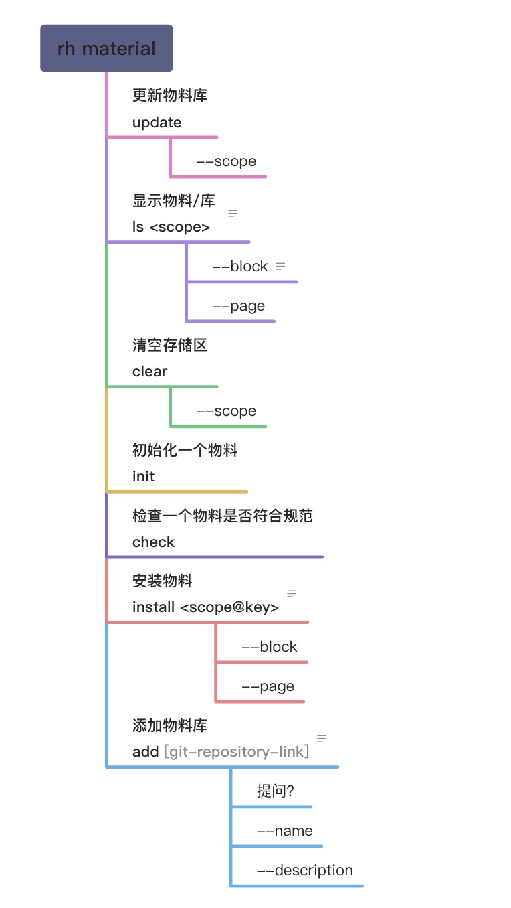
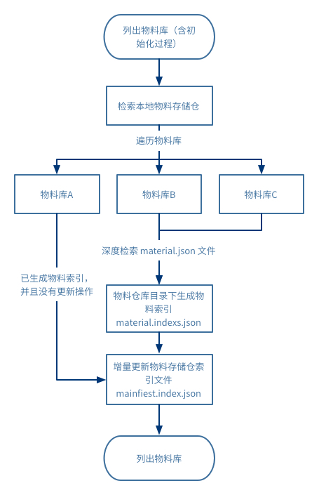
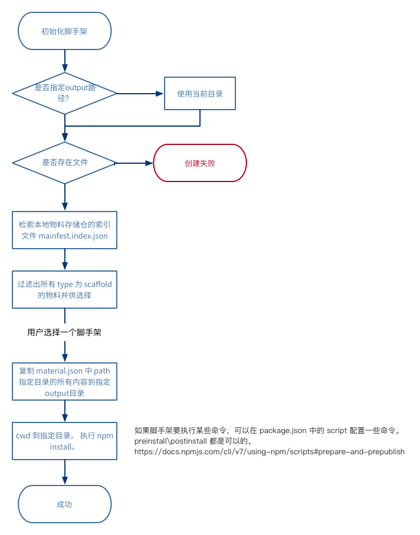
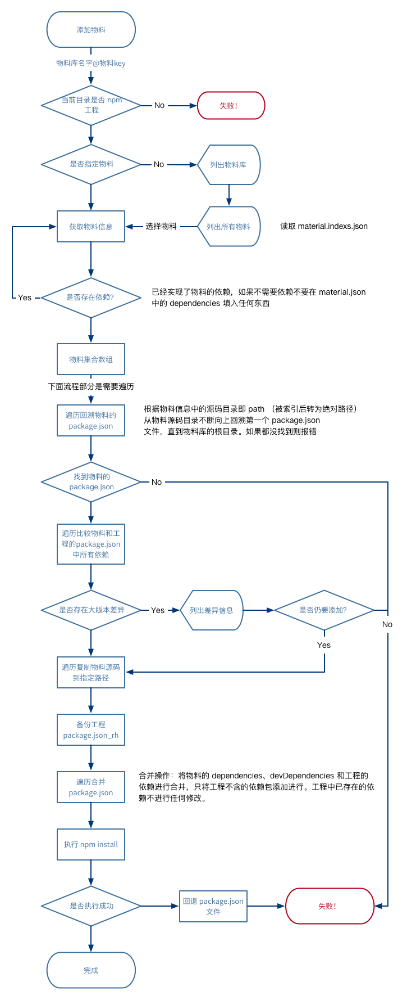

分享一个开源平台

1. Pandora
文档链接：[https://ideagay.github.io/pandora-doc/](https://ideagay.github.io/pandora-doc/)
github：[https://github.com/ideagay/pandora](https://github.com/ideagay/pandora)

2 Roothub
文档链接：[https://ideagay.github.io/roothub-doc/](https://ideagay.github.io/roothub-doc/)
github：[https://github.com/RootLinkFE/roothub](https://github.com/RootLinkFE/roothub)

