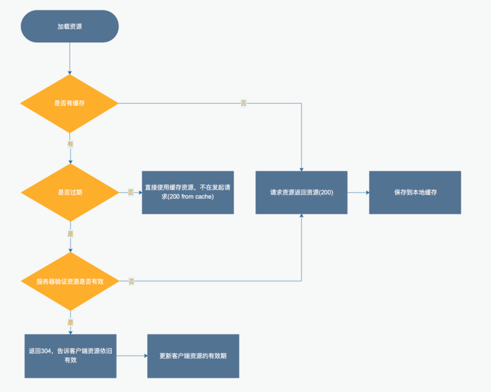

## 网站性能优化-缓存的使用

其中： 
缓存是否过期参考Cache-Control, Expires 
缓存是否有效参考Last-Modified，Etag

从流程中我们可以发现

+ 性能最好的应该是200 from cache，这种资源直接从本地返回，没有网络请求
+ 之后是304 Not Modified，改状态码没有资源实体，只有头部告诉浏览器文件指纹依旧有效，可以继续使用，并同时带回Expires, Etag等信息，供客户端更新使用
+ 效率最低的是200，由于尚未缓存或者缓存已经过期，所以浏览器返回对应的资源实体，供浏览器使用。

综上所诉：我们可以让资源请求变成200 from cache的状态，以提高性能。在资源发生变动时，可以利用更改文件名的方法重新获取，现在很多的打包框架都支持这种方式，比如gulp，webpack，fis3等

### 介绍几个缓存相关http的属性

#### Cache-Control

HTTP1.1中实现。用来控制文件在本地缓存的有效时长。共有以下属性值：

+ `public`：所有内容都将被缓存(客户端和代理服务器都可缓存)
+ `private`：内容只缓存到私有缓存中(仅客户端可以缓存，代理服务器不可缓存)
+ `no-cache`：必须先与服务器确认返回的响应是否被更改，然后才能使用该响应来满足后续对同一个网址的请求。因此，如果存在合适的验证令牌 (ETag)，no-cache 会发起往返通信来验证缓存的响应，如果资源未被更改，可以避免下载。
+ `no-store`：所有内容都不会被缓存到缓存或 Internet 临时文件中
+ `must-revalidation/proxy-revalidation`：如果缓存的内容失效，请求必须发送到服务器/代理以进行重新验证
+ `max-age=xxx (xxx是数字)`：缓存的内容将在 xxx 秒后失效, 这个选项只在HTTP 1.1可用, 并如果和Last-Modified一起使用时, 优先级较高

#### Expires
HTTP1.0的属性，用来指名文件的过期事件，是一个绝对的时间点。由于服务器事件和客户端事件可能存在不一致的情况，所以之后在HTTP 1.1中Cache-Control添加了max-age属性

#### Last-Modified
Last-Modified是标识文件在服务器上的最新更新时间。下次再次获取的时候，如果缓存已经过期，则请求头部会带上If-Modified-Since字段给服务器，服务器根据该字段和文件的更新事件进行对比，一致则返回304， 不一致将对应文件作为response返回

#### Etag
Etag由服务器端生成，客户端通过If-Match或者说If-None-Match这个条件判断请求来验证资源是否修改，常见的是使用If-None-Match。

用户点击刷新：浏览器发送Cache-Control:max-age=0 给浏览器

手动刷新页面（F5)，浏览器会直接认为缓存已经过期（可能缓存还没有过期），在请求中加上字段：Cache-Control:max-age=0，发包向服务器查询是否有文件是否有更新。
强制刷新页面（Ctrl+F5)，浏览器会直接忽略本地的缓存（有缓存也会认为本地没有缓存），在请求中加上字段：Cache-Control:no-cache（或 Pragma:no-cache），发包向服务重新拉取文件。

