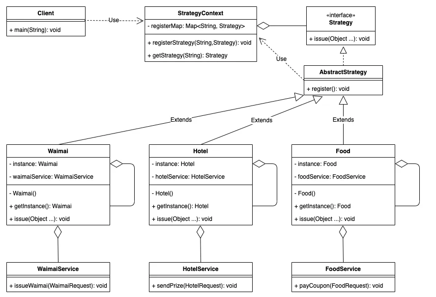
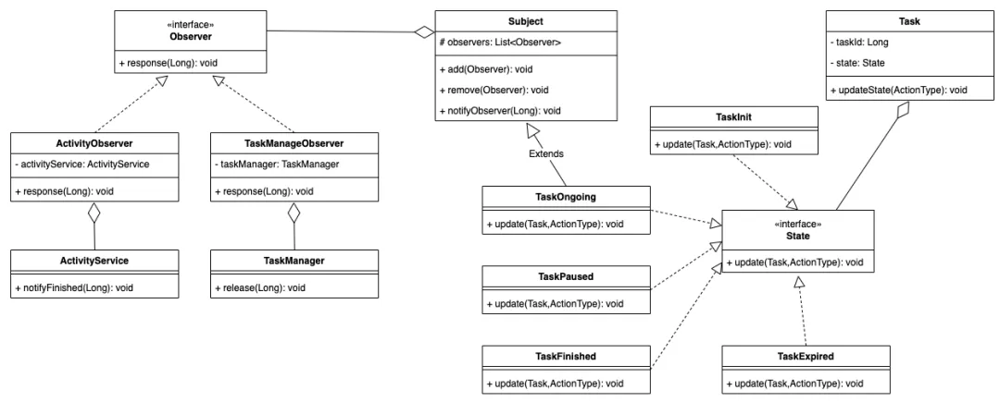
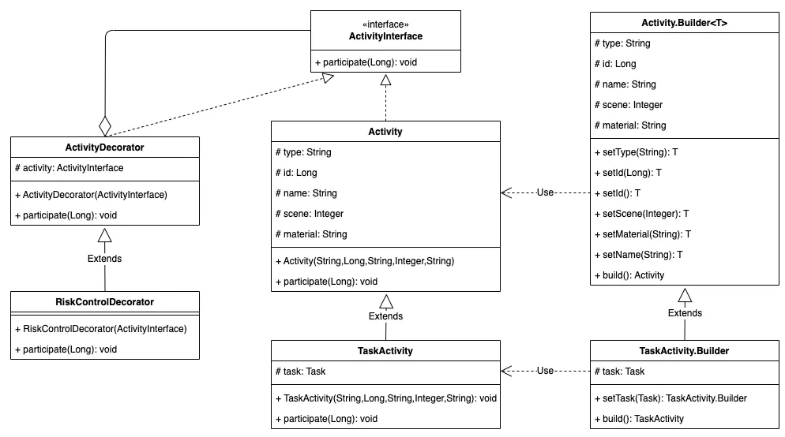

## 设计模式

- [单例模式]
- [策略模式]
- [代理模式]
- [发布订阅模式]
- [观察者模式]
- [命令模式]
- [组合模式]
- [模板方法模式]
- [享元模式]
- [职责链模式]
- [中介者模式]
- [装饰者模式]
- [状态模式]
- [适配器模式]

## 应用

### 策略+适配器



```js
class StrategyContext {
  static registerMap = new Map();
  constructor() {}
  static registerStrategy(type, Strategy) {
    this.registerMap.set(type, Strategy);
  }
  static getStrategy(type) {
    return this.registerMap.get(type);
  }
}
class Registry {
  registry() {
    StrategyContext.registerStrategy(this.constructor.name, this);
  }
}
class Hotel extends Registry {
  static instance = new Hotel();
  constructor() {
    super();
    this.registry();
  }

  static getInstance() {
    return this.instance;
  }
  issue() {
    console.log('Hotel 实例方法执行');
  }
}
class Food extends Registry {
  static instance = new Food();
  constructor() {
    super();
    this.registry();
  }

  static getInstance() {
    return this.instance;
  }
  issue() {
    console.log('Food 实例方法执行');
  }
}

//使用方式
//调用酒店
StrategyContext.getStrategy('Hotel').issue();
//跳用用餐
StrategyContext.getStrategy('Food').issue();
```

## 状态+观察者



```js
// 观察者接口
class Observer {
  response(taskId) {
    throw new Error('This method should be overridden!');
  }
}

// 抽象主题类
class Subject {
  observers = [];
  constructor() {
    this.observers = []; // 存储观察者的列表
  }

  // 增加观察者方法
  add(observer) {
    this.observers.push(observer); // 将观察者添加到列表中
  }

  // 删除观察者方法
  remove(observer) {
    this.observers = this.observers.filter((obs) => obs !== observer); // 从列表中移除观察者
  }

  // 通知观察者方法
  notifyObserver(taskId) {
    this.observers.forEach((observer) => {
      observer.response(taskId); // 遍历所有观察者并调用其反应方法
    });
  }
}

// 活动观察者
class ActivityObserver {
  activityService = null;
  constructor(activityService) {
    this.activityService = activityService;
  }
  response(taskId) {
    this.activityService.notifyFinished(taskId);
  }
}
// 任务管理观察者
class TaskManageObserver {
  taskManager = null;
  constructor(taskManager) {
    this.taskManager = taskManager;
  }
  response(taskId) {
    this.taskManager.release(taskId);
  }
}
const ActionType = {
  START: 1, //开始
  STOP: 2, //暂停
  ACHIEVE: 3, //完成
  EXPIRE: 4, //过期
};
// 任务初始状态
class TaskInit {
  update(task, actionType) {
    if (actionType == ActionType.START) {
      const taskOngoing = new TaskOngoing();
      //给状态添加观察者
      taskOngoing.add(
        new ActivityObserver({
          notifyFinished(id) {
            console.log('通知活动', id);
          },
        })
      );
      taskOngoing.add(
        new TaskManageObserver({
          release(id) {
            console.log('管理', id);
          },
        })
      );
      task.setState(taskOngoing);
    }
  }
}
// 任务进行状态
class TaskOngoing extends Subject {
  update(task, actionType) {
    if (actionType == ActionType.ACHIEVE) {
      task.setState(new TaskFinished());
      // 通知
      this.notifyObserver(task.taskId);
    } else if (actionType == ActionType.STOP) {
      task.setState(new TaskPaused());
    } else if (actionType == ActionType.EXPIRE) {
      task.setState(new TaskExpired());
    }
  }
}
//完成状态类
class TaskFinished {
  update(task, actionType) {}
}
//暂停状态类
class TaskPaused {
  update(task, actionType) {}
}
//过期状态类
class TaskExpired {
  update(task, actionType) {}
}
//任务
class Task {
  taskId = Date.now();
  // 初始化为初始态
  state = new TaskInit();
  setState(state) {
    this.state = state;
  }
  getState() {
    return this.state;
  }
  // 更新状态
  updateState(actionType) {
    this.state.update(this, actionType);
  }
}

//使用方式
const task = new Task();
task.updateState(ActionType.START);

setTimeout(() => {
  task.updateState(ActionType.ACHIEVE);
}, 1000);
```

## 构造器+装饰器



### 构造器

```js
class Activity {
  constructor(type, id, name, scene, material) {
    this.type = type; // 活动类型
    this.id = id; // 活动ID
    this.name = name; // 活动名称
    this.scene = scene; // 活动场景
    this.material = material; // 活动材料
  }

  participate(userId) {
    // 参与活动的方法，当前未实现具体逻辑
  }

  // 静态建造器类
  static Builder = class {
    constructor() {
      this.type = null;
      this.id = null;
      this.name = null;
      this.scene = null;
      this.material = null;
      console.log('Activity.Builder');
    }

    setType(type) {
      this.type = type; // 设置活动类型
      return this; // 返回当前建造器实例
    }

    setId(id) {
      this.id = id; // 设置活动ID
      return this; // 返回当前建造器实例
    }

    setId() {
      // 如果活动类型为"period"，将ID设置为0
      if (this.type === 'period') {
        this.id = 0;
      }
      return this; // 返回当前建造器实例
    }

    setScene(scene) {
      this.scene = scene; // 设置活动场景
      return this; // 返回当前建造器实例
    }

    setMaterial(material) {
      this.material = material; // 设置活动材料
      return this; // 返回当前建造器实例
    }

    setName(name) {
      // 根据活动类型设置活动名称前缀
      this.name = (this.type === 'period' ? 'period' : 'normal') + name;
      return this; // 返回当前建造器实例
    }

    build() {
      console.log('Activity.Builder.build');
      // 构建并返回Activity对象
      return new Activity(
        this.type,
        this.id,
        this.name,
        this.scene,
        this.material
      );
    }
  };
}

// 任务型活动类，继承自Activity
class TaskActivity extends Activity {
  constructor(type, id, name, scene, material, task) {
    super(type, id, name, scene, material); // 调用父类构造函数
    this.task = task; // 设置任务对象
  }

  participate(userId) {
    // 更新任务状态为进行中
    console.log(`用户${userId}参与活动`);
    this.task.getState().update(this.task, ActionType.START);
  }

  // 继承建造器类
  static Builder = class extends Activity.Builder {
    constructor() {
      super();
      this.task = null; // 任务对象
    }

    setTask(task) {
      this.task = task; // 设置任务对象
      return this; // 返回当前建造器实例
    }

    build() {
      // 构建并返回TaskActivity对象
      return new TaskActivity(
        this.type,
        this.id,
        this.name,
        this.scene,
        this.material,
        this.task
      );
    }
  };
}

// 使用示例
const task = new Task(); // 假设Task类已经定义

// 使用TaskActivity的建造者创建一个任务型活动
const taskActivity = new TaskActivity.Builder()
  .setType('normal')
  .setId(1)
  .setName('Example Activity')
  .setScene(0)
  .setMaterial('Material Info')
  .setTask(task) // 设置任务
  .build();

// 参与活动
taskActivity.participate(123); // 假设用户ID为123
```

### 装饰器

```js
// 抽象装饰角色
class ActivityDecorator {
  constructor(activity) {
    this.activity = activity; // 被装饰的活动对象
  }
  participate(userId) {
    throw new Error('This method should be overridden!');
  }
}

// 能够对活动做风险控制的包装类
class RiskControlDecorator extends ActivityDecorator {
  constructor(activity) {
    super(activity);
  }
  participate(userId) {
    // 对目标用户做风险控制，失败则抛出异常
    if (!Risk.doControl(userId)) {
      // 假设Risk.doControl返回true或false
      throw new Error('Risk control failed for user: ' + userId);
    }
    // 更新任务状态为进行中
    this.activity.participate(userId); // 调用被装饰活动的参与方法
  }
}

// 假设的风险控制类
const Risk = {
  doControl: function (userId) {
    // 这里可以实现风险控制逻辑
    // 返回true表示通过，返回false表示失败
    return true; // 例如，假设总是通过
  },
};

// 使用示例
const basicActivity = new Activity(
  'normal',
  1,
  'Basic Activity',
  0,
  'Material Info'
);

// 使用风险控制装饰器对基本活动进行包装
const riskControlledActivity = new RiskControlDecorator(basicActivity);

// 参与活动
try {
  riskControlledActivity.participate(123); // 假设用户ID为123
} catch (e) {
  console.log('Risk control failed: ' + e.message);
}
```


## 责任链模式
```js
class Handler {
    constructor(nextHandler) {
        this.nextHandler = nextHandler;
    }

    setNext(nextHandler) {
        this.nextHandler = nextHandler;
        return this;
    }

    handle(request) {
        if (this.canHandle(request)) {
            return this.doHandle(request);
        } else if (this.nextHandler) {
            return this.nextHandler.handle(request);
        }
        return null;
    }

    canHandle(request) {
        throw new Error('canHandle method must be implemented');
    }

    doHandle(request) {
        throw new Error('doHandle method must be implemented');
    }
}

class ConcreteHandler1 extends Handler {
    canHandle(request) {
        return request >= 1 && request <= 10;
    }

    doHandle(request) {
        return `ConcreteHandler1 handled request ${request}`;
    }
}

class ConcreteHandler2 extends Handler {
    canHandle(request) {
        return request >= 11 && request <= 20;
    }

    doHandle(request) {
        return `ConcreteHandler2 handled request ${request}`;
    }
}

class ConcreteHandler3 extends Handler {
    canHandle(request) {
        return request >= 21 && request <= 30;
    }

    doHandle(request) {
        return `ConcreteHandler3 handled request ${request}`;
    }
}

// 创建责任链
const handler1 = new ConcreteHandler1();
const handler2 = new ConcreteHandler2();
const handler3 = new ConcreteHandler3();

handler1.setNext(handler2).setNext(handler3);

// 测试请求
const requests = [5, 15, 25];
requests.forEach((request) => {
    const result = handler1.handle(request);
    console.log(result);
});
```