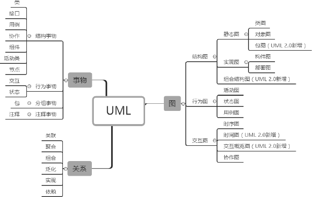

## UML统一建模语言
`UML（Unified Modeling Language，统一建模语言）`是用来设计软件蓝图的可视化建模语言，是一种为面向对象系统的产品进行说明、可视化和编制文档的标准语言，独立于任何一种具体的程序设计语言。

### 图

|图名称|解释|
|::--|--::|
|类图（Class Diagrams）	|用于定义系统中的类|
|对象图（Object Diagrams）	|类图的一个实例，描述了系统在具体时间点上所包含的对象及各个对象之间的关系|
|构件图（Component Diagrams）	|一种特殊的 UML 图，描述系统的静态实现视图|
|部署图（Deployment Diagrams）	|定义系统中软硬件的物理体系结构|
|活动图（Activity Diagrams）	|用来描述满足用例要求所要进行的活动及活动间的约束关系|
|状态图（State Chart Diagrams）	|用来描述类的对象的所有可能的状态和时间发生时，状态的转移条件|
|用例图（Usecase Diagrams）	|用来描述用户的需求，从用户的角度描述系统的功能，并指出各功能的执行者，强调谁在使用系统、系统为执行者完成哪些功能|
|时序图（Sequence Diagrams）	|描述对象之间的交互顺序，着重体现对象间消息传递的时间顺序，强调对象之间消息的发送顺序，同时显示对象之间的交互过程|
|协作图（Collaboration Diagrams）	|描述对象之间的合作关系，更侧重向用户对象说明哪些对象有消息的传递|
|包图（Package Diagrams）	|对构成系统的模型元素进行分组整理的图|
|组合结构图（Composite Structure Diagrams）	|表示类或者构建内部结构的图|
|时间图（Timing Diagrams）	|用来显示随时间变化，一个或多个元素的值或状态的更改，也显示时间控制事件之间的交互及管理它们的时间和期限约束|
|交互概览图（Interaction Overview Diagrams）	|用活动图来表示多个交互之间的控制关系的图|

### 类、接口和类图
#### 1. 类

类（Class）是指具有相同属性、方法和关系的对象的抽象，它封装了数据和行为，是面向对象程序设计（OOP）的基础，具有封装性、继承性和多态性等三大特性。在 UML 中，类使用包含类名、属性和操作且带有分隔线的矩形来表示。

(1) 类名（Name）是一个字符串，例如，Student。

(2) 属性（Attribute）是指类的特性，即类的成员变量。UML 按以下格式表示：`[可见性]属性名:类型[=默认值]`

**`注意：“可见性”表示该属性对类外的元素是否可见，包括公有（Public）、私有（Private）、受保护（Protected）和朋友（Friendly）4 种，在类图中分别用符号+、-、#、~表示。`**

(3) 操作（Operations）是类的任意一个实例对象都可以使用的行为，是类的成员方法。UML 按以下格式表示：`[可见性]名称(参数列表)[:返回类型]`

#### 2. 接口

接口（Interface）是一种特殊的类，它具有类的结构但不可被实例化，只可以被子类实现。它包含抽象操作，但不包含属性。它描述了类或组件对外可见的动作。在 UML 中，接口使用一个带有名称的小圆圈来进行表示。

### 类之间的关系

#### 1. 依赖关系

`依赖（Dependency）`关系是一种使用关系，它是对象之间耦合度最弱的一种关联方式，是临时性的关联。在代码中，某个类的方法通过局部变量、方法的参数或者对静态方法的调用来访问另一个类（被依赖类）中的某些方法来完成一些职责。

#### 2. 关联关系

`关联（Association）`关系是对象之间的一种引用关系，用于表示一类对象与另一类对象之间的联系，如老师和学生、师傅和徒弟、丈夫和妻子等。关联关系是类与类之间最常用的一种关系，分为一般关联关系、聚合关系和组合关系。
#### 3. 聚合关系

`聚合（Aggregation）`关系是关联关系的一种，是强关联关系，是整体和部分之间的关系，是 has-a 的关系。

#### 4. 组合关系

`组合（Composition）`关系也是关联关系的一种，也表示类之间的整体与部分的关系，但它是一种更强烈的聚合关系，是 cxmtains-a 关系。

#### 5. 泛化关系

`泛化（Generalization）`关系是对象之间耦合度最大的一种关系，表示一般与特殊的关系，是父类与子类之间的关系，是一种继承关系，是 is-a 的关系。

#### 6. 实现关系

`实现（Realization）`关系是接口与实现类之间的关系。在这种关系中，类实现了接口，类中的操作实现了接口中所声明的所有的抽象操作。