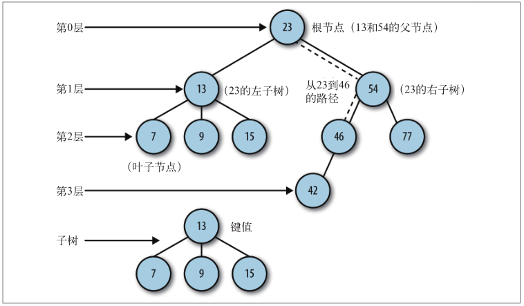
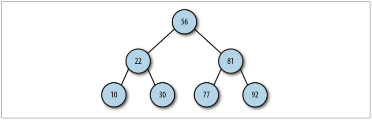

## 二叉树和二叉查找树
> 树是一种非线性的数据结构，以分层的方式存储数据。树由一组以边连接的节点组成

一棵树最上面的节点称为根节点，如果一个节点下面连接多个节点，那么该节点称为父节点，它下面的节点称为子
节点。一个节点可以有 0 个、1 个或多个子节点。没有任何子节点的节点称为叶子节点。<br>
树可以分为几个层次，根节点是第 0 层，它的子节点是第 1 层，子节点的子节点是第 2
层，以此类推。树中任何一层的节点可以都看做是子树的根，该子树包含根节点的子节
点，子节点的子节点等。我们定义树的层数就是树的深度


> 二叉树是一种特殊的树，它的子节点不超过两个。

在使用 JavaScript 构建二叉树之前，需要给我们关于树的词典里再加两个新名词。一个父
节点的两个子节点分别称为左节点和右节点。在一些二叉树的实现中，左节点包含一组特
定的值，右节点包含另一组特定的值。


> 二叉查找树是一种特殊的二叉树，相对较小的值保存在左节点中，较大的值保存在右节点中。这一特性使得
查找的效率很高，对于数值型和非数值型的数据，比如单词和字符串，都是如此。

## 实现二叉查找树
二叉查找树由节点组成，所以我们定义第一个对象Node,既保存数据也保存和其他节点的链接。
```js
function Node(data,left,right){
    this.data=data;
    this.left=left;
    this.right=right;
    this.show=show;
}
function show(){
    return this.data;
}
```
现在可以创建一个类，用来表示二叉查找树(BST)
+ BST首先要有一个insert方法，用来向树中加入新节点
+ 其次检查BST是否有根节点，如果没有那这是一棵新树，该节点就是根节点。
+ 如果待插入节点不是根节点，那么就需要准备遍历BST，找到插入的适当位置。该过程类似遍历链表，用一个变量存储当前节点。
+ 找到正确插入点时跳出循环。
 - 1、设根节点为当前节点
 - 2、如果待插入的节点保存的数据小于当前节点，则设置新的当前节点为原节点的左节点，反之执行4
 - 3、如果当前节点的左节点为null，就将新的节点插入到这个位置，退出循环，反之，继续下一次循环
 - 4、设新的当前节点为原节点的右节点。
 - 5、如果当前节点的右节点为null，就将新的节点插入到这个位置，退出循环；反之，继续执行下次循环。    

 ```js
 function BST(){
     this.root=null;
     this.insert=insert;
     this.inOrder=inOrder;
 }
 function insert(data){
     var n=new Node(data,null,null);
     if(this.root=null){
        this.root=n;
     }else{
         var current=this.root;
         var parent;
         while(true){
             parent=current;
             if(data<current.data){
                 current=current.left;
                 if(current==null){
                     parent.left=n;
                     break;
                 }
             }else{
                 current=current.right;
                 if(current==null){
                     parent.right=n;
                     break
                 }
             }
         }
     }
 }
 ```
 ### 遍历二叉查找树
 三种遍历BST的方式：中序、先序、后序
 + 中序：按照节点上的键值，以升序访问BST上的所有节点。
 + 先序：先访问根节点，然后以同样方式访问左子树和右子树。
 + 后序：先访问叶子节点，从左子树到右子树，再到根节点

 ```js
 //中序
function inOrder(node){
    if(!(node==null)){
        inOrder(node.left);
        print(node.show()+' ');
        inOrder(node.right);
    }
}
//先序
function preOrder(node){
    if(!(node==null)){
        print(node.show()+' ');
        preOrder(node.left);
        preOrder(node.right);
    }
}
//后序
function postOrder(node){
    if(!(node==null)){
        postOrder(node.left);
        postOrder(node.right);
        print(node.show()+' ');
    }
}
 ```

 ## 在二叉树上进行查找
 对BST通常有下列三种类型查找
 + 查找给定值
 + 查找最小值
 + 查找最大值

 ```js
//查找最小值
function getMin(){
    var current=this.root;
    while(!(current==null)){
        current=current.left
    }
    return current.data;
}
//查找最大值
function getMax() {
    var current = this.root;
    while (!(current.right == null)) {
        current = current.right;
    }
    return current.data;
}
//查找给定值
function find(data){
    var current=this.root;
    while(current!=null){
        if(current.data==data){
            return current;
        }else if(data<current.data){
            current=current.left;
        }else{
            current=current.right;
        }
    }
    return null;
}
 ```

 ## 从二叉树上删除节点

 + 判断当前节点是否包含待删除的数据，如果包含，则删除该节点；如果不包含，则比较当前节点上的数据和待删除的数据。如果待删除的数据小于当前节点的数据，则移至当前节点的左子节点继续比较；如果删除数据大于当前节点数据，则移至当前节点的右子节点继续比较
 + 如果待删除节点是叶子节点，那么只需将从父节点指向它的链接指向null
 + 如果待删除节点只包含一个子节点，那么原本指向它的节点就得做些调整，使其指向它的子节点
 + 最后，如果待删除节点包含两个子节点，正确的做法有两种：要么查找待删除节点左子树上的最大值，要么查找其右子树上的最小值

 ```js
function remove(data){
    var root=removeNode(this.root,data);
}
function removeNode(node,data){
    if(node==null){
        return null
    }
    if(data==node.data){
        //没有子节点的节点
        if(node.left==null&&node.right==null){
            return null;
        }
        //没有左子节点的节点
        if(node.left==null){
            return node.right;
        }
        //没有右子节点的节点
        if(node.right==null){
            return node.left;
        }
        //有两个子节点的节点
        var tempNode=getSmallest(node.right);
        node.data=tempNode.data;
        node.right=removeNode(node.right,tempNode.data);
        return node;
    }else if(data<node.data){
        node.left=removeNode(node.left,data);
        return node
    }else{
        node.right=removeNode(node.right,data);
        return node;
    }
}
 ```

 ## 计数
 BST的一个用途是记录一组数据集中数据出现的次数
 ```js
 function Node(data,left,right){
     this.data=data;
     this.count=1;
     this.left=left;
     this.right=right;
     this.show=show;
 }
 function update(data){
     var grade=this.find(data);
     grade.count++;
     return grade;
 }

 //以下两个为玩耍
 function prArray(arr) {
    putstr(arr[0].toString() + ' ');
    for (var i = 1; i < arr.length; ++i) {
        putstr(arr[i].toString() + ' ');
        if (i % 10 == 0) {
            putstr("\n");
        }
    }
}
function genArray(length) {
    var arr = [];
    for (var i = 0; i < length; ++i) {
        arr[i] = Math.floor(Math.random() * 101);
    }
    return arr;
}
 ```