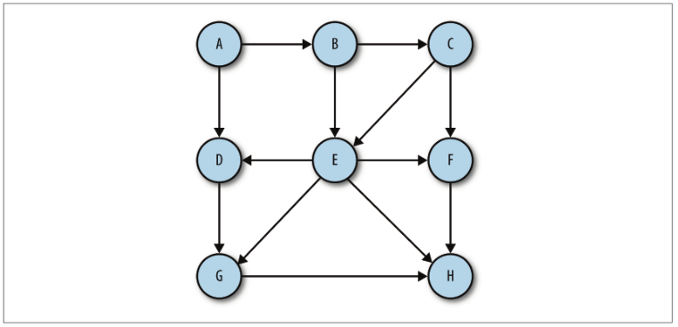
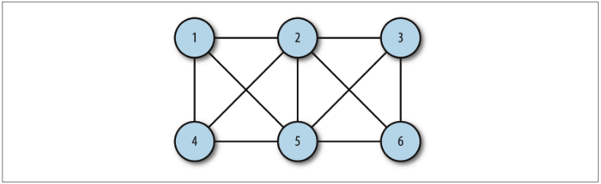
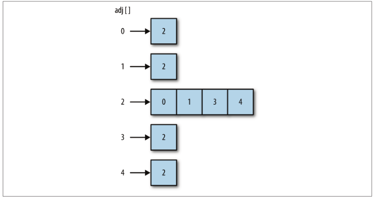
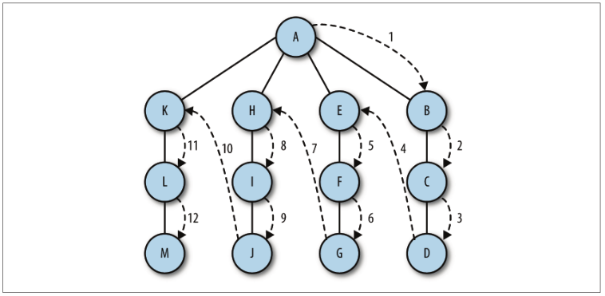
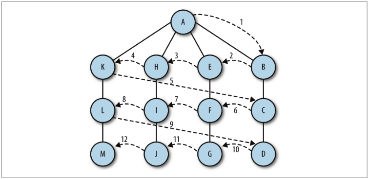

## 图和图算法

> 图由边的集合及顶点的集合组成。如果一个图的顶点对是有序的，则可以称之为有向图。

有向图

无向图


图中的一系列顶点构成路径，路径中所有的顶点都由边连接。路径的长度用路径中第一个
顶点到最后一个顶点之间边的数量表示。由指向自身的顶点组成的路径称为环，环的长度
为 0。<br>
圈是至少有一条边的路径，且路径的第一个顶点和最后一个顶点相同。无论是有向图还是
无向图，只要是没有重复边或重复顶点的圈，就是一个简单圈。除了第一个和最后一个顶
点以外，路径的其他顶点有重复的圈称为平凡圈。<br>
如果两个顶点之间有路径，那么这两个顶点就是强连通的，反之亦然。如果有向图的所有
的顶点都是强连通的，那么这个有向图也是强连通的。<br>
**可以用图对现实中的系统建模**例如运输、网络

## 图类
创建图类第一步就是创建Vertex来保存顶点和边，这个类像链表和二叉树的Node。Vertex有两个成员：一个用于表示顶点，另一个是表明这个顶点是否被访问过的布尔值。它们分别被命名为 label 和 wasVisited
### 表示顶点
```js
function Vertex(label){
    this.label=label;
}
```
### 表示边
我们将表示图的边的方法称为邻接表或者邻接表数组。这种方法将边存储为由顶点的相邻<br>
顶点列表构成的数组，并以此顶点作为索引。使用这种方案，当我们在程序中引用一个顶
点时，可以高效地访问与这个顶点相连的所有顶点的列表。比如，如果顶点 2 与顶点 0、
1、3、4 相连，并且它存储在数组中索引为 2 的位置，那么，访问这个元素，我们可以访
问到索引为 2 的位置处由顶点 0、1、3、4 组成的数组。

另一种表示图边的方法被称为邻接矩阵。它是一个二维数组，其中的元素表示两个顶
点之间是否有一条边。

### 构建图
```js
function Graph(v){
    this.vertices=v;
    this.edges=0;
    for(var i=0;i<this.verteces.length;++i){
        this.adj[i]=[];
        this.adj[i].push('');
    }
    this.addEdge=addEdge;
    this.toString=toString;
}
//addEdge
function addEdge(v,w){
    this.adj[v].push(w);
    this.adj[w].push(v);
    this.edges++;
}
//showGraph通过打印所有顶点及其相邻顶点列表的方式来显示图
function showGraph(){
    for(var i=0;i<this.vertices.length;++i){
        print(i+'->');
        for(var j=0;j<this.vertices.length:++j){
            if(this.adj[i][j]!=undefined){
                print(this.adj[i][j]+'');
            }
        }
        print();
    }
}
```

## 搜索图
确定从一个指定的顶点可以到达其他哪些顶点，这是经常对图执行的操作。在图上可以执行两种基础搜索：**深度优先搜索**
和**广度优先搜索**。

### 深度优先搜索
深度优先搜索包括从一条路径的起始顶点开始追溯，直到到达最后一个顶点，然后回溯，
继续追溯下一条路径，直到到达最后的顶点，如此往复，直到没有路径为止。这不是在搜
索特定的路径，而是通过搜索来查看在图中有哪些路径可以选择。

```js
//修改Graph
function Graph(v){
    this.vertices=v;
    this.edges=0;
    for(var i=0;i<this.verteces.length;++i){
        this.adj[i]=[];
        this.adj[i].push('');
    }
    this.addEdge=addEdge;
    this.toString=toString;
    //添加如下代码用来存储已访问的顶点
    this.marked = [];
    for (var i = 0; i < this.vertices; ++i ) {
        this.marked[i] = false;
    }
}
//搜索函数
function dfs(v){
    this.marked[v]=true;
    if(this.adj[v]!=undefined){
        print('Visited vertex:'+v);
        for (var w in this.adj[v]){
            if(!this.marked[w]){
                this.dfs(w)
            }
        }
    }
}
```
### 广度优先搜索
广度优先搜索从第一个顶点开始，尝试访问尽可能靠近它的顶点。本质上，这种搜索在图
上是逐层移动的，首先检查最靠近第一个顶点的层，再逐渐向下移动到离起始顶点最远的
层。

广度优先搜索算法使用了抽象的队列而不是数组来对已访问过的顶点进行排序。其算法的
工作原理如下：
 + 查找与当前顶点相邻的未访问顶点，将其添加到已访问顶点列表及队列中；
 + 从图中取出下一个顶点 v ，添加到已访问的顶点列表；
 + 将所有与 v 相邻的未访问顶点添加到队列。

 ```js
function bfs(s) {
    var queue = [];
    this.marked[s] = true;
    queue.push(s); // 添加到队尾
    while (queue.length > 0) {
        var v = queue.shift(); // 从队首移除
        if (v == undefined) {
            print("Visisted vertex: " + v);
        }
        for each(var w in this.adj[v]) {
            if (!this.marked[w]) {
                this.edgeTo[w] = v;
                this.marked[w] = true;
                queue.push(w);
            }
        }
    }
}
 ```

 ## 查找最短路径
 ### 广度优先搜索对应的最短路径
 在执行广度优先搜索时，会自动查找从一个顶点到另一个相连顶点的最短路径。例如，要
查找从顶点 A 到顶点 D 的最短路径，我们首先会查找从 A 到 D 是否有任何一条单边路径，
接着查找两条边的路径，以此类推。这正是广度优先搜索的搜索过程，因此我们可以轻松
地修改广度优先搜索算法，找出最短路径。
### 确定路径
首先，需要一个数组来保存从一个顶点到下一个顶点的所有边。我们将这个数组命名为
edgeTo 。因为从始至终使用的都是广度优先搜索函数，所以每次都会遇到一个没有标记的
顶点，除了对它进行标记外，还会从邻接列表中我们正在探索的那个顶点添加一条边到这
个顶点。这是新的 bfs() 函数，以及需要添加到 Graph 类的代码：
```js
// 将这行添加到 Graph 类
this.edgeTo = [];
// bfs 函数
function bfs(s) {
    var queue = [];
    this.marked[s] = true;
    queue.push(s); // 添加到队尾
    while (queue.length > 0) {
        var v = queue.shift(); // 从队首移除
        if (v == undefined) {
            print("Visisted vertex: " + v);
        }
        for each(var w in this.adj[v]) {
            if (!this.marked[w]) {
                this.edgeTo[w] = v;
                this.marked[w] = true;
                queue.push(w);
            }
        }
    }
}
```
现在我们需要一个函数，用于展示图中连接到不同顶点的路径。函数 pathTo() 创建了一个
栈，用来存储与指定顶点有共同边的所有顶点。以下是 pathTo() 函数的代码，以及一个简
单的辅助函数：
```js
//Graph
this.pathTo = pathTo;
this.hasPathTo = hashPathTo;
function pathTo(v) {
    var source = 0;
    if (!this.hasPathTo(v)) {
        return undefined;
    }
    var path = [];
    for (var i = v; i != source; i = this.edgeTo[i]) {
        path.push(i);
    }
    path.push(s);
    return path;
}
function hashPathTo(v) {
    return this.marked[v];
}
```

## 拓扑排序
> 拓扑排序会对有向图的所有顶点进行排序，使有向边从前面的顶点指向后面的顶点。

拓扑排序算法与深度优先搜索类似。不同的是，拓扑排序算法不会立即输出已访问的顶
点，而是访问当前顶点邻接表中的所有相邻顶点，直到这个列表穷尽时，才将当前顶点压
入栈中。

### 实现一个拓扑排序算法

```js
function topSort() {
    var stack = [];
    var visited = [];
    for (var i = 0; i < this.vertices; i++) {
        visited[i] = false;
    }
    for (var i = 0; i < this.vertices; i++) {
        if (visited[i] == false) {
        this.topSortHelper(i, visited, stack);
        }
    }
    for (var i = 0; i < stack.length; i++) {
        if (stack[i] != undefined && stack[i] != false) {
            print(this.vertexList[stack[i]]);
        }
    }
}
function topSortHelper(v, visited, stack) {
    visited[v] = true;
    for each(var w in this.adj[v]) {
        if (!visited[w]) {
            this.topSortHelper(visited[w], visited, stack);
        }
    }
    stack.push(v);
}
```
此时Graph也需要修改，下面是完整代码
```js
function Graph(v) {
    this.vertices = v;
    this.vertexList = [];
    this.edges = 0;
    this.adj = [];
    for (var i = 0; i < this.vertices; ++i) {
        this.adj[i] = [];
        this.ajd[i].push("");
    }
    this.addEdge = addEdge;
    this.showGraph = showGraph;
    this.dfs = dfs;
    this.marked = [];
    for (var i = 0; i < this.vertices; ++i) {
        this.marked[i] = false;
    }
    this.bfs = bfs;
    this.edgeTo = [];
    this.hasPathTo = hasPathTo;
    this.topSortHelper = topSortHelper;
    this.topSort = topSort;
}
function topSort() {
    var statck = [];
    var visited = [];
    for (var i = 0; i < this.vertices; i++ ) {
        visited[i] = false;
    }
    for ( var i = 0; i < stack.length; i++ ) {
        if (visited[i] == false ) {
            this.topSortHelper(i, visited, stack);
        }
    }
    for (var i = 0; i < stack.length; i++ ) {
        if (stack[i] != undefined && stack[i] != false){
            print(this.vertexList[stack[i]]);
        }
    }
}
function topSortHelper(v, visited, stack) {
    visited[v] = true;
    for each(var w in this.adj[v]) {
        if (!visited[w]) {
            this.topSortHelper(visited[w], visited, stack);
        }
    }
    stack.push(v);
}
function addEdge(v, w) {
    this.adj[v].push(w);
    this.adj[w].push(v);
    this.edges++;
}
/*function showGraph() {
    for (var i = 0; i < this.vertices; ++i) {
        putstr(i + "->");
        for (var j = 0; j < this.vertices; ++j) {
            if (this.adj[i][j] != undefined)
                putstr(this.adj[i][j] + ' ');
            }
        }
        print();
    }
}*/
// 用于显示符号名字而非数字的新函数
function showGraph() {
    var visited = [];
    for ( var i = 0; i < this.vertices; ++i) {
        putstr(this.vertexList[i] + " -> ");
        visited.push(this.vertexList[i]);
        for ( var j = 0; j < this.vertices; ++j ) {
            if (this.adj[i][j] != undefined) {
                if (visited.indexOf(this.vertexList[j]) < 0) {
                    putstr(this.vertexList[j] + ' ');
                }
            }
        }
        print();
        visited.pop();
    }
}
function dfs(v) {
    this.marked[v] = true;
    if (this.adj[v] != undefined) {
        print("Visited vertex: " + v);
    }
    for each(var w in this.adj[v]) {
        if (this.marked[w]) {
            this.dfs(w);
        }
    }
}
function bfs(s) {
    var queue = []; 
    this.marked[s] = true;
    queue.unshift(s);
    while (queue.length > 0) {
        var v = queue.shift();
        if (typeof(v) != 'string') {
            print("Visited vertex:" + v);
        }
        for each(var w in this.adj[v]) {
            if (!this.marked[w]) {
                this.edgeTo[w] = v;
                this.marked[w] = true;
                queue.unshift(w);
            }
        }
    }
}
function hasPathTo(v) {
    return this.marked[v];
}
function pathTo(v) {
    var source = 0;
    if (!this.hasPathTo(v)) {
        return undefined;
    }
    var path = [];
    for (var i = v; i != source; i = this.edgeTo[i]) {
        path.push(i);
    }
    path.push(s);
    return path;
}
```
