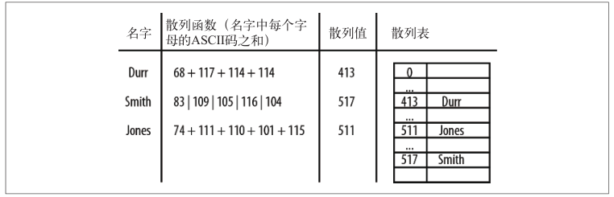

## 散列
> 散列是一种常用的数据存储技术，散列后的数据可以快速的插入或取用。散列使用的数据结构叫做**散列表**。在散列表上插入或取用非常快，但是对于查找却效率低下。

### 散列概览
我们的散列是基于数组进行设计的。数组的长度是预先设定的，如有需要，可以随时增加。所有元素根据和该元素对应的键，保存在数组的特定位置，该键和前面字典的键是类似的。使用散列表存储数据时，通过一个**散列函数**将键映射为一个数字，这个数字的范围是0-散列表的长度<br>
即使使用一个高效的散列函数，仍然存在将两个键映射成同一个值的可能，这种现象称为**碰撞**。<br>
散列表中的数组究竟应该有多大，对数组大小常见的限制是：数组长度应该是一个质数。下图展示了一个散列


## HashTable类
我们使用一个类来表示散列表，该类包含计算散列值的方法、向散列中插入数据的方法、从散列表中读取数据的方法、显示散列表中数据分布的方法等
```js
function HashTable(){
    this.table=new Array(137);
    this.simpleHash=simpleHash;
    this.showDistro=showDistro;
    this.put=put;
    //this.get=get;
}
```

### 选择一个散列函数
散列函数的选择依赖键值的数据类型。如果键是整型，最简单的散列函数就是以数组的长度对键取余。加入数组长度是10，而键值都是10的倍数就不建议了。如果键是随机的整数，则散列函数应该更均匀地分布这些键，这种散列方式称为**除留余数法**。
```js
//使用键的ASCII码值的和除以数组长度的余数，会发生碰撞
function simpleHash(data){
    var total=0;
    for(var i=0;i<data.length,++i){
        total+=data.charCodeAt(i);
    }
    return total%this.table.length;
}
function put(data){
    var pos=this.simpleHash(data);
    this.table[pos]=data;
}
function showDistro(){
    var n=0;
    for(var i=0;i<this.table.length;++i){
        if(this.table[i]!=undefined){
            print(i+':'+this.table[i]);
        }
    }
}
```
### 一个更好的散列函数
为了避免碰撞，首先确保散列表中用来存储数据的数组的大小是个质数
```js
function betterHash(string,arr){
    const H=37;
    var total=0;
    for(var i=0;i<string.length;++i){
        total+=H*total+string.charCodeAt(i);//乘以一个质数
    }
    total=total%arr.length;
    return parseInt(total);
}
```
### 散列化整型键
上面展示了如何散列化字符串类型的键。
```js
function getRandomInt(min,max){
    return Math.floor(Math.random()*(max-min+1)+min);
}
function genStuData(arr){
    for(var i=0;i<arr.length;++i){
        var num='';
        for(var j=1;j<=9;++j>){
            num+=Math.floor(Math.random()*10);
        }
        num+=getRandomInt(50,100);
        arr[i]=num
    }
}
```
### 对散列表排序、从散列表中取值
```js
//重新定义put()
function put(key,data){
    var pos=this.betterHash(key);
    this.table[pos]=data;
}
//get()
function get(key){
    return this.table[this.betterHash(key)];
}
```

## 碰撞处理
当散列函数对于多个输入产生同样的输出时，就产生了碰撞。
### 开链法
实现开链法的方法是：在创建存储散列过的键值的数组时，通过调用一个函数创建一个新的空数组，然后将该数组赋值给散列表里的每个数组元素，这样就创建了一个二维数组
```js
function buildChains(){
    for(var i=0;i<this.table.length;++i){
        this.table[i]=new Array()
    }
}
//重新定义put和get
function put(key,data){
    var pos=this.betterHash(key);
    var index=0;
    if(this.table[pos][index]==undefined){
        this.table[pos][index+1]=data;
    }
    ++index;
    else{
        while(this.table[pos][index]!=undefined){
            ++index;
        }
        this.table[pos][index+1]=data;
    }
}
function get(key){
    var index=0;
    var hash=this.betterHash(key);
    if(this.table[pos][index]==key){
        return this.table[pos][index+1];
    }
    index+=2;
    else{
        while(this.table[pos][index]!=key){
            index+=2
        }
        return this.table[pos][index+1];
    }
    return undefined;
}
```

### 线性探测法
线性探测法隶属于一种更一般化的散列技术：开放寻址散列。发生碰撞时，线性探测法检查散列表中的下一个位置是否为空。如果为空，就将数据存入该位置；如果不为空，则继续检查下一个位置，知道找到一个空的位置为止。该技术基于这样的事实：每一个散列表都会有很多空的单元格，可以使用他们来存储数据。<br>
存储数据比较大时使用线性探测法要比开链法好。<br>
如果数组的大小是待存储数据个数的 1.5 倍，那么使用开链法；如果数组的大小是待存储数据的两倍及两倍以上时，那么使用线性探
测法。
```js
this.values=[];//为HashTable类增加一个新数组
//重写put
function put(key,data){
    var pos=this.betterHash(key);
    if(this.table[pos]==undefined){
        this.table[pos]=key;
        this.values[pos]=data;
    }else{
        while(this.table[pos]!=undefined){
            pos++
        }
        this.table[pos]=key;
        this.values[pos]=data;
    }
}
//重写get
function get(key){
    var hash=-1;
    hash=this.betterHash(key);
    if(hash>-1){
        for(var i=hash;this.table[hash]!=undefined;i++){
            if(this.table[hash]==key){
                return this.values[hash]
            }
        }
    }
    return undefined;
}

```