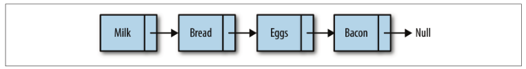
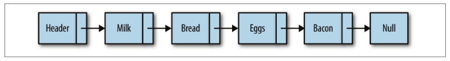
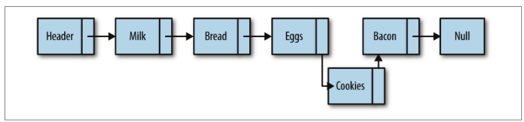
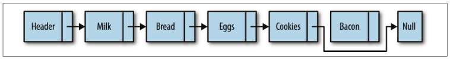

## 链表

### 数组的缺点
数组不总是组织数据的最佳数据结构，原因如下，在很多编程语言中，数组的长度是固定的，所以当数组已经被数据填满时，再要加入新的元素就非常困难；在数组中添加和删除元素也很麻烦，因为需要将数组中的其他元素向前或向后平移，以反映数组刚刚的操作。<br>
然而js并无上述问题，js中他们被实现成了对象，与其他语言数组相比效率很低。

### 定义链表
> 链表是由一组节点组成的集合。每一个节点都使用一个对象的引用指向它的后继。指向另一个节点的引用叫做链。



数组元素靠他们的位置进行引用，链表元素则是靠互相之间的关系进行引用。我们说bread跟在milk后面，而不说bread是链表中的第二个元素。遍历链表就是跟着连接，从链表的首元素一直走到尾元素(不包含链表的头节点，头节点常常用来作为链表的接入点)。**注意点尾元素指向null节点**。<br>
然而要标识出链表的起始节点却有点麻烦，许多链表的实现都是在链表最前面有一个特殊节点，叫做**头节点**

链表中插入一个节点的效率很高。向链表中插入一个节点，需要修改它前面的节点(前驱)，使其指向新加入的节点，而新加入的节点则指向原来前驱指向的节点

从链表中删除一个元素也很简单。将待删除元素的前驱节点指向待删除元素的后继节点，同时将待删除元素指向null，元素就删除成功了。


## 设计一个基于对象的链表

我们设计的链表包含两个类。Node类用来表示节点，LinkedList类提供了插入节点、删除节点、显示列表元素的方法，以及其他一些辅助。

### Node类
Node类包含两个属性：element用来保存节点上的数据，next用来保存指向下一节点的链接。
```js
function Node(element){
    this.element=element;
    this.next=null;
}
```
### LinkedList类
LList类提供了对链表进行操作的方法。该类的功能包括插入删除节点、在列表中查找给定的值。链表只有一个属性，那就是使用一个Node对象来保存该链表的头节点
```js
function LList(){
    this.head=new Node('head');//head节点的next属性被初始化指向null，有新元素插入时next指向新元素
    this.find=find;
    this.insert=insert;
    this.remove=remove;
    this.display=display;
}
```